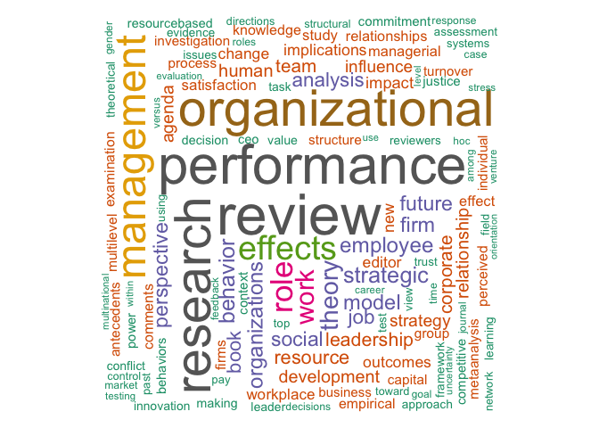

Wordcloud
================
Jessica Lyu
May 18, 2020

``` r
library("tm")
```

    ## Loading required package: NLP

``` r
library("SnowballC")
library("wordcloud")
```

    ## Loading required package: RColorBrewer

``` r
library("RColorBrewer")

text <- readLines("jomtitle.txt")
docs <- Corpus(VectorSource(text))
inspect(docs)
```

    ## <<SimpleCorpus>>
    ## Metadata:  corpus specific: 1, document level (indexed): 0
    ## Content:  documents: 2150
    ## 
    ##    [1] "x"                                                                                                                                                                                                                                                               
    ##    [2] "Academic Stratification In Graduate Management Programs: Departmental Prestige and Faculty Hiring Patterns"                                                                                                                                                      
    ##    [3] "Toward A Conceptual Clarification Of Employee Responses To Flexible Working Hours: A Work Adjustment Approach"                                                                                                                                                   
    ##    [4] "Perceived Competence Of Women Managers In Public Human Service Organizations: A Comparative View"                                                                                                                                                                
    ##    [5] "The Appropriateness of Management-By-Objectives For Development and Research Personnel"                                                                                                                                                                          
    ##    [6] "The Causal Relationship Between Trust And The Assessed Value Of Management By Objectives"                                                                                                                                                                        
    ##    [7] "Goal Specificity and Difficulty and Leader Initiating Structure as Strategies For Managing Role Stress"                                                                                                                                                          
    ##    [8] "Acknowledgement of Special Reviewers"                                                                                                                                                                                                                            
    ##    [9] "A Constructive Replication of the Lawrence and Lorsch Conflict Resolution Methodology"                                                                                                                                                                           
    ##   [10] "Theory and Applications in Management Pedagogy: An Empirical Study"                                                                                                                                                                                              
    ##   [11] "Managerial Receptivity and Implementation of Policies"                                                                                                                                                                                                           
    ##   [12] "Role of Valid Test Score Information and Other Factors in Selection Decision-Making"                                                                                                                                                                             
    ##   [13] "The Factor Replicability of the Litwin and Stringer Organizational Climate Questionnaire: An Inter and Intra-Organizational Assessment"                                                                                                                          
    ##   [14] "Managerial Perceptions of Career Planning Information"                                                                                                                                                                                                           
    ##   [15] "Acknowledgement of Special Reviewers"                                                                                                                                                                                                                            
    ##   [16] "Plateaued and Non-Plateaued Managers: Factors in Job Performance"                                                                                                                                                                                                
    ##   [17] "Perceived Environmental Uncertainty: An Individual or Environmental Attribute?"                                                                                                                                                                                  
    ##   [18] "Using Videotape Technology: Innovations in Behavioral Research"                                                                                                                                                                                                  
    ##   [19] "An Evaluation of the Reliability, Stability and Factor Structure of the Manifest Needs Questionnaire"                                                                                                                                                            
    ##   [20] "From Leaderless Group Discussions To The Cross-National Assessment of Managers"                                                                                                                                                                                  
    ##   [21] "Participant Estimates of the Effectiveness of Judgmental Decisions"                                                                                                                                                                                              
    ##   [22] "Decision Making Configurations: An Alternative to the Centralization/Decentralization Conceptualization"                                                                                                                                                         
    ##   [23] "Job Design Task Attributes: An Evaluation of Prior Manipulations Based on a Retranslation Technique"                                                                                                                                                             
    ##   [24] "Organization Structure and Administrative Control: A Question of Dimensionality"                                                                                                                                                                                 
    ##   [25] "Differentiating Between Perceived Organization and Work Group Climates"                                                                                                                                                                                          
    ##   [26] "Manager's Self Assessments of Managerial Roles: The Influence of Hierarchical Level"                                                                                                                                                                             
    ##   [27] "The Effects of MBO on Performance and Satisfaction in a Public Sector Organization"                                                                                                                                                                              
    ##   [28] "The Joint Influence of Situational Constraints and Goal Setting on Performance and Affective Outcomes"                                                                                                                                                           
    ##   [29] "Union-Management Ideological Frames of Reference"                                                                                                                                                                                                                
    ##   [30] "A Comparison of Moderated Regression Techniques Considering Strength of Effect"                                                                                                                                                                                  
    ##   [31] "Size, Stability and Incremental Budgeting Outcomes in Public Universities"                                                                                                                                                                                       
    ##   [32] "Professionalization in a Rationally Managed Corporate Organization"                                                                                                                                                                                              
    ##   [33] "Toward Proper Specification of the Effects of Leader Punitive Behavior: A Research Note"                                                                                                                                                                         
    ##   [34] "Feedback Effects in Intrinsic/Extrinsic Reward Paradigms"                                                                                                                                                                                                        
    ##   [35] "Acknowledgement of Special Reviewers"                                                                                                                                                                                                                            
    ##   [36] "Employee Responses to Flexible Work Schedules: An Inter-Organization, Inter-System Comparison"                                                                                                                                                                   
    ##   [37] "An Integrative Theory of Leadership"                                                                                                                                                                                                                             
    ##   [38] "The Bureaucratic Model in University Budgeting: An Alternative Explanation to Power"                                                                                                                                                                             
    ##   [39] "Attributions and Actions: A Note of Caution"                                                                                                                                                                                                                     
    ##   [40] "Structural Correlates of Affirmative Action Compliance"                                                                                                                                                                                                          
    ##   [41] "Multidimensional Scaling and the Organizational Sciences"                                                                                                                                                                                                        
    ##   [42] "The Influence of Corporate Image and Specificity of Candidate Qualifications on Response to Recruitment Advertisement"                                                                                                                                           
    ##   [43] "Comments from the Editor"                                                                                                                                                                                                                                        
    ##   [44] "Acknowledgement of AD HOC Reviewers"                                                                                                                                                                                                                             
    ##   [45] "Erratum"                                                                                                                                                                                                                                                         
    ##   [46] "A Multitrait-Multimethod Matrix Analysis of the PRF and MNQ Need Scales"                                                                                                                                                                                         
    ##   [47] "Negotiating Corporate Combinations: A Theory and Evidence"                                                                                                                                                                                                       
    ##   [48] "Work Environment and Grievance Rates in a Manufacturing Plant"                                                                                                                                                                                                   
    ##   [49] "Forms of Control and Leader Behavior"                                                                                                                                                                                                                            
    ##   [50] "Leader Expertise as a Moderator of the Effects of Instrumental and Supportive Leader Behaviors"                                                                                                                                                                  
    ##   [51] "Job Context and Job Content: A Conceptual Perspective"                                                                                                                                                                                                           
    ##   [52] "A Note on the Armstrongl Mitroff Debate"                                                                                                                                                                                                                         
    ##   [53] "I'm Sorry That Science Is a Complex Phenomenon and It Doesn't Work by Simpleminded Rules"                                                                                                                                                                        
    ##   [54] "The Importance of Objectivity and Falsification in Management Science"                                                                                                                                                                                           
    ##   [55] "Hawthorne a Half Century Later: Relay Assembly Participants Remember"                                                                                                                                                                                            
    ##   [56] "Comments From the Editor"                                                                                                                                                                                                                                        
    ##   [57] "Editorial Policy & Instructions To Authors: (Revised May, 1983)"                                                                                                                                                                                                 
    ##   [58] "Perceptions of Managerial Power as a Consequence of Managerial Behavior and Reputation"                                                                                                                                                                          
    ##   [59] "The Impact of Skill Learnability on the Effectiveness of Managerial Training and Development"                                                                                                                                                                    
    ##   [60] "Rater Involvement as a Moderator of Performance Cues and Leader Behavior Descriptions"                                                                                                                                                                           
    ##   [61] "The Effects of Participative Versus Assigned Goal Setting on Intrinsic Motivation"                                                                                                                                                                               
    ##   [62] "The Impact of Goal Change on Prominent Perceptions and Beha viors of Emplo yees"                                                                                                                                                                                 
    ##   [63] "Measuring Organizational Slack: A Note on the Convergence and Divergence of Alternative Operational Definitions"                                                                                                                                                 
    ##   [64] "Comments from the Editor"                                                                                                                                                                                                                                        
    ##   [65] "The Effect of Organizational Emphases upon the Diffusion of Information about Innovations"                                                                                                                                                                       
    ##   [66] "Mediation: The Effects of Mediator Proposals, Number of Issues, and Altered Negotiator Aspirations"                                                                                                                                                              
    ##   [67] "Supervisor, Self- and Subordinate Ratings of Performance and Satisfaction with Supervision"                                                                                                                                                                      
    ##   [68] "Situational Performance Constraints and Task Characteristics: Their Relationship to Motivation and Satisfaction"                                                                                                                                                 
    ##   [69] "Manuscripts Accepted for Publication"                                                                                                                                                                                                                            
    ##   [70] "The Relevance of Kahneman and Tversky's Concept of Framing to Organizational Behavior"                                                                                                                                                                           
    ##   [71] "Technology and Structure: The Concrete, Abstract, and Activity Systems of Organizations"                                                                                                                                                                         
    ##   [72] "Call for Award Nominations"                                                                                                                                                                                                                                      
    ##   [73] "A Comparison of Pre- and Postemployment Work Values"                                                                                                                                                                                                             
    ##   [74] "The Effects of Multiple Sources of Performance Feedback and Feedback Favorability on Self-Perceived Task Competence and Perceived Feedback Accuracy"                                                                                                             
    ##   [75] "Comments from the Editor"                                                                                                                                                                                                                                        
    ##   [76] "Strategic Planning and Organizational Performance: A Critical Appraisal"                                                                                                                                                                                         
    ##   [77] "The Effects of Group Performance on Cognitions, Satisfaction, and Behavior: A Process Model"                                                                                                                                                                     
    ##   [78] "The Harvard \\"Pareto Circle\\" and the Historical Development of Organization Theory"                                                                                                                                                                           
    ##   [79] "Making Sense of Organizationally Based Environmental Disasters"                                                                                                                                                                                                  
    ##   [80] "Identifying Moderator Variables Using Multiple Regression: A Reply to Darrow and Kahl"                                                                                                                                                                           
    ##   [81] "Model Determination in Moderated Regression"                                                                                                                                                                                                                     
    ##   [82] "On the Premature Death of Need-Satisfaction Models: An Investigation of Salancik and Pfeffer's Views on Priming and Consistency Artifacts"                                                                                                                       
    ##   [83] "On Priming, Consistency, and Order Effects in Job Attitude Assessment: With a Note on Current Research"                                                                                                                                                          
    ##   [84] "Misperceiving and/or Misrepresenting the Facts: A Reply to Salancik"                                                                                                                                                                                             
    ##   [85] "A Comparison of Centralizationl Decentralization of Decision Making Concepts and Measures"                                                                                                                                                                       
    ##   [86] "Comments From the Editor"                                                                                                                                                                                                                                        
    ##   [87] "Special Issue on Organizational Design"                                                                                                                                                                                                                          
    ##   [88] "Contingency Theory: Some Suggested Directions"                                                                                                                                                                                                                   
    ##   [89] "Taxonomic Approaches to Studying Strategy: Some Conceptual and Methodological Issues"                                                                                                                                                                            
    ##   [90] "The Nature and Use of Formal Control Systems for Management Control and Strategy Implementation"                                                                                                                                                                 
    ##   [91] "Design Strategy from the Population Perspective"                                                                                                                                                                                                                 
    ##   [92] "Erratum"                                                                                                                                                                                                                                                         
    ##   [93] "Designing New Business Startups: Entrepreneurial, Organizational, and Ecological Considerations"                                                                                                                                                                 
    ##   [94] "The Anatomy of Organizational Design"                                                                                                                                                                                                                            
    ##   [95] "Comments from the Editor"                                                                                                                                                                                                                                        
    ##   [96] "Facets of Work Support and Employee Work Outcomes: An Exploratory Analysis"                                                                                                                                                                                      
    ##   [97] "Implications of Controversy Research for Management"                                                                                                                                                                                                             
    ##   [98] "Social Support and Adjustment to Work: A Longitudinal Study"                                                                                                                                                                                                     
    ##   [99] "The Effect of Quantum Versus Incremental M-form Reorganization on Performance: A Time-Series Exploration of Intervention Dynamics"                                                                                                                               
    ##  [100] "The Cognitive Structure of Corporate Social Responsibility"                                                                                                                                                                                                      
    ##  [101] "A Multiple-Period, Mixed-Integer-Programming Model for Multinational Facility Location"                                                                                                                                                                          
    ##  [102] "Pfeffer's Model of Management: An Expansion and Modification"                                                                                                                                                                                                    
    ##  [103] "Taking Stock of Organizational Decline Management: Some Issues and Illustrations From an Empirical Study"                                                                                                                                                        
    ##  [104] "Acknowledgement of Ad Hoc Reviewers"                                                                                                                                                                                                                             
    ##  [105] "Need for Clarity as a Moderator of the Role Ambiguity-Job Satisfaction Relationship"                                                                                                                                                                             
    ##  [106] "Conventional Wisdom and Ratings of Job Characteristics: Can Observers be Objective?"                                                                                                                                                                             
    ##  [107] "Comments from the Editor"                                                                                                                                                                                                                                        
    ##  [108] "Special Issue on Organizational Symbolism"                                                                                                                                                                                                                       
    ##  [109] "Practical and Emancipatory Interests in Organizational Symbolism: A Review and Evaluation"                                                                                                                                                                       
    ##  [110] "Spinning on Symbolism: Some Developmental Issues in Organizational Symbolism"                                                                                                                                                                                    
    ##  [111] "Breakfast at Spiro's: Dramaturgy and Dominance"                                                                                                                                                                                                                  
    ##  [112] "Spinning on Symbolism: The Spinning Metaphor and Dialectical Tensions"                                                                                                                                                                                           
    ##  [113] "Understanding Organizations: The Poetic Mode"                                                                                                                                                                                                                    
    ##  [114] "Spinning on Symbolism: Imaging Strategy"                                                                                                                                                                                                                         
    ##  [115] "Spinning on Symbolism: Taking More Than One Story Seriously"                                                                                                                                                                                                     
    ##  [116] "\\"When the Sleeper Wakes\\": A Short Story Extending Themes in Radical Organization Theory"                                                                                                                                                                     
    ##  [117] "Spinning on Symbolism: Creating and Using the Threads of Our Minds"                                                                                                                                                                                              
    ##  [118] "Organizations as Constructions and Destructions of Meaning"                                                                                                                                                                                                      
    ##  [119] "Spinning on Symbolism: The Liberating Potential of Symbolism"                                                                                                                                                                                                    
    ##  [120] "Spinning on Symbolism: The Problem of Ambivalence"                                                                                                                                                                                                               
    ##  [121] "Achieving Routine in Organizational Change"                                                                                                                                                                                                                      
    ##  [122] "Spinning on Symbolism: A Brief Note on the Future of Symbolism in Organizational Research"                                                                                                                                                                       
    ##  [123] "Spinning on Symbolism: Disquisition"                                                                                                                                                                                                                             
    ##  [124] "Errata"                                                                                                                                                                                                                                                          
    ##  [125] "Critical-Cultural Research: New Sensibilities and Old Realities"                                                                                                                                                                                                 
    ##  [126] "Comments from the Editor"                                                                                                                                                                                                                                        
    ##  [127] "A Partial Test of Janis' Groupthink Model: Effects of Group Cohesiveness and Leader Behavior on Defective Decision Making"                                                                                                                                       
    ##  [128] "A Contradictory Norms View of Employer-Employee Exchange"                                                                                                                                                                                                        
    ##  [129] "The Usefulness of Myth and the Myth of Usefulness: A Dilemma for the Applied Organizational Scientist"                                                                                                                                                           
    ##  [130] "Harvest From the Archives: The Search for Fayol and Carlioz"                                                                                                                                                                                                     
    ##  [131] "Relationships Between Leader Reward and Punishment Behavior and Group Processes and Productivity"                                                                                                                                                                
    ##  [132] "Redefining the Boundary Spanning-Environment Relationship"                                                                                                                                                                                                       
    ##  [133] "The Effects of Objective Work-load Variations of Psychological Strain and Post-Work-Load Performance"                                                                                                                                                            
    ##  [134] "Factors Influencing the Success and Failure of Two Quality Circle Programs"                                                                                                                                                                                      
    ##  [135] "Inside the Teaching Machine: Integrating Attribution and Reinforcement Theories"                                                                                                                                                                                 
    ##  [136] "Learning What's Inside the Teaching Machine From the Outside: Operant Technology Applied to Cognitive Phenomena"                                                                                                                                                 
    ##  [137] "Leadership as an Example of Integrating Attribution and Operant Theory: A Reply to Mawhinney"                                                                                                                                                                    
    ##  [138] "Comments from the Editor the Editor's Swan Song"                                                                                                                                                                                                                 
    ##  [139] "Trust, Perceived Importance of Praise and Criticism, and Work Performance: An Examination of Feedback in the United States and England"                                                                                                                          
    ##  [140] "Self-Serving Biases in Leadership: A Laboratory Experiment"                                                                                                                                                                                                      
    ##  [141] "Managers as Agents Without Principals: An Empirical Examination of Agency and Constituency Perspectives"                                                                                                                                                         
    ##  [142] "An Empirical Critique of In Search of Excellence: How Excellent are the Excellent Companies?"                                                                                                                                                                    
    ##  [143] "The Effects of Realistic Job Previews on Applicant Self-Selection and Employee Turnover, Satisfaction, and Coping Ability"                                                                                                                                       
    ##  [144] "Partialling Factor Scores Does Not Control Method Variance: A Reply to Podsakoff and Todor"                                                                                                                                                                      
    ##  [145] "Self-Reports in Organizational Research: Problems and Prospects"                                                                                                                                                                                                 
    ##  [146] "Task Effectiveness and Interaction Process of a Modified Nominal Group Technique in Solving an Evaluation Problem"                                                                                                                                               
    ##  [147] "Early Career Factors That Differentiate Technical Management Careers From Technical Professional Careers"                                                                                                                                                        
    ##  [148] "Acknowledgement of Ad Hoc Reviewers"                                                                                                                                                                                                                             
    ##  [149] "Job Involvement and Organizational Commitment as Interactive Predictors of Tardiness and Absenteeism"                                                                                                                                                            
    ##  [150] "The Congruence of Goal-Setting Strategies With Socio-Cultural Values and its Effect on Performance"                                                                                                                                                              
    ##  [151] "Comments from the Editor"                                                                                                                                                                                                                                        
    ##  [152] "The Role of Negotiated Belief Structures in Strategy Making"                                                                                                                                                                                                     
    ##  [153] "Correspondence From Henry L. Gantt to an Old Friend Reveals New Information About Gantt"                                                                                                                                                                         
    ##  [154] "Attribution Theories of Leadership and Network Analysis"                                                                                                                                                                                                         
    ##  [155] "Is Strategic Management Ideological?"                                                                                                                                                                                                                            
    ##  [156] "Coping With the Corporate Tribe: How Women in Different Cultures Experience the Managerial Role"                                                                                                                                                                 
    ##  [157] "Managing From Below"                                                                                                                                                                                                                                             
    ##  [158] "Procrustes: A Modern Management Pattern Found in a Classical Myth"                                                                                                                                                                                               
    ##  [159] "The Development of Henry Metcalfe's Card System of Shop Returns at Frank ford Arsenal, 1880-1881"                                                                                                                                                                
    ##  [160] "Erratum"                                                                                                                                                                                                                                                         
    ##  [161] "Effectiveness of Specificity in Recruitment Advertising"                                                                                                                                                                                                         
    ##  [162] "Applying a Causal Analytic Framework to the Mobley, Horner, and Hollingsworth (1978) Turnover Model: A Useful Reexamination"                                                                                                                                     
    ##  [163] "Comments from the Editors"                                                                                                                                                                                                                                       
    ##  [164] "Getting Inside the Head of the Management Researcher One More Time: Context-Free and Context-Specific Orientations in Research"                                                                                                                                  
    ##  [165] "Evaluating the Research on Strategy Content"                                                                                                                                                                                                                     
    ##  [166] "Contemporary Challenges in the Study of Organizations"                                                                                                                                                                                                           
    ##  [167] "Organizational Behavior: The Central Role of Motivation"                                                                                                                                                                                                         
    ##  [168] "Evolution of Concept and Practice in Personnel Administration/Human Resource Management (PA/HRM)"                                                                                                                                                                
    ##  [169] "Argument and Narration in Organizational Communication"                                                                                                                                                                                                          
    ##  [170] "Business and Public Policy"                                                                                                                                                                                                                                      
    ##  [171] "Management Development"                                                                                                                                                                                                                                          
    ##  [172] "From the Atlantic to the Pacific Century: Cross-Cultural Management Reviewed"                                                                                                                                                                                    
    ##  [173] "Comments from the Editor"                                                                                                                                                                                                                                        
    ##  [174] "Management and Research Methodology"                                                                                                                                                                                                                             
    ##  [175] "Mapping Bank Employee Perceptions of Organizational Stimuli in Two Countries"                                                                                                                                                                                    
    ##  [176] "Notes on the Practical and Theoretical Consequences of Implicit Leadership Theories for the Future of Leadership Measurement"                                                                                                                                    
    ##  [177] "Thinking About Implementation"                                                                                                                                                                                                                                   
    ##  [178] "Uniformity and Variation in Occupational Earngs Determination: Potential Sources of Incomparable Worth"                                                                                                                                                          
    ##  [179] "Technology Advances in Batch Production and Improved Competitive Position"                                                                                                                                                                                       
    ##  [180] "A Preliminary Investigation Into the Influence of Customer-Firm Interface on Information Processing and Task Activities in Service Organizations"                                                                                                                
    ##  [181] "Evidence for a Curvilinear Relationship Between Job Performance and Turnover"                                                                                                                                                                                    
    ##  [182] "Public-Sector Context Versus Private-Sector Context as a Mediator of Financial Allocation Decisions"                                                                                                                                                             
    ##  [183] "Nationality and Work Attitudes: A Study of Australian and American Business Majors"                                                                                                                                                                              
    ##  [184] "Comments from the Editor"                                                                                                                                                                                                                                        
    ##  [185] "Acknowledgment of Reviewers"                                                                                                                                                                                                                                     
    ##  [186] "Employee Health Management Programs: Review, Critique, and Research Agenda"                                                                                                                                                                                      
    ##  [187] "Organizational Impact of Regulation: The Case of Long-Term-Care Facilities"                                                                                                                                                                                      
    ##  [188] "Perceived Organizational Characteristics and Personality Measures as Predictors of Stress/Strain in the Work Place"                                                                                                                                              
    ##  [189] "Organizational Culture: Internal and External Fits"                                                                                                                                                                                                              
    ##  [190] "Identity and Non-Identity Thinking: Dialectical Critique of the Transaction Cost Theory of the Modern Corporation"                                                                                                                                               
    ##  [191] "The Adoption of Technological, Administrative, and Ancillary Innovations: Impact of Organizational Factors"                                                                                                                                                      
    ##  [192] "Aggregation Bias in Strategic Decision Making Research"                                                                                                                                                                                                          
    ##  [193] "The Attenuating Effects of Internal Mobility on Employee Turnover: Multiple Field Assessments"                                                                                                                                                                   
    ##  [194] "Shifts in Resource Allocation Preference Following Panel Discussion"                                                                                                                                                                                             
    ##  [195] "The Effects of Environmental Uncertainty and Dependence on Organizational Structure and Performance: A Comparative Study"                                                                                                                                        
    ##  [196] "Participation: A Close Look at Its Dynamics"                                                                                                                                                                                                                     
    ##  [197] "An Alternative to the Intrinsic-Extrinsic Dichotomy of Work Rewards"                                                                                                                                                                                             
    ##  [198] "Comments from the Editor"                                                                                                                                                                                                                                        
    ##  [199] "The Satisfaction With My Supervisor Scale: Its Utility for Research and Practical Applications"                                                                                                                                                                  
    ##  [200] "The Relationship Between Work/Nonwork Role Conflict and Job-Related Outcomes: Some Unanticipated Findings"                                                                                                                                                       
    ##  [201] "Constraining Forces and the Work Performance of Finance Company Cashiers"                                                                                                                                                                                        
    ##  [202] "Divestment Decision-Making: The Role of Business Unit Size"                                                                                                                                                                                                      
    ##  [203] "Directors' Stock Ownership and Organizational Performance: An Investigation of Fortune 500 Companies"                                                                                                                                                            
    ##  [204] "The Effect of CEO Succession on Stockholder Wealth in Large Firms Following the Death of the Predecessor"                                                                                                                                                        
    ##  [205] "Effects of Social Support, Role Stress, and Locus of Control on Health"                                                                                                                                                                                          
    ##  [206] "Images of Death and Slavery in Organizational Life"                                                                                                                                                                                                              
    ##  [207] "Imagery and Strategy"                                                                                                                                                                                                                                            
    ##  [208] "Long-Term Acquisition Strategies in the U.S. Economy"                                                                                                                                                                                                            
    ##  [209] "Critical Administrative Scholarship, Praxis, and the Academic Workplace"                                                                                                                                                                                         
    ##  [210] "Promotions in the Corporate World: Comparing the Perspectives of University Professors, MBA Students, and Corporate Managers"                                                                                                                                    
    ##  [211] "Comments from the Editors"                                                                                                                                                                                                                                       
    ##  [212] "Content, Process, and the Matthew Effect Among Management Academics"                                                                                                                                                                                             
    ##  [213] "A Review of Strategic Process Research"                                                                                                                                                                                                                          
    ##  [214] "Organizational Behavior: Group Structure, Process, and Effectiveness"                                                                                                                                                                                            
    ##  [215] "Entrepreneurship: An Integrating Typology and Evaluation of the Empirical Research in the Field"                                                                                                                                                                 
    ##  [216] "Labor Relations: Research and Practice in Transition"                                                                                                                                                                                                            
    ##  [217] "Careers and Socialization"                                                                                                                                                                                                                                       
    ##  [218] "Public-Sector Management Today: Advanced Differentiation and Early Institutionalization"                                                                                                                                                                         
    ##  [219] "Management History: Issues and Ideas for Teaching and Research"                                                                                                                                                                                                  
    ##  [220] "Operations Management: A Field Rediscovered"                                                                                                                                                                                                                     
    ##  [221] "Health Care Organizational Performance: Present and Future Research"                                                                                                                                                                                             
    ##  [222] "Organization Development in the 1980's"                                                                                                                                                                                                                          
    ##  [223] "Research Methodology in Organizational Studies"                                                                                                                                                                                                                  
    ##  [224] "Comments from the Editor"                                                                                                                                                                                                                                        
    ##  [225] "Biography and the Assessment of Transformational Leadership at the World-Class Level"                                                                                                                                                                            
    ##  [226] "Behavior Modeling Training in Organizations: Concerns and Conclusions"                                                                                                                                                                                           
    ##  [227] "On the Psychodynamics of Organizational Totalitarianism"                                                                                                                                                                                                         
    ##  [228] "Public-Private Cooperation and Hybrid Organizations"                                                                                                                                                                                                             
    ##  [229] "The Disintegration of an Organization: A Dialectical Analysis"                                                                                                                                                                                                   
    ##  [230] "The Impact of Type A Behavior Pattern on Role Overload-induced Stress and Performance Attributions"                                                                                                                                                              
    ##  [231] "A Comparison of Entrepreneurs and Managers of Small Business Firms"                                                                                                                                                                                              
    ##  [232] "Measurement of Business Economic Performance: An Examination of Method Convergence"                                                                                                                                                                              
    ##  [233] "Creating Models of the Strategic Decision Making Process Via Participant Recall: A Free Simulation Examination"                                                                                                                                                  
    ##  [234] "Organizational Diagnostics: Translating the Political into the Technical"                                                                                                                                                                                        
    ##  [235] "A Role Model Approach to Sexual Harassment"                                                                                                                                                                                                                      
    ##  [236] "Organizational Commitment: Pre-Employment Propensity and Initial Work Experiences"                                                                                                                                                                               
    ##  [237] "Comments from the Editor"                                                                                                                                                                                                                                        
    ##  [238] "Ad Hoc Reviewers"                                                                                                                                                                                                                                                
    ##  [239] "Executive's Knowledge of Organizational Problem Types: Applying a Contingency Perspective"                                                                                                                                                                       
    ##  [240] "Interorganizational Coordination in the Airline Industry, 1925-1938: A Transaction Cost Approach"                                                                                                                                                                
    ##  [241] "A Restatement of the Satisfaction-Performance Hypothesis"                                                                                                                                                                                                        
    ##  [242] "The Significance of Congruence Coefficients: A Comment and Statistical Test"                                                                                                                                                                                     
    ##  [243] "Effect of Female-Linked Job Titles on Job Evaluation Ratings"                                                                                                                                                                                                    
    ##  [244] "The Effects of Organizational Restructuring on Frames of Reference and Cooperation"                                                                                                                                                                              
    ##  [245] "A Concept of Conglomerate Diversification"                                                                                                                                                                                                                       
    ##  [246] "Providing Performance Feedback: Reactions to Alternate Methods"                                                                                                                                                                                                  
    ##  [247] "Intervention and Cultural Context: Mediation in the US and Norway"                                                                                                                                                                                               
    ##  [248] "Comments from the Editor"                                                                                                                                                                                                                                        
    ##  [249] "Individual Responses to Job Loss: Perceptions, Reactions, and Coping Behaviors"                                                                                                                                                                                  
    ##  [250] "Sex Differences in Psychological Well-Being During a Facility Closure"                                                                                                                                                                                           
    ##  [251] "Job Performance and Turnover Decisions: Two Field Studies"                                                                                                                                                                                                       
    ##  [252] "The Impact of Rating Scale Format on Rater Accuracy: An Evaluation of the Mixed Standard Scale"                                                                                                                                                                  
    ##  [253] "Addressing Temporal Change in Strategic Groups Analysis: A Three-Mode Factor Analysis Approach"                                                                                                                                                                  
    ##  [254] "An Empirical Note on the Interaction of Personality and Aptitude in Personnel Selection"                                                                                                                                                                         
    ##  [255] "Executive Leadership and Organizational Performance: Suggestions for a New Theory and Methodology"                                                                                                                                                               
    ##  [256] "A Policy-Capturing Approach to the Study of United States and Japanese Managers' Compensation Decisions"                                                                                                                                                         
    ##  [257] "Outcomes of Work-Family Conflict Among Married Male and Female Professionals"                                                                                                                                                                                    
    ##  [258] "Employee Beliefs and Support for a Work Redesign Intervention"                                                                                                                                                                                                   
    ##  [259] "Comments from the Editor"                                                                                                                                                                                                                                        
    ##  [260] "Entrepreneurship: Past Research and Future Challenges"                                                                                                                                                                                                           
    ##  [261] "The Efficacy of Business Political Activity: Competitive Considerations in a Principal-Agent Context"                                                                                                                                                            
    ##  [262] "Organizational Communication in the Information Age: Implications of Computer-Based Systems"                                                                                                                                                                     
    ##  [263] "Management Education and Development: Current Issues and Emerging Trends"                                                                                                                                                                                        
    ##  [264] "The Changing Nature of Research on Women at Work"                                                                                                                                                                                                                
    ##  [265] "Issues in Research Methodology"                                                                                                                                                                                                                                  
    ##  [266] "The Management Governance Theories of Justice and Liberty"                                                                                                                                                                                                       
    ##  [267] "Time and Organizations"                                                                                                                                                                                                                                          
    ##  [268] "Impression Management in Organizations"                                                                                                                                                                                                                          
    ##  [269] "Consultation Research: Contributions to Practice and Directions for Improvement"                                                                                                                                                                                 
    ##  [270] "Comments from the Editor"                                                                                                                                                                                                                                        
    ##  [271] "Variations in Critical Success Factors Over the Stages in the Project Life Cycle"                                                                                                                                                                                
    ##  [272] "Cultural Contradictions of Statistical Process Control In American Manufacturing Organizations"                                                                                                                                                                  
    ##  [273] "The Priming Effect in Task Design Research"                                                                                                                                                                                                                      
    ##  [274] "Effects of Perceived Organizational Factors on Role Stress-Job Attitude Relationships"                                                                                                                                                                           
    ##  [275] "B.M. Springbett and the Notion of the \\"Snap Decision\\" in the Interview"                                                                                                                                                                                      
    ##  [276] "Career Plateaus Reconsidered"                                                                                                                                                                                                                                    
    ##  [277] "Reclaiming Personality Traits for Personnel Selection: Self-Esteem as an Illustrative Case"                                                                                                                                                                      
    ##  [278] "Sociopolitical Events and Foreign Direct In vestment: American In vestments in South and Central American Countries, 1950-1982"                                                                                                                                  
    ##  [279] "A Dialectical Analysis of Interorganizational Networks"                                                                                                                                                                                                          
    ##  [280] "Comments from the Editor"                                                                                                                                                                                                                                        
    ##  [281] "Acknowledgement of Reviewers"                                                                                                                                                                                                                                    
    ##  [282] "The Influence of the Spouse on American Expatriate Adjustment and Intent to Stay in Pacific Rim Overseas Assignments"                                                                                                                                            
    ##  [283] "Relationships of Leader Power to Compliance and Satisfaction with Supervision: Evidence from a National Sample of Managers"                                                                                                                                      
    ##  [284] "The Effects of Applicant Impression Management Tactics on Interviewer Judgments"                                                                                                                                                                                 
    ##  [285] "The Relationship Among Firm Characteristics and Design of Strategic Planning Systems in Large Organizations"                                                                                                                                                     
    ##  [286] "The Equity Sensitivity Construct: Potential Implications for Worker Performance"                                                                                                                                                                                 
    ##  [287] "Task Strategy Interventions in Goal Setting: The Importance of Search in Strategy Development"                                                                                                                                                                   
    ##  [288] "Herman Hollerith: Inventor, Manager, Entrepreneur—A Centennial Remembrance"                                                                                                                                                                                      
    ##  [289] "Strategy, Beliefs about the Environment, and Performance in a Banking Simulation"                                                                                                                                                                                
    ##  [290] "How Can OD Consultants and Researchers Assess Gamma Change? A Comparison of Two Analytical Procedures"                                                                                                                                                           
    ##  [291] "Performance Variations Among Strategic Group Members: An Examination of Individual Firm Capability"                                                                                                                                                              
    ##  [292] "Comments from the Editor"                                                                                                                                                                                                                                        
    ##  [293] "A Path Analytic Study of Individual Characteristics, Computer Anxiety and Attitudes toward Microcomputers"                                                                                                                                                       
    ##  [294] "Diagnosing Management Development Needs: An Instrument Based on How Managers Develop"                                                                                                                                                                            
    ##  [295] "Investigating Supervisor Attributions of Subordinate Performance"                                                                                                                                                                                                
    ##  [296] "The Employee Separation Process: Criterion-Related Issues Associated with Tenure and Turnover"                                                                                                                                                                   
    ##  [297] "Countercyclical Hiring as a Staffing Strategy for Managerial and Professional Personnel: An Empirical Investigation"                                                                                                                                             
    ##  [298] "The Influence of Managerial Style on Business Unit Performance"                                                                                                                                                                                                  
    ##  [299] "Board of Director Composition, Shareholder Wealth, and Dividend Policy"                                                                                                                                                                                          
    ##  [300] "A Meta-Analytic Review of the Concentra tion-Performance Relationship: Aggregating Findings in Strategic Management"                                                                                                                                             
    ##  [301] "Functioning Modeling Corporate Entrepreneurship: An Empirical Integrative Analysis"                                                                                                                                                                              
    ##  [302] "The Pioneering Efforts of Major General William Crozier (1855-1942) in the Field of Management"                                                                                                                                                                  
    ##  [303] "Comments from the Editors"                                                                                                                                                                                                                                       
    ##  [304] "Careers in Organizations: Recent Trends and Future Directions"                                                                                                                                                                                                   
    ##  [305] "Current and Recurrent Challenges in HRM"                                                                                                                                                                                                                         
    ##  [306] "Assessing Operations Management from a Strategic Perspective"                                                                                                                                                                                                    
    ##  [307] "Organizational Change and Development: New Arenas for Inquiry and Action"                                                                                                                                                                                        
    ##  [308] "Public Management: Recent Research on the Political Context and Managerial Roles, Structures, and Behaviors"                                                                                                                                                     
    ##  [309] "Managerial Leadership: A Review of Theory and Research"                                                                                                                                                                                                          
    ##  [310] "Boards of Directors and Corporate Financial Performance: A Review and Integrative Model"                                                                                                                                                                         
    ##  [311] ".05: A Case of the Tail Wagging the Distribution"                                                                                                                                                                                                                
    ##  [312] "Self Theories and Employee Motivation"                                                                                                                                                                                                                           
    ##  [313] "Comments from the Editor"                                                                                                                                                                                                                                        
    ##  [314] "Patterns of Performance and Rating Frequency: Influence on the Assessment of Performance"                                                                                                                                                                        
    ##  [315] "Environment, Department Power, and Strategic Decison Making in Organizations: A Proposed Integration"                                                                                                                                                            
    ##  [316] "Individual Responses to the Stress of Career Plateauing"                                                                                                                                                                                                         
    ##  [317] "Interdependence and Power Between Managers and Employees: A Study of the Leader Relationship"                                                                                                                                                                    
    ##  [318] "Power and Gender Congruency Effects in Evaluations of Male and Female Managers"                                                                                                                                                                                  
    ##  [319] "Toward a Market/Ownership Constrained Theory of Merger Behavior"                                                                                                                                                                                                 
    ##  [320] "Determinants of Human Resource Management Priorities and Implications for Industrial Relations"                                                                                                                                                                  
    ##  [321] "Quality Circle Productivity as Related to Upper-Management Attendance, Circle Initiation, and Collar Color"                                                                                                                                                      
    ##  [322] "Using Job Involvement and Organizational Commitment Interactively to Predict Turnover"                                                                                                                                                                           
    ##  [323] "Comments From the Editor"                                                                                                                                                                                                                                        
    ##  [324] "Acknowledgement of Reviewers"                                                                                                                                                                                                                                    
    ##  [325] "Transformational Leadership: Beyond Initiation and Consideration"                                                                                                                                                                                                
    ##  [326] "Accounting for Organizational Citizenship Behavior: Leader Fairness and Task Scope versus Satisfaction"                                                                                                                                                          
    ##  [327] "The Effects of Physical Attractiveness and Other Demographic Characteristics on Promotion Decisions"                                                                                                                                                             
    ##  [328] "Feedback-Seeking Behavior of New Hires and Job Changers"                                                                                                                                                                                                         
    ##  [329] "Research Evidence On The Miles-Snow Typology"                                                                                                                                                                                                                    
    ##  [330] "Mergers and Shareholder Returns: The Roles of Acquiring Firm's Ownership and Diversification Strategy"                                                                                                                                                           
    ##  [331] "The Market Share-Profitability Relationship: Testing Temporal Stability Across Business Cycles"                                                                                                                                                                  
    ##  [332] "Corporate Acquisitions and Shareholder Wealth: A Review and Exploratory Analysis"                                                                                                                                                                                
    ##  [333] "The Relation of Career and Family Factors to the Expressed Minimum Percentage Pay Increase Required for Relocation"                                                                                                                                              
    ##  [334] "Elements of an Employee Responsibilities and Rights Paradigm"                                                                                                                                                                                                    
    ##  [335] "Organizational Design and Management Norms: A Comparative Study of Managers' Perceptions in the People's Republic of China, Hong Kong, and Canada"                                                                                                               
    ##  [336] "Book Review: Why Leaders Can't Lead: The Unconscious Conspiracy Continues"                                                                                                                                                                                       
    ##  [337] "Book Review: Organizational Citizenship Behavior: The Good Soldier Syndrome"                                                                                                                                                                                     
    ##  [338] "Book Review: The Human Side of Mergers and Acquisitions: Managing Collisions between People, Cultures, and Organizations"                                                                                                                                        
    ##  [339] "Book Review: Pygmalion in Management: Productivity as a Self-Fulfilling Prophecy"                                                                                                                                                                                
    ##  [340] "Book Review: SuperLeadership - Leading Others to Lead Themselves"                                                                                                                                                                                                
    ##  [341] "Book Review: Reinventing the Factory: Productivity Breakthroughs in Manufacturing Today"                                                                                                                                                                         
    ##  [342] "Book Review: Essence of Creativity, A Guide to Tackling Difficult Problems"                                                                                                                                                                                      
    ##  [343] "Determinants of Top Management Compensation: Explaining the Impact of Economic, Behavioral, and Strategic Constructs and the Moderating Effects of Industry"                                                                                                     
    ##  [344] "The Behavioral Sciences and Management: An Evaluation of Relevant Journals"                                                                                                                                                                                      
    ##  [345] "Temporal and Contextual Change in the Measurement Structure of Financial Performance: Implications for Strategy Research"                                                                                                                                        
    ##  [346] "The Vulnerable System: An Analysis of the Tenerife Air Disaster"                                                                                                                                                                                                 
    ##  [347] "Using Constructive Developmental Theory and Biodata to Bridge the Gap Between Personnel Selection and Leadership"                                                                                                                                                
    ##  [348] "The Role of Self-Monitoring and Gender on Leader Emergence: A Laboratory and Field Study"                                                                                                                                                                        
    ##  [349] "A Contingency Approach to Appraisal Satisfaction: An Initial Investigation of the Joint Effects of Organizational Variables and Appraisal Characteristics"                                                                                                       
    ##  [350] "Multiple Outcomes from Product R&D: Profitability Under Different Strategic Orientations"                                                                                                                                                                        
    ##  [351] "Key Executive Succession and Stockholder Wealth: The Influence of Successorys Origin, Position, and Age"                                                                                                                                                         
    ##  [352] "Positive-Findings Bias in QWL Studies: Rigor and Outcomes in a Large Sample"                                                                                                                                                                                     
    ##  [353] "Book Review: Beyond Rational Management"                                                                                                                                                                                                                         
    ##  [354] "Book Review: Frederick Taylor and the Public Administration Community: A Reevaluation"                                                                                                                                                                           
    ##  [355] "Book Review: The Charismatic Leader"                                                                                                                                                                                                                             
    ##  [356] "Book Review: Women in Management Worldwide"                                                                                                                                                                                                                      
    ##  [357] "Book Review: Managing Strategy in the Real World: Conclusions and Frameworks from Field Studies of Business Practice"                                                                                                                                            
    ##  [358] "Book Review: Crucial Decisions: Leadership in Policymaking and Crisis Management"                                                                                                                                                                                
    ##  [359] "Comments from the Editors"                                                                                                                                                                                                                                       
    ##  [360] "Recent Developments in International Management Research"                                                                                                                                                                                                        
    ##  [361] "Humor and Work: Applications of Joking Behavior to Management"                                                                                                                                                                                                   
    ##  [362] "Organizational Behavior: Whom Do We Talk to and Who Talks to Us?"                                                                                                                                                                                                
    ##  [363] "The Role of Management Games and Simulations in Education and Research"                                                                                                                                                                                          
    ##  [364] "Confirmatory Modeling in Organizational Behavior/Human Resource Management: Issues and Applications"                                                                                                                                                             
    ##  [365] "Doctoral Education in the Field of Business Policy and Strategy"                                                                                                                                                                                                 
    ##  [366] "Organizational Justice: Yesterday, Today, and Tomorrow"                                                                                                                                                                                                          
    ##  [367] "Innocents in the Forest: Forecasting and Research Methods"                                                                                                                                                                                                       
    ##  [368] "Antecedents and Performance Outcomes of Diversification: A Review and Critique of Theoretical Perspectives"                                                                                                                                                      
    ##  [369] "Comments from the Editor"                                                                                                                                                                                                                                        
    ##  [370] "Industry Effects and Strategic Management Research"                                                                                                                                                                                                              
    ##  [371] "Relationships Between Type of Acquisition, The Autonomy Given to the Acquired Firm, and Acquisition Success: An Empirical Analysis"                                                                                                                              
    ##  [372] "Physical Attractiveness and Selection Decision Making"                                                                                                                                                                                                           
    ##  [373] "Diversification and Business Economic Performance Revisited: Issues of Measurement and Causality"                                                                                                                                                                
    ##  [374] "Selecting Top Corporate Leaders: An Example of Biographical Information"                                                                                                                                                                                         
    ##  [375] "Salesperson Performance and Managerially Controllable Factors: An Investigation of Individual and Work Group Effects"                                                                                                                                            
    ##  [376] "Improving the Accuracy of Stereotypes Within the Workplace"                                                                                                                                                                                                      
    ##  [377] "To Lobby or to Petition: The Political Environment of U.S. Trade Policy"                                                                                                                                                                                         
    ##  [378] "Strategy and Structure: Reconceiving the Relationship"                                                                                                                                                                                                           
    ##  [379] "Fighting for a Better Navy: An Attempt at Scientific Management (1905-1912)"                                                                                                                                                                                     
    ##  [380] "Perceptions of Firm Quality: A Cause or Result of Firm Performance"                                                                                                                                                                                              
    ##  [381] "Exploration of the Conceptualization and Measurement of Career Plateau: A Comparative Analysis"                                                                                                                                                                  
    ##  [382] "Book Review: The Hero's Farewell"                                                                                                                                                                                                                                
    ##  [383] "Book Review: Organizational Ecology"                                                                                                                                                                                                                             
    ##  [384] "Book Review: Made in America: Regaining the Productive Edge"                                                                                                                                                                                                     
    ##  [385] "Book Review: Permanently Failing Organizations"                                                                                                                                                                                                                  
    ##  [386] "Book Review: Optimizing the Organization: How to Link People with Technology"                                                                                                                                                                                    
    ##  [387] "Book Review: Implementing Routine and Radical Innovations"                                                                                                                                                                                                       
    ##  [388] "Book Review: The Leadership Factor"                                                                                                                                                                                                                              
    ##  [389] "Book Review: The Workplace Within: Psychodynamics of Organizational Life"                                                                                                                                                                                        
    ##  [390] "Comments from the Editor"                                                                                                                                                                                                                                        
    ##  [391] "Acknowledgement of Reviewers"                                                                                                                                                                                                                                    
    ##  [392] "Conceptualizing and Measuring the Organizational Environment: A Multidimensional Approach"                                                                                                                                                                       
    ##  [393] "Conceptualizing and Measuring Organizational Environments: A Critique and Suggestions"                                                                                                                                                                           
    ##  [394] "Dimensions and Constructs: A Response to Dess and Rasheed"                                                                                                                                                                                                       
    ##  [395] "Development of Organizational Commitment During the First Year of Employment: A Longitudinal Study of Pre- and Post-Entry Influences"                                                                                                                            
    ##  [396] "Environmental Change and Management Staffing: An Empirical Study"                                                                                                                                                                                                
    ##  [397] "Three Components of Perceived Environmental Uncertainty: An Exploratory Analysis of the Effects of Aggregation"                                                                                                                                                  
    ##  [398] "Antitakeover Charter Amendments: Impact on Determinants of Future Competitive Position"                                                                                                                                                                          
    ##  [399] "Introduction"                                                                                                                                                                                                                                                    
    ##  [400] "Organization Theory and Structural Perspectives on Management"                                                                                                                                                                                                   
    ##  [401] "Dressing Up Like an Organization: When Psychological Theories Can Explain Organizational Action"                                                                                                                                                                 
    ##  [402] "What Is Strategy's Distinctive Competence?"                                                                                                                                                                                                                      
    ##  [403] "Book Review: The Corporation of the 1990s: Information Technology and Organizational Transformation"                                                                                                                                                             
    ##  [404] "Book Review: Strategic Choices: Supremacy; Survival or Sayonara"                                                                                                                                                                                                 
    ##  [405] "Book Review: Tackling Strategic Problems"                                                                                                                                                                                                                        
    ##  [406] "Book Review: Corporate Corruption: The Abuse of Power"                                                                                                                                                                                                           
    ##  [407] "Book Review: Managing Disability at Work. Improving Practice in Organisations"                                                                                                                                                                                   
    ##  [408] "Book Review: Competing Against Time: How Time-Based Competition is Reshaping Global Markets"                                                                                                                                                                     
    ##  [409] "Current Topics in Industrial and Labor Relations Research and Practice"                                                                                                                                                                                          
    ##  [410] "Enforcements, Inducements, Expected Utility and Employee Misconduct"                                                                                                                                                                                             
    ##  [411] "Identifying Common Methods Variance With Data Collected From A Single Source: An Unresolved Sticky Issue"                                                                                                                                                        
    ##  [412] "Predicting Job Performance Across Organizations: The Interaction of Work Orientation and Psychological Climate"                                                                                                                                                  
    ##  [413] "Job Satisfaction and Organizational Commitment as Predictors of Organizational Citizenship and In-Role Behaviors"                                                                                                                                                
    ##  [414] "A Leader's Wake: Organization Member Reactions to CEO Succession"                                                                                                                                                                                                
    ##  [415] "Toward Understanding and Measuring Conditions of Trust: Evolution of a Conditions of Trust Inventory"                                                                                                                                                            
    ##  [416] "Book Review: Organizational Evolution: New Directions."                                                                                                                                                                                                          
    ##  [417] "Book Review: The Human Side of Corporate Competitiveness."                                                                                                                                                                                                       
    ##  [418] "Book Review: Alcohol Problem Intervention in the Workplace: Employee Assistance Programs and Strategic Alternatives."                                                                                                                                            
    ##  [419] "Book Review: Managing in Developing Countries: Strategic Analysis and Operating Techniques."                                                                                                                                                                     
    ##  [420] "Book Review: Trade Policy and Corporate Business Decisions."                                                                                                                                                                                                     
    ##  [421] "Book Review: Communication for Managerial Effectiveness."                                                                                                                                                                                                        
    ##  [422] "Comments from the Editor"                                                                                                                                                                                                                                        
    ##  [423] "Work Stress and Employee Health"                                                                                                                                                                                                                                 
    ##  [424] "Negotiations"                                                                                                                                                                                                                                                    
    ##  [425] "Strategy Formation Processes in Health Care Organizations: A Context-Specific Examination of Context-Free Strategy Issues"                                                                                                                                       
    ##  [426] "Five Years of Groups Research: What We Have Learned and What Needs to Be Addressed"                                                                                                                                                                              
    ##  [427] "Social Issues in Management: Theory and Research in Corporate Social Performance"                                                                                                                                                                                
    ##  [428] "Emerging Theories of Communication in Organizations"                                                                                                                                                                                                             
    ##  [429] "Personnel/Human Resources Management: A Political Influence Perspective"                                                                                                                                                                                         
    ##  [430] "Three Modern Classics: A Very Special Book Review Section"                                                                                                                                                                                                       
    ##  [431] "Comments From the Editor"                                                                                                                                                                                                                                        
    ##  [432] "A Communication-Information Model of Competitive Response Timing"                                                                                                                                                                                                
    ##  [433] "Quality Circle Performance"                                                                                                                                                                                                                                      
    ##  [434] "Equity in Effort: The \\"Sucker Effect\\" in Co-Acting Groups"                                                                                                                                                                                                   
    ##  [435] "Communication Abilities of Managers: The Relationship to Performance"                                                                                                                                                                                            
    ##  [436] "The Effects of Graphical Versus Numerical Response on the Accuracy of Graph-Based Forecasts"                                                                                                                                                                     
    ##  [437] "Special Theory Forum The Resource-Based Model of the Firm: Origins, Implications, and Prospects"                                                                                                                                                                 
    ##  [438] "Firm Resources and Sustained Competitive Advantage"                                                                                                                                                                                                              
    ##  [439] "A Historical Comparison of Resource-Based Theory and Five Schools of Thought Within Industrial Organization Economics: Do We Have a New Theory of the Firm?"                                                                                                     
    ##  [440] "Managerial Resources and Rents"                                                                                                                                                                                                                                  
    ##  [441] "Synergies and Post-Acquisition Performance: Differences versus Similarities in Resource Allocations"                                                                                                                                                             
    ##  [442] "Managing Culture as a Competitive Resource: An Identity-Based View of Sustainable Competitive Advantage"                                                                                                                                                         
    ##  [443] "Book Review: The Competitive Advantage of Nations"                                                                                                                                                                                                               
    ##  [444] "Book Review: Managing as a Performing Art"                                                                                                                                                                                                                       
    ##  [445] "Book Review: A Force for Change: How Leadership Differs from Management"                                                                                                                                                                                         
    ##  [446] "Book Review: Mintzberg On Management: Inside Our Strange World of Organizations"                                                                                                                                                                                 
    ##  [447] "Book Review: Teamwork: What Must Go Right/What Can Go Wrong"                                                                                                                                                                                                     
    ##  [448] "Book Review: Corporate Imagination Plus"                                                                                                                                                                                                                         
    ##  [449] "Book Review: Managing Complexity in High Technology Organizations"                                                                                                                                                                                               
    ##  [450] "Book Review: Charting the Corporate Mind: Graphic Solutions to Business Conflicts"                                                                                                                                                                               
    ##  [451] "Editor's Comments"                                                                                                                                                                                                                                               
    ##  [452] "Acknowledgement of Reviewers"                                                                                                                                                                                                                                    
    ##  [453] "An Examination of the Effects of Organizational Norms, Organizational Structure, and Environmental Uncertainty on Entrepreneurial Strategy"                                                                                                                      
    ##  [454] "Mediating and Moderating Effects in Job Design"                                                                                                                                                                                                                  
    ##  [455] "An Examination of the Relationships Among Monetary Incentives, Goal Level, Goal Commitment, and Performance"                                                                                                                                                     
    ##  [456] "Interorganizational and Collective Strategies in Small Firms: Environmental Effects and Performance"                                                                                                                                                             
    ##  [457] "Shareholder Value and Investment Strategy Using the General Portfolio Model"                                                                                                                                                                                     
    ##  [458] "Managing Internal Corporate Entrepreneurship: An Agency Theory Perspective"                                                                                                                                                                                      
    ##  [459] "The Social Implications of Punishing Unethical Behavior: Observers' Cognitive and Affective Reactions"                                                                                                                                                           
    ##  [460] "Implementing International Strategy at the Business Unit Level: The Role of Managerial Decision-Making Characteristics"                                                                                                                                          
    ##  [461] "Insights Between Environmental Scanning Activities and Porter's Generic Strategies: An Empirical Analysis"                                                                                                                                                       
    ##  [462] "Book Review: The Russian Management Revolution: Preparing Managers for the Market Economy"                                                                                                                                                                       
    ##  [463] "Book Review: Blowing the whistle: The organizational and legal implications for companies and employees"                                                                                                                                                         
    ##  [464] "Book Review: Womanpower"                                                                                                                                                                                                                                         
    ##  [465] "Book Review: Job Satisfaction: How People Feel About Their Jobs and How It Affects Their Performance"                                                                                                                                                            
    ##  [466] "Book Review: Entreprenuers In High-Technology"                                                                                                                                                                                                                   
    ##  [467] "Book Review: Beyond Success: Corporations and Their Critics in the 1990s"                                                                                                                                                                                        
    ##  [468] "Book Review: Leadership in the Twenty-First Century"                                                                                                                                                                                                             
    ##  [469] "Book Review: Work, Health and Productivity"                                                                                                                                                                                                                      
    ##  [470] "Book Review: In the Way of Women: Men s Resistance to Sex Equality in Organizations"                                                                                                                                                                             
    ##  [471] "Book Review: Reframing Organizations"                                                                                                                                                                                                                            
    ##  [472] "Book Review: Technology Management in Organizations"                                                                                                                                                                                                             
    ##  [473] "Book Review: Organizational Climate and Culture"                                                                                                                                                                                                                 
    ##  [474] "Book Review: The Icarus Paradox: How Exceptional Companies Bring About Their Own Downfall"                                                                                                                                                                       
    ##  [475] "Absence Schema and Managerial Judgment"                                                                                                                                                                                                                          
    ##  [476] "A Strategic Management Perspective on Host Country Structure of Multinational Enterprises"                                                                                                                                                                       
    ##  [477] "Business-Level Competitive Strategy: A Contingency Link to Internationalization"                                                                                                                                                                                 
    ##  [478] "Transformational Leadership and the Performance of Research and Development Project Groups"                                                                                                                                                                      
    ##  [479] "Takeover Resistance, Information Leakage, and Target Firm Value"                                                                                                                                                                                                 
    ##  [480] "A Causal Model of Organizational Performance and Change"                                                                                                                                                                                                         
    ##  [481] "Computer Skills Acquisition: A Review and Future Directions for Research"                                                                                                                                                                                        
    ##  [482] "Growth Need Strength and Context Satisfactions as Moderators of the Relations of the Job Characteristics Model"                                                                                                                                                  
    ##  [483] "Meta-Analysis of the Antecedents of Personal Goal Level and of the Antecedents and Consequences of Goal Commitment"                                                                                                                                              
    ##  [484] "Book Review: The Nature of the Firm: Origins, Evolution, and Development"                                                                                                                                                                                        
    ##  [485] "Book Review: Do Compensation Policies Matter?"                                                                                                                                                                                                                   
    ##  [486] "Book Review: Managing with Integrity: Insights from America's CEOs"                                                                                                                                                                                              
    ##  [487] "Book Review: Turbulence in the American Workplace"                                                                                                                                                                                                               
    ##  [488] "Book Review: Managerial Skills: Explorations in Practical Knowledge"                                                                                                                                                                                             
    ##  [489] "Book Review: Focus Groups: Theory and Practice"                                                                                                                                                                                                                  
    ##  [490] "Book Review: Corporate Culture and Performance"                                                                                                                                                                                                                  
    ##  [491] "Book Review: Reframing Organizational Culture"                                                                                                                                                                                                                   
    ##  [492] "Book Review: Managing the Future: 10 Driving Forces of Change for the 90's"                                                                                                                                                                                      
    ##  [493] "Book Review: Leadership: A New Synthesis"                                                                                                                                                                                                                        
    ##  [494] "The Role of Personality in Organizational Life: Issues and Evidence"                                                                                                                                                                                             
    ##  [495] "Cross-Currents in the River of Time: Conceptualizing the Complexities of Women's Careers"                                                                                                                                                                        
    ##  [496] "Alcohol and Drug Use in the Workplace: Issues, Controversies, and Directions for Future Research"                                                                                                                                                                
    ##  [497] "Cross-Functional Structures: A Review and Integration of Matrix Organization and Project Management"                                                                                                                                                             
    ##  [498] "Theoretical Perspectives for Strategic Human Resource Management"                                                                                                                                                                                                
    ##  [499] "The Current State of Performance Appraisal Research and Practice: Concerns, Directions, and Implications"                                                                                                                                                        
    ##  [500] "Organizational Stress, Job Satisfaction and Job Performance: Where Do We Go From Here?"                                                                                                                                                                          
    ##  [501] "Participation, Individual Development, and Organizational Change: A Review and Synthesis"                                                                                                                                                                        
    ##  [502] "Innovation and Competitive Advantage: What We Know and What We Need to Learn"                                                                                                                                                                                    
    ##  [503] "Assisting the Handicapped: The Pioneering Efforts of Frank and Lillian Gilbreth"                                                                                                                                                                                 
    ##  [504] "Commitment Propensity, Organizational Commitment, and Voluntary Turnover: A Longitudinal Study of Organizational Entry Processes"                                                                                                                                
    ##  [505] "The Measurement of Work Value Congruence: A Field Study Comparison"                                                                                                                                                                                              
    ##  [506] "Alternative Methods for Measuring Organization Fit: Technology, Structure, and Performance"                                                                                                                                                                      
    ##  [507] "Examining the Link Between Leader Member Exchange and Subordinate Performance: The Role of Task Analyzability and Variety as Moderators"                                                                                                                         
    ##  [508] "A Competency-Based Model of Sustainable Competitive Advantage: Toward a Conceptual Integration"                                                                                                                                                                  
    ##  [509] "Perceptions of Organizational Politics"                                                                                                                                                                                                                          
    ##  [510] "The Responses of Drug Abuse Treatment Organizations to Financial Adversity: A Partial Test of the Threat-Rigidity Thesis"                                                                                                                                        
    ##  [511] "The Financial Cost of Absence Decisions"                                                                                                                                                                                                                         
    ##  [512] "Examining the Causal Order of Job Satisfaction and Organizational Commitment"                                                                                                                                                                                    
    ##  [513] "Book Review: Bass & Stogdill's Handbook of Leadership: Theory, Research, & Managerial Applications, Third Edition"                                                                                                                                               
    ##  [514] "Book Review: Business Ethics: The State of the Art"                                                                                                                                                                                                              
    ##  [515] "Book Review: The Art of Getting Things Done: A Practical Guide to the Use of Power"                                                                                                                                                                              
    ##  [516] "Book Review: Participatory Action Research"                                                                                                                                                                                                                      
    ##  [517] "Book Review: Internal Evaluation: Building Organizationsfrom Within"                                                                                                                                                                                             
    ##  [518] "Book Review: Corporate Culture and Organizational Effectiveness"                                                                                                                                                                                                 
    ##  [519] "Managerial Search Activity: The Impact of Perceived Role Uncertainty and Role Threat"                                                                                                                                                                            
    ##  [520] "An Empirical Assessment of the Multidimensionality of Union Participation"                                                                                                                                                                                       
    ##  [521] "Configuration Research in Strategic Management: Key Issues and Suggestions"                                                                                                                                                                                      
    ##  [522] "Relating Porter’s Configuration/Coordination Framework to Competitive Strategy and Structural Mechanisms: Analysis and Implications"                                                                                                                             
    ##  [523] "A Resource-Based Perspective on the Dynamic Strategy-Performance Relationship: An Empirical Examination of the Focus and Differentiation Strategies in Entrepreneurial Firms"                                                                                    
    ##  [524] "Embeddedness, Interdependence, and Opportunism in Organizational Supplier-Buyer Networks"                                                                                                                                                                        
    ##  [525] "Path-Goal Theories of Leadership: A Meta-Analysis"                                                                                                                                                                                                               
    ##  [526] "Environmental Change and Management Staffing: A Comment"                                                                                                                                                                                                         
    ##  [527] "Environmental Change and Management Staffing: A Reply"                                                                                                                                                                                                           
    ##  [528] "Don’t “Waste” Your Time! The Effects of Time Series Errors in Management Research: The Case of Ownership Concentration and Research and Development Spending"                                                                                                    
    ##  [529] "Interaction, Nonlinearity, and Multicollinearity: implications for Multiple Regression"                                                                                                                                                                          
    ##  [530] "The Stock Market Effects of CEO Succession in Bankrupt Firms"                                                                                                                                                                                                    
    ##  [531] "The MBA as Careerist: An Analysis of Early-Career Job Change"                                                                                                                                                                                                    
    ##  [532] "Top Management Influence on Innovations: Effects of Executive Characteristics and Social Culture"                                                                                                                                                                
    ##  [533] "Strategy Changes as a Response to Alterations in Tax Policy"                                                                                                                                                                                                     
    ##  [534] "Individualism and the Modern Corporation: Implications for Innovation and Entrepreneurship"                                                                                                                                                                      
    ##  [535] "Toward Improved Theory and Research on Business Turnaround"                                                                                                                                                                                                      
    ##  [536] "Computer-facilitated Qualitative Data Analysis: Potential Contributions to Management Research"                                                                                                                                                                  
    ##  [537] "Research Methods & Analysis"                                                                                                                                                                                                                                     
    ##  [538] "Construct Validity of Three Types of Organizational Citizenship behavior: An Illustration of the Direct Product Model with Refinements"                                                                                                                          
    ##  [539] "Watch the Time Carefully: The Use and Misuse of Time Effects in Management Research"                                                                                                                                                                             
    ##  [540] "Using Planned Comparisons in Management Research: A Case for the Bonferroni Procedure"                                                                                                                                                                           
    ##  [541] "Pilgrim’s Progress: Trends and Convergence in Research on Organizational Size and Environments"                                                                                                                                                                  
    ##  [542] "Turnover, Transfer, Absenteeism: An interdependent Perspective"                                                                                                                                                                                                  
    ##  [543] "The Role of Role Playing in Organizational Research"                                                                                                                                                                                                             
    ##  [544] "Making Sense of Careers: A Review 1989-1992"                                                                                                                                                                                                                     
    ##  [545] "The Multidivisional Structure: Organizational Fossil or Source of Value?"                                                                                                                                                                                        
    ##  [546] "Transforming Public Organizations with Strategic Management and Strategic Leadership"                                                                                                                                                                            
    ##  [547] "Strategic Decision Processes: Critical Review and Future Directions"                                                                                                                                                                                             
    ##  [548] "Improving Construct Measurement In Management Research: Comments and a Quantitative Approach for Assessing the Theoretical Content Adequacy of Paper-and-Pencil Survey-Type Instruments"                                                                         
    ##  [549] "An Integrative Framework of Strategic International Human Resource Management"                                                                                                                                                                                   
    ##  [550] "Forming, Adapting, and Terminating the Employment Relationship: A Review of the Literature from Individual, Organizational, & Interactionist Perspectives"                                                                                                       
    ##  [551] "Fitting Job Performance into Turnover Model: An Examination of the Form of the Job Performance-Turnover Relationship and a Path Model"                                                                                                                           
    ##  [552] "Determinants of Faculty Voting Behavior in Union Representation Elections: A Multivariate Model"                                                                                                                                                                 
    ##  [553] "An Exploratory Investigation into the Relationshps between Promotion and Turnover: A Quasi-experimental Longitudinal Study"                                                                                                                                      
    ##  [554] "Self-Appraisal and Attributions: A Test of a Model"                                                                                                                                                                                                              
    ##  [555] "Efficiency v. Structure-Conduct-Performance: Implications for Strategy Research and Practice"                                                                                                                                                                    
    ##  [556] "Emergence of Organizational Attributions: The Role of a Shared Cognitive Schema"                                                                                                                                                                                 
    ##  [557] "Gender and Willingness to Mentor in Organizations"                                                                                                                                                                                                               
    ##  [558] "Moderators of Sex Bias in the Performance Appraisal Process: A Cognitive Analysis"                                                                                                                                                                               
    ##  [559] "Turning Work into Play: Implications for Microcomputer Software Training"                                                                                                                                                                                        
    ##  [560] "Role of Employee Coping and Performance in Voluntary Employee Withdrawal: A Research Refinement and Elaboration"                                                                                                                                                 
    ##  [561] "Pressure, Opportunity and Predisposition: A Multivariate Model of Corporate Illegality"                                                                                                                                                                          
    ##  [562] "Group, Sub-Group, and Nominal Group Idea Generation: New Rules for a New Media?"                                                                                                                                                                                 
    ##  [563] "Rater Motivation in the Performance Appraisal Context: A Theoretical Framework"                                                                                                                                                                                  
    ##  [564] "Test of a Latent Structure of Performance Ratings Derived from Wherry’s (1952) Theory of Rating"                                                                                                                                                                 
    ##  [565] "Relationships Among Value Congruence, Perceived Victimization, and Retaliation Against Whistle-blowers"                                                                                                                                                          
    ##  [566] "Strategy and Bankruptcy: An Exploration in to Organizational Death"                                                                                                                                                                                              
    ##  [567] "Top Management Team Certainty: Environmental Assessments, Teamwork, and Performance Implications"                                                                                                                                                                
    ##  [568] "A Large-scale Second-order Structural Equation Model of the Influence of Management Participation on Organizational Planning Benefits"                                                                                                                           
    ##  [569] "Wording Effects in the Measurement of Role Conflict and Role Ambiguity: A Multitrait-Multimethod Analysis"                                                                                                                                                       
    ##  [570] "Computerized Content Analysis in Management Research: A Demonstration of Advantages & Limitations"                                                                                                                                                               
    ##  [571] "The Role of Human Resource Systems in Job Applicant Decision Processes"                                                                                                                                                                                          
    ##  [572] "The Effect of Advance Notice of Plant Closings on Firm Value"                                                                                                                                                                                                    
    ##  [573] "Relationship between Job and Family Satisfaction: Causal or Noncausal Covariation?"                                                                                                                                                                              
    ##  [574] "The Effects of Environment and Technology on Managerial Roles"                                                                                                                                                                                                   
    ##  [575] "The Influence of Sex and Equity Sensitivity on Relationship Preferences, Assessment of Opponent, and Outcomes in a Negotiation Experiment"                                                                                                                       
    ##  [576] "Additive and Multiplicative Method Effects in Applied Psychological Research: An Empirical Assessment of Three Models"                                                                                                                                           
    ##  [577] "A Central Question in Cross-Cultural Research: Do Employees of Different Cultures Interpret Work-related Measures in an Equivalent Manner?"                                                                                                                      
    ##  [578] "Erratum"                                                                                                                                                                                                                                                         
    ##  [579] "Difference Scores: Rationale, Formulation, and Interpretation"                                                                                                                                                                                                   
    ##  [580] "Defending and Extending Difference Score Methods"                                                                                                                                                                                                                
    ##  [581] "Regression Analysis as an Alternative to Difference Scores"                                                                                                                                                                                                      
    ##  [582] "Rejoinder to Edwards’ s Comments"                                                                                                                                                                                                                                
    ##  [583] "Concluding Statement"                                                                                                                                                                                                                                            
    ##  [584] "The Interface and Convergence of the Strategic Management and Organizational Environment Domains"                                                                                                                                                                
    ##  [585] "Bankruptcy in Strategic Studies: Past and Promise"                                                                                                                                                                                                               
    ##  [586] "A Mid-Range Theory of the Interactive Effects of International and Product Diversification on Innovation and Performance"                                                                                                                                        
    ##  [587] "Executive Succession: Past, Present & Future"                                                                                                                                                                                                                    
    ##  [588] "The Japanese Management Theory Jungle-Revisited"                                                                                                                                                                                                                 
    ##  [589] "Team Mental Model: Construct or Metaphor?"                                                                                                                                                                                                                       
    ##  [590] "A Review of Current Practices for Evaluating Causal Models in Organizational Behavior and Human Resources Management Research"                                                                                                                                   
    ##  [591] "Personality and Organizational Citizenship Behavior"                                                                                                                                                                                                             
    ##  [592] "Crossing Internal Career Boundaries: The State of Research on Subjective Career Transitions"                                                                                                                                                                     
    ##  [593] "The Knowledge, Skill, and Ability Requirements for Teamwork: Implications for Human Resource Management"                                                                                                                                                         
    ##  [594] "The Fortune Corporate 'Reputation' Index: Reputation for What?"                                                                                                                                                                                                  
    ##  [595] "A Causal Model of Behavioral Commitment: Evidence From a Study of Australian Blue-collar Employees"                                                                                                                                                              
    ##  [596] "Political Influence Behavior and Career Success"                                                                                                                                                                                                                 
    ##  [597] "The Effects of Intra-individual Goal Conflict on Performance"                                                                                                                                                                                                    
    ##  [598] "Adaptive Self-regulation: A Process View of Managerial Effectiveness"                                                                                                                                                                                            
    ##  [599] "A Critical Examination of the Internalization, Identification, and Compliance Commitment Measures"                                                                                                                                                               
    ##  [600] "The Theory/Applications Balance in Management Pedagogy: Where Do We Stand?"                                                                                                                                                                                      
    ##  [601] "Simple Question, Not So Simple Answer: Interpreting Interaction Terms in Moderated Multiple Regression"                                                                                                                                                          
    ##  [602] "Type II Error Problems in the Use of Moderated Multiple Regression for the Detection of Moderating Effects of Dichotomous Variables"                                                                                                                             
    ##  [603] "An Examination of Perceptions and Usage of Regression Diagnostics in Organization Studies"                                                                                                                                                                       
    ##  [604] "On Theory, Statistics, and the Search for Interactions in the Organizational Sciences"                                                                                                                                                                           
    ##  [605] "Coping with a Layoff: A Longitudinal Study of Victims"                                                                                                                                                                                                           
    ##  [606] "The Relationship Between Board Composition and Leadership Structure and Bankruptcy Reorganization Outcomes"                                                                                                                                                      
    ##  [607] "Metaphors and Mental Models: Sensemaking and Sensegiving in Innovative and Entrepreneurial Activities"                                                                                                                                                           
    ##  [608] "A Structural Analysis of Dominant Coalitions in Small Banks"                                                                                                                                                                                                     
    ##  [609] "Antecedents of Employee Benefit Level Satisfaction: A Test of a Model"                                                                                                                                                                                           
    ##  [610] "P=f(M X A): Cognitive Ability as a Moderator of the Relationship Between Personality and Job Performance"                                                                                                                                                        
    ##  [611] "Statistical Power with Moderated Multiple Regression in Management Research"                                                                                                                                                                                     
    ##  [612] "On Using Direct Measures of Met Expectations: A Methodological Note"                                                                                                                                                                                             
    ##  [613] "An Exploratory and Confirmatory Factor-Analytic Investigation of Item Wording Effects on the Obtained Factor Structures of Survey Questionnaire Measures"                                                                                                        
    ##  [614] "Starting Out and Setting Up"                                                                                                                                                                                                                                     
    ##  [615] "Strategic Restructuring and Outsourcing: The Effect of Mergers and Acquisitions and LBOs on Building Firm Skills and Capabilities"                                                                                                                               
    ##  [616] "Board Composition, Stock Ownership and the Exemption of Directors from Liability"                                                                                                                                                                                
    ##  [617] "The Influence of Employee Involvement Program Membership During Downsizing: Attitudes Toward the Employer and the Union"                                                                                                                                         
    ##  [618] "Perceptions of Organizational Politics: An Investigation of Antecedents and Consequences"                                                                                                                                                                        
    ##  [619] "Rationality in Strategic Decision Processes, Environmental Dynamism and Firm Performance"                                                                                                                                                                        
    ##  [620] "Cultural Differences in Innovation Championing Strategies"                                                                                                                                                                                                       
    ##  [621] "The Impact of Referral Sources on Employee Attitudes: Evidence from a National Sample"                                                                                                                                                                           
    ##  [622] "A Review of Scale Development Practices in the Study of Organizations"                                                                                                                                                                                           
    ##  [623] "A Refinement of the Entropy Measure of Firm Diversification: Toward Definitional and Computational Accuracy"                                                                                                                                                     
    ##  [624] "A Monte Carlo Analysis of Missing Data Techniques in a HRM Setting"                                                                                                                                                                                              
    ##  [625] "Passing Through: Observations on Research and Reviewing"                                                                                                                                                                                                         
    ##  [626] "The Multidimensional View of Commitment and the Theory of Reasoned Action: A Comparative Evaluation"                                                                                                                                                             
    ##  [627] "Culture and High Reliability Organizations: The Case of the Nuclear Submarine"                                                                                                                                                                                   
    ##  [628] "Procedural Justice in Performance Evaluation: The Role of Instrumental and Non-Instrumental Voice in Performance Appraisal Discussions"                                                                                                                          
    ##  [629] "Managing in the International Context: Testing Cultural Generality of Sources of Commitment to Multinational Enterprises"                                                                                                                                        
    ##  [630] "Structured Conflict and Consensus Outcomes in Group Decision Making"                                                                                                                                                                                             
    ##  [631] "Human Resource Management and Firm Performance: Testing a Contingency Model of Executive Controls"                                                                                                                                                               
    ##  [632] "An Examination of the Relationship Between Upward Influence Tactics and Assessments of Promotability"                                                                                                                                                            
    ##  [633] "The Differential Effects of Software Training Previews on Training Outcomes"                                                                                                                                                                                     
    ##  [634] "The Small Sample Performance of Four Tests of the Difference Between Pairs of Meta-Analytically Derived Effect Sizes"                                                                                                                                            
    ##  [635] "Meta-Analytic Procedures for Estimation of Effect Sizes in Experiments Using Complex Analysis of Variance"                                                                                                                                                       
    ##  [636] "Why Meta-Analysis Doesn’t Tell Us What the Data Really Mean: Distinguishing between Moderator Effects and Moderator Processes"                                                                                                                                   
    ##  [637] "Conducting and Integrating Strategy Research at the International, Corporate, and Business Levels: Issues and Directions"                                                                                                                                        
    ##  [638] "Participation in Organizations: A Preview of the Issues and Proposed Framework for Future Analysis"                                                                                                                                                              
    ##  [639] "Searching for a Needle in a Haystack: Trying to Identify the Illusive Moderators of Leadership Behaviors"                                                                                                                                                        
    ##  [640] "Strategic Decision Making"                                                                                                                                                                                                                                       
    ##  [641] "Firm-level Responses to Government Regulation: Theoretical and Research Approaches"                                                                                                                                                                              
    ##  [642] "Conflict and Its Management"                                                                                                                                                                                                                                     
    ##  [643] "Gainsharing: A Critical Review and a Future Research Agenda"                                                                                                                                                                                                     
    ##  [644] "The Effects of Understaffing on Individual and Group Performance in Professional and Trade Occupations"                                                                                                                                                          
    ##  [645] "Managerial Dominance of Japan’s Major Corporations"                                                                                                                                                                                                              
    ##  [646] "Is the Past Prologue?: A Test of Ghiselli’s Hobo Syndrome"                                                                                                                                                                                                       
    ##  [647] "The Strategic Usefulness of Management Information as Perceived by Middle Managers"                                                                                                                                                                              
    ##  [648] "When We Don’t See Eye to Eye: Discrepancies between Supervisors and Subordinates in Absence Disciplinary Decisions"                                                                                                                                              
    ##  [649] "The Critical Psychological States: An Underrepresented Component in Job Characteristics Model Research"                                                                                                                                                          
    ##  [650] "A Method for Eliciting and Comparing Causal Maps"                                                                                                                                                                                                                
    ##  [651] "Measuring Emotion in Open-ended Survey Responses: An Application of Textual Data Analysis"                                                                                                                                                                       
    ##  [652] "The influence of General Perceptions of the Training Environment on Pretraining Motivation and Perceived Training Transfer"                                                                                                                                      
    ##  [653] "Looking Fair or Being Fair: Remedial Voice Procedures in Nonunion Workplaces"                                                                                                                                                                                    
    ##  [654] "Antecedents and Effects of Outside Director’s Awareness of CEO Decision Style"                                                                                                                                                                                   
    ##  [655] "Combined Effects of Normative Information and Task Difficulty on the Goal Commitment-Performance Relationship"                                                                                                                                                   
    ##  [656] "Spillback Effects of Expansion When Product-Types and Firm-Types Differ"                                                                                                                                                                                         
    ##  [657] "The Effects of Politics and Power on The Organizational Commitment of Federal Executives"                                                                                                                                                                        
    ##  [658] "Comments from the Consulting Editor"                                                                                                                                                                                                                             
    ##  [659] "Testing for Cross-Situational-Consistency: A Confirmatory Factor Analytic Approach"                                                                                                                                                                              
    ##  [660] "Trends in Research Design and Data Analytic Strategies in Organizational Research"                                                                                                                                                                               
    ##  [661] "The Impact of Method Effects on Structural Parameters in Validation Research"                                                                                                                                                                                    
    ##  [662] "Pre-Startup Planning and the Survival of New Small Businesses: Theoretical Linkages"                                                                                                                                                                             
    ##  [663] "Announcements of Purely Related and Purely Unrelated Mergers and Shareholder Returns: Reconciling the Relatedness Paradox"                                                                                                                                       
    ##  [664] "Dispositional Influences on Attributions Concerning Absenteeism"                                                                                                                                                                                                 
    ##  [665] "The Evolution of Strategic Simplicity: Exploring Two Models of Organizational Adaption"                                                                                                                                                                          
    ##  [666] "Congruence Between Pay Policy and Competitive Strategy in High-Performing Firms"                                                                                                                                                                                 
    ##  [667] "Workplace Characteristics and Health Care Cost Containment Practices"                                                                                                                                                                                            
    ##  [668] "Differences in Achieving Person-Organization Fit among Diverse Groups of Managers"                                                                                                                                                                               
    ##  [669] "Acquisition Decision-Making Processes: The Central Role of Risk"                                                                                                                                                                                                 
    ##  [670] "Explaining Variation in Rates of Entrepreneurship in the United States: 1899-1988"                                                                                                                                                                               
    ##  [671] "Governance Antecedents of Board Entrenchment: The Case of Classified Board Provisions"                                                                                                                                                                           
    ##  [672] "The Affective Implications of Perceived Congruence with Culture Dimensions during Organizational Transformation"                                                                                                                                                 
    ##  [673] "Dynamic Core Competences through Meta-Learning and Strategic Context"                                                                                                                                                                                            
    ##  [674] "Business Failure Path ways: Environmental Stress and Organizational Response"                                                                                                                                                                                    
    ##  [675] "Configurations of Manufacturing Strategy, Business Strategy, Environment and Structure"                                                                                                                                                                          
    ##  [676] "Assessing the Non-Random Sampling Effects of Subject Attrition in Longitudinal Research"                                                                                                                                                                         
    ##  [677] "Latent Variable Models in the Investigation of Salary Discrimination: Theory and Practice"                                                                                                                                                                       
    ##  [678] "Grievance Procedure Research: A Review and Theoretical Recommendations"                                                                                                                                                                                          
    ##  [679] "The Nature, Antecedents and Consequences of Underemployment"                                                                                                                                                                                                     
    ##  [680] "Boards of Directors: A Review and Research Agenda"                                                                                                                                                                                                               
    ##  [681] "Antecedents and Outcomes of Corporate Refocusing"                                                                                                                                                                                                                
    ##  [682] "A Preliminary Typology of Organizational Learning: Synthesizing the Literature"                                                                                                                                                                                  
    ##  [683] "Whistle-Blowing: Myth and Reality"                                                                                                                                                                                                                               
    ##  [684] "Chief Executive Officers, Top Management Teams, and Boards of Directors: Congruent or Countervailing Forces?"                                                                                                                                                    
    ##  [685] "Multiple Commitments Upon Repatriation: The Japanese Experience"                                                                                                                                                                                                 
    ##  [686] "Process, Content and Context: Synergistic Effects on Organizational Performance"                                                                                                                                                                                 
    ##  [687] "Transformational Leader Behaviors and Substitutes for Leadership as Determinants of Employee Satisfaction, Commitment, Trust, and Organizational Citizenship Behaviors"                                                                                          
    ##  [688] "Outcome Feedback Effects on Risk Propensity in an MCPLP Task"                                                                                                                                                                                                    
    ##  [689] "Structural Properties and Psychometric Qualities of Organizational Self-Reports: Field Tests of Connections Predicted by Cognitive Theory"                                                                                                                       
    ##  [690] "A Comparison of Loglinear Modeling and Logistic Regression in Management Research"                                                                                                                                                                               
    ##  [691] "Executive Scanning and Perceived Uncertainty: A Multidimensional Model"                                                                                                                                                                                          
    ##  [692] "Reactions of Diverse Groups to Politics in the Workplace"                                                                                                                                                                                                        
    ##  [693] "Using the Myers-Briggs Type Indicator to Study Managers: A Literature Review and Research Agenda"                                                                                                                                                                
    ##  [694] "Artificial Intelligence in HRM: An Experimental Study of an Expert System"                                                                                                                                                                                       
    ##  [695] "An Information Processing Approach for Deciding Upon Control Strategies and Reducing Control Loss in Emerging Organizations"                                                                                                                                     
    ##  [696] "Analysis and Design of Multitrait-Multirater Performance Appraisal Studies"                                                                                                                                                                                      
    ##  [697] "Estimating La tent Variable Interactions and Quadratics: The State of This Art"                                                                                                                                                                                  
    ##  [698] "Special Issue: Focus on Hierarchical Linear Modeling"                                                                                                                                                                                                            
    ##  [699] "An Overview of the Logic and Rationale of Hierarchical Linear Models"                                                                                                                                                                                            
    ##  [700] "Using Hierarchical Linear Modeling to Examine Dynamic Performance Criteria Over Time"                                                                                                                                                                            
    ##  [701] "Interaction Between Individuals and Situations: Using HLM Procedures to Estimate Reciprocal Relationships"                                                                                                                                                       
    ##  [702] "Cohesiveness and Organizational Citizenship Behavior: A Multilevel Analysis Using Work Groups and Individuals"                                                                                                                                                   
    ##  [703] "The Application of HLM to the Analysis of the Dynamic Interaction of Environment, Person and Behavior"                                                                                                                                                           
    ##  [704] "A Nother Ceiling? Can Males Compete for Traditionally Female Jobs?"                                                                                                                                                                                              
    ##  [705] "Further Validation of the Perceptions of Politics Scale (Pops): A Multiple Sample Investigation"                                                                                                                                                                 
    ##  [706] "When Two Factors Don’t Reflect Two Constructs: How Item Characteristics Can Produce Artifactual Factors"                                                                                                                                                         
    ##  [707] "A Dimensional Analysis of the Relationship between Psychological Empowerment and Effectiveness Satisfaction, and Strain"                                                                                                                                         
    ##  [708] "Distributional Ratings of Performance: More Evidence for a New Rating Format"                                                                                                                                                                                    
    ##  [709] "The Effects of Top Management Team Size and interaction Norms on Cognitive and Affective Conflict"                                                                                                                                                               
    ##  [710] "The Role of Risk in Executive Compensation"                                                                                                                                                                                                                      
    ##  [711] "Explaining the Assigned Goal-Incentive Interaction: The Role of Self-Efficacy and Personal Goals"                                                                                                                                                                
    ##  [712] "Adaptive Learning in Organizations: A System Dynamics-Based Exploration"                                                                                                                                                                                         
    ##  [713] "The Impact of Role Conflict/Facilitation on Core and Discretionary Behaviors: Testing a Mediated Model"                                                                                                                                                          
    ##  [714] "1997 Yearly Review: A Focus on Leadership"                                                                                                                                                                                                                       
    ##  [715] "Contrasting Perspectives on Strategic Leaders: Toward a More Realistic View of Top Managers"                                                                                                                                                                     
    ##  [716] "What Makes Teams Work: Group Effectiveness Research from the Shop Floor to the Executive Suite"                                                                                                                                                                  
    ##  [717] "Reframing Execufive Compensation: An Assessment and Outlook"                                                                                                                                                                                                     
    ##  [718] "Leadership Complexity and Development of the leaderplex Model"                                                                                                                                                                                                   
    ##  [719] "The Social Scientific Study of Leadership: Quo Vadis?"                                                                                                                                                                                                           
    ##  [720] "Managerial intelligence: Why IQ Isn’t Enough"                                                                                                                                                                                                                    
    ##  [721] "Sources of CEO Power and Firm Financial Performance: A Longitudinal Assessment"                                                                                                                                                                                  
    ##  [722] "Person-Environment Fit and Creativity: An Examination of Supply-Value and Demand-Ability Versions of Fit"                                                                                                                                                        
    ##  [723] "Celebrating the “Essential:” The Impact of Performance on the Functional Favoritism of CEOs in Two Contexts"                                                                                                                                                     
    ##  [724] "Temporal Pacing in Task Forces: Group Development or Deadline Pressure?"                                                                                                                                                                                         
    ##  [725] "Strategy Formation Patterns, Performance, and the Significance of Context"                                                                                                                                                                                       
    ##  [726] "Organizational Slack and Response to Environmental Shifts: The Impact of Resource Allocation Patterns"                                                                                                                                                           
    ##  [727] "Comparative Tests of Multivariate Models of Recruiting Sources Effects"                                                                                                                                                                                          
    ##  [728] "A Theory of Equitable Performance Standards"                                                                                                                                                                                                                     
    ##  [729] "Merger Strategies and Shareholder Value During Times of Relaxed Antitrust Enforcement: The Case of Large Mergers During the 1980s"                                                                                                                               
    ##  [730] "Who is Publishing the Entrepreneurship Research?"                                                                                                                                                                                                                
    ##  [731] "Determinants of Managerial Career Success: Evidence and Explanation of Male/Female Differences"                                                                                                                                                                  
    ##  [732] "Organizational Characteristics and Employer Responses to Employee Substance Abuse"                                                                                                                                                                               
    ##  [733] "Explaining the Distribution of Franchised and Company-Owned Outlets in Franchise Systems"                                                                                                                                                                        
    ##  [734] "The Formal Analysis of Narratives of Organizational Change"                                                                                                                                                                                                      
    ##  [735] "Systematic Data Loss in HRM Settings: A Monte Carlo Analysis"                                                                                                                                                                                                    
    ##  [736] "Testing Moderator Variable Hypotheses Meta-Analytically"                                                                                                                                                                                                         
    ##  [737] "The Influence of Eligibility on Employees' Reactions to Voluntary Workforce Reductions"                                                                                                                                                                          
    ##  [738] "Nonlinearity, Multicollinearity and the Probability of Type II Error in Detecting Interaction"                                                                                                                                                                   
    ##  [739] "Centering Decisions in Hierarchical Linear Models: Implications for Research in Organizations"                                                                                                                                                                   
    ##  [740] "Context and Charisma: A \\"Meso\\" Level Examination of the Relationship of Organic Structure, Collectivism, and Crisis to Charismatic Leadership"                                                                                                               
    ##  [741] "Employee Perceptions of the Fairness of Work Group Incentive Pay Plans"                                                                                                                                                                                          
    ##  [742] "Expert Systems, Knowledge Development and Utilization, and Sustained Competitive Advantage: A Resource-Based Model"                                                                                                                                              
    ##  [743] "Product Market Heterogeneity, Resource Imitability and Sfrategic Group Formation"                                                                                                                                                                                
    ##  [744] "Relationships between Bases of Power and Work Reactions: The Mediational Role of Procedural Justice"                                                                                                                                                             
    ##  [745] "Influences of Trait Negative Affect and Situational Similarity on Correlation and Convergence of Work Attitudes and Job Stress Perceptions Across Two Jobs"                                                                                                      
    ##  [746] "COMMENTS: From the Editor: 1998 Yearly Review: A Focus on Deviance and Individual Differences"                                                                                                                                                                   
    ##  [747] "Taking Stock in Our Progress on Individualism-Collectivism: 100 Years of Solidarity and Community"                                                                                                                                                               
    ##  [748] "Time for Absenteeism: A 20-Year Review of Origins, Offshoots, and Outcomes"                                                                                                                                                                                      
    ##  [749] "Individual Values in Organizations: Concepts, Controversies, and Research"                                                                                                                                                                                       
    ##  [750] "Workplace Violence and Workplace Aggression: Evidence Concerning Specific Forms, Potential Causes, and Preferred Targets"                                                                                                                                        
    ##  [751] "Something to Talk About: Romantic Relationships M Organizational Settings"                                                                                                                                                                                       
    ##  [752] "Dysfunctional Mentoring Relationships and Outcomes"                                                                                                                                                                                                              
    ##  [753] "Product-Market Uncertainty, Portfolio Restructuring, and Performance: An Information-processing and Resource-Based View"                                                                                                                                         
    ##  [754] "Group Size and Measures of Group-Level Properties: An Examination of Eta-Squared and ICC Values"                                                                                                                                                                 
    ##  [755] "An Integrative Attributional Perspective of Empowerment and Learned Helplessness: A Multimethod Field Study"                                                                                                                                                     
    ##  [756] "Examining the Market Orientation-Performance Relationship: A Context-Specific Study"                                                                                                                                                                             
    ##  [757] "Measuring Organizational Growth: Issues, Consequences and Guidelines"                                                                                                                                                                                            
    ##  [758] "Comments: From the Editor"                                                                                                                                                                                                                                       
    ##  [759] "Board Characteristics, Managerial Controls and Corporate Strategy: A Study of U.S. Hospitals"                                                                                                                                                                    
    ##  [760] "Resource and Risk Management in the Strategic Alliance Making Process"                                                                                                                                                                                           
    ##  [761] "Multidimensionafity of Leader-Member Exchange: An Empirical Assessment through Scale Development"                                                                                                                                                                
    ##  [762] "A Field Experiment on the Effects of Benchmarking and Goal Setting on Company Sales Performance"                                                                                                                                                                 
    ##  [763] "Response Rates in HRM/OB Survey Research: Norms and Correlates, 1990-1994"                                                                                                                                                                                       
    ##  [764] "The Development of a Systematic, Aggregate Measure of Corporate Social Performance"                                                                                                                                                                              
    ##  [765] "Observers’ Reactions to Social-Sexual Behavior at Work: An Ethical Decision Making Perspective"                                                                                                                                                                  
    ##  [766] "Comparing the Sample-Weighted and Unweighted Meta-Analysis: An Applied Perspective"                                                                                                                                                                              
    ##  [767] "Containing Compensation Costs: Why Firms Differ in their Willingness to Reduce Pay"                                                                                                                                                                              
    ##  [768] "The Importance of Justice Perceptions on Pay Effectiveness: A Two-Year Study of a Skill-Based Pay Plan"                                                                                                                                                          
    ##  [769] "Down and Out: An Investigation of the Relationship between Mood and Employee Withdrawal Behavior"                                                                                                                                                                
    ##  [770] "Fairness Perceptions and Trust as Mediators for Transformational and Transactional Leadership: A Two-Sample Study"                                                                                                                                               
    ##  [771] "Inherent Limitations of Demographic Proxies in Top Management Team Heterogeneity Research"                                                                                                                                                                       
    ##  [772] "The Effects of Blame Attributions and Offender Likableness on Forgiveness and Revenge in the Workplace"                                                                                                                                                          
    ##  [773] "Seller Responsiveness to the Need to Divest"                                                                                                                                                                                                                     
    ##  [774] "Why Are Styles of Upward Influence Neglected? Making the Case for a Configurational Approach to Influences"                                                                                                                                                      
    ##  [775] "Strategic Responses to Poor Organizational Performance: A Test of Competing Perspectives"                                                                                                                                                                        
    ##  [776] "The Joint Relationship of Conscientiousness and Ability with Performance: Test of the Interaction Hypothesis"                                                                                                                                                    
    ##  [777] "The Manager Giveth, the Manager Taketh Away: Variation in Distribution/Recovery Rules Due to Resource Type and Cultural Orientation"                                                                                                                             
    ##  [778] "From Workplace Attitudes and Values to a Global Pattern of Nations: An Application of Latent Class Modeling"                                                                                                                                                     
    ##  [779] "From the Outgoing Editor: “Our Board Members Have Completed Their Review of Your Manuscript.......”"                                                                                                                                                             
    ##  [780] "A Cross-Cultural Test of a Model of the Work-Family Interface"                                                                                                                                                                                                   
    ##  [781] "The Role of Social Support in the Stressor-Strain Relationship: An Examination of Work-Family Conflict"                                                                                                                                                          
    ##  [782] "Control in Multinational Corporations (MNCs): The Case of Korean Manufacturing Subsidiaries"                                                                                                                                                                     
    ##  [783] "Firing and Hiring of Managers: Does Efficiency Matter?"                                                                                                                                                                                                          
    ##  [784] "A Theory of Global Strategy and Firm Efficiencies: Considering the Effects of Cultural Diversity"                                                                                                                                                                
    ##  [785] "Comments From the Editor: 1999 Yearly Review: A Retrospective Issue Celebrating the 25th Anniversary of the Journal of Management"                                                                                                                               
    ##  [786] "Old Friends, New Faces: Motivation Research in the 1990s"                                                                                                                                                                                                        
    ##  [787] "Organizational Change: A Review of Theory and Research in the 1990s"                                                                                                                                                                                             
    ##  [788] "The Embeddedness of Organizations: Dialogue & Directions"                                                                                                                                                                                                        
    ##  [789] "Health and Well-Being in the Workplace: A Review and Synthesis of the Literature"                                                                                                                                                                                
    ##  [790] "Human Resources Management: Some New Directions"                                                                                                                                                                                                                 
    ##  [791] "Theory and research in strategic management: Swings of a pendulum"                                                                                                                                                                                               
    ##  [792] "The Changing Nature of Careers: A Review and Research Agenda"                                                                                                                                                                                                    
    ##  [793] "How Task and Person Conflict Shape the Role of Positive Interdependence in Management Teams"                                                                                                                                                                     
    ##  [794] "Multidimensional Constructs M Structural Equation Analysis: An Illustration Using the Job Perception and Job Satisfaction Constructs"                                                                                                                            
    ##  [795] "Institutional Strategy"                                                                                                                                                                                                                                          
    ##  [796] "Positive and Negative Affect, Signal Sensitivity, and Pay Satisfaction"                                                                                                                                                                                          
    ##  [797] "Staffing Work Teams: Development and Validation of a Selection Test for Teamwork Settings"                                                                                                                                                                       
    ##  [798] "Testing Factorial Invariance across Groups: A Reconceptualization and Proposed New Method"                                                                                                                                                                       
    ##  [799] "Programmable Automation and the Locus of Decision-Making Power"                                                                                                                                                                                                  
    ##  [800] "Top Management Turnover M Related M&A’s: An Additional Test of the Theory of Relative Standing"                                                                                                                                                                  
    ##  [801] "Efficiency Motives and Normative Forces: Combining Transactions Costs and Institutional Logic"                                                                                                                                                                   
    ##  [802] "Strategic Responses to Three Kinds of Uncertainty: Product Line Simplicity at the Hollywood Film Studios"                                                                                                                                                        
    ##  [803] "From the Editor"                                                                                                                                                                                                                                                 
    ##  [804] "Media Reputation as a Strategic Resource: An Integration of Mass Communication and Resource-Based Theories"                                                                                                                                                      
    ##  [805] "Support, Commitment, and Employee Outcomes in a Team Environment"                                                                                                                                                                                                
    ##  [806] "She Said, He Said. The Influence of Remedial Accounts on Third-Party Judgments of Coworker Sexual Harassment"                                                                                                                                                    
    ##  [807] "Composition of the Top Management Team and Firm International Diversification"                                                                                                                                                                                   
    ##  [808] "The Price of Change: The Role of CEO Compensation in Strategic Variation and Deviation From Industry Strategy Norms"                                                                                                                                             
    ##  [809] "Corporate Environmental Initiatives and Anticipated Firm Performance: The Differential Effects of Process-Driven Versus Product-Driven Greening Initiatives"                                                                                                     
    ##  [810] "Multimarket Contact and Resource Dissimilarity: A Competitive Dynamics Perspective"                                                                                                                                                                              
    ##  [811] "Belaboring the Not-So-Obvious: Consensus, Commitment, and Strategy Implementation Speed and Success"                                                                                                                                                             
    ##  [812] "Determinants, Process, and Consequences of Personal Goals and Performance"                                                                                                                                                                                       
    ##  [813] "From the Editor"                                                                                                                                                                                                                                                 
    ##  [814] "A Theoretical and Empirical Analysis of Journal Rankings: The Case of Formal Lists"                                                                                                                                                                              
    ##  [815] "Influences on Strategic Decision-making in the Dutch Financial Services Industry"                                                                                                                                                                                
    ##  [816] "Equity Sensitivity: Construction of a Measure and Examination of Its Psychometric Properties"                                                                                                                                                                    
    ##  [817] "Convergence Versus Strategic Reorientation: The Antecedents of Fast-paced Organizational Change"                                                                                                                                                                 
    ##  [818] "Entrepreneurship in Medium-Size Companies: Exploring the Effects of Ownership and Governance Systems"                                                                                                                                                            
    ##  [819] "Determinants of Voluntary Turnover and Layoffs in an Environment of Repeated Downsizing Following a Merger: An Event History Analysis"                                                                                                                           
    ##  [820] "Antitakeover Provisions and Shareholder Value Implications: A Review and a Contingency Framework"                                                                                                                                                                
    ##  [821] "Work–Family Conflict in the Organization: Do Life Role Values make a Difference?"                                                                                                                                                                                
    ##  [822] "Enhancing Entrepreneurial Orientation Research: Operationalizing and Measuring a Key Strategic Decision Making Process"                                                                                                                                          
    ##  [823] "From the Editor"                                                                                                                                                                                                                                                 
    ##  [824] "What Did You Expect? An Examination of Career-Related Support and Social Support Among Mentors and Protégés"                                                                                                                                                     
    ##  [825] "Team Members’ Affective Responses to Patterns of Intragroup Interdependence and Job Complexity"                                                                                                                                                                  
    ##  [826] "The Role of Time in Theory and Theory Building"                                                                                                                                                                                                                  
    ##  [827] "Power-Distance, Gender and Organizational Justice"                                                                                                                                                                                                               
    ##  [828] "Factors Influencing Creativity in the Domain of Managerial Decision Making"                                                                                                                                                                                      
    ##  [829] "Performance Implications of Aligning CEO Functional Experiences with Competitive Strategies"                                                                                                                                                                     
    ##  [830] "Making More by Doing Less: An Analysis of Outsourcing and its Effects on Firm Performance"                                                                                                                                                                       
    ##  [831] "Efficacy-Performance Spirals: An Empirical Test"                                                                                                                                                                                                                 
    ##  [832] "Convergent and Discriminant Validity of Assessment Center Dimensions: A Conceptual and Empirical Reexamination of the Assessment Center Construct-Related Validity Paradox"                                                                                      
    ##  [833] "Comments from the Editor: 2000 Yearly Review"                                                                                                                                                                                                                    
    ##  [834] "Walking a Tightrope: Creating Value Through Interorganizational Relationships"                                                                                                                                                                                   
    ##  [835] "Research on Employee Recruitment: So Many Studies, So Many Remaining Questions"                                                                                                                                                                                  
    ##  [836] "Proactive Behavior in Organizations"                                                                                                                                                                                                                             
    ##  [837] "A Meta-Analysis of Antecedents and Correlates of Employee Turnover: Update, Moderator Tests, and Research Implications for the Next Millennium"                                                                                                                  
    ##  [838] "Understanding Procedural Justice and Its Impact on Business Organizations"                                                                                                                                                                                       
    ##  [839] "Organizational Citizenship Behaviors: A Critical Review of the Theoretical and Empirical Literature and Suggestions for Future Research"                                                                                                                         
    ##  [840] "Applicants’ Perceptions of Selection Procedures and Decisions: A Critical Review and Agenda for the Future"                                                                                                                                                      
    ##  [841] "Structural and Individual Determinants of Workplace Victimization: The Effects of Hierarchical Status and Conflict Management Style"                                                                                                                             
    ##  [842] "Independence of the Chairman and Board Composition: Firm Choices and Shareholder Value"                                                                                                                                                                          
    ##  [843] "Moderating Effects of Organization-Based Self-Esteem on Organizational Uncertainty: Employee Response Relationships"                                                                                                                                             
    ##  [844] "Critical Push: Strategies for Creating Momentum in the Motion Picture Industry"                                                                                                                                                                                  
    ##  [845] "Interdependence and Preference for Group Work: Main and Congruence Effects on the Satisfaction and Performance of Group Members"                                                                                                                                 
    ##  [846] "Implications of Utility Analysis Adjustments for Estimates of Human Resource Intervention Value"                                                                                                                                                                 
    ##  [847] "How Much Does Performance Matter? A Meta-Analysis of CEO Pay Studies"                                                                                                                                                                                            
    ##  [848] "The Impact of Workforce Reductions on Financial Performance: A Longitudinal Perspective"                                                                                                                                                                         
    ##  [849] "From the Editor"                                                                                                                                                                                                                                                 
    ##  [850] "Does Cultural Socialization Predict Multiple Bases and Foci of Commitment?"                                                                                                                                                                                      
    ##  [851] "A Resource-Based Theory of Strategic Alliances"                                                                                                                                                                                                                  
    ##  [852] "Communication, Procedural Justice, and Employee Attitudes: Relationships Under Conditions of Divestiture"                                                                                                                                                        
    ##  [853] "MNC-Host Government Bargaining Power Relationship: A Critique and Extension Within the Resource-Based View"                                                                                                                                                      
    ##  [854] "Within-Person Analysis of Information Seeking: The Effects of Perceived Costs and Benefits"                                                                                                                                                                      
    ##  [855] "The Moderating Role of Positive Affectivity: Empirical Evidence from Bank Employees in the United Arab Emirates"                                                                                                                                                 
    ##  [856] "Jackson and Schuler (1985) Revisited: A Meta-Analysis of the Relationships Between Role Ambiguity, Role Conflict, and Job Performance"                                                                                                                           
    ##  [857] "The resource-based view of the firm: Ten years after 1991"                                                                                                                                                                                                       
    ##  [858] "Resource-based theories of competitive advantage: A ten-year retrospective on the resource-based view"                                                                                                                                                           
    ##  [859] "A resource-based theory of sustainable rents"                                                                                                                                                                                                                    
    ##  [860] "The managerial rents model: Theory and empirical analysis"                                                                                                                                                                                                       
    ##  [861] "Resource complementarity in business combinations: Extending the logic to organizational alliances"                                                                                                                                                              
    ##  [862] "Revisiting an identity-based view of sustainable competitive advantage"                                                                                                                                                                                          
    ##  [863] "Human resources and the resource based view of the firm"                                                                                                                                                                                                         
    ##  [864] "The resource-based view and economics"                                                                                                                                                                                                                           
    ##  [865] "The entrepreneurship of resource-based theory"                                                                                                                                                                                                                   
    ##  [866] "The resource-based view and marketing: The role of market-based assets in gaining competitive advantage"                                                                                                                                                         
    ##  [867] "The resource-based view and international business"                                                                                                                                                                                                              
    ##  [868] "From the Editor"                                                                                                                                                                                                                                                 
    ##  [869] "Do “high commitment” human resource practices affect employee commitment?: A cross-level analysis using hierarchical linear modeling"                                                                                                                            
    ##  [870] "Gender and discipline in the workplace: Wait until your father gets home"                                                                                                                                                                                        
    ##  [871] "Development and field test of a feedback seeking, self-efficacy, and goal setting model of work performance"                                                                                                                                                     
    ##  [872] "Using stories to create change: The object lesson of Frederick Taylor’s “pig-tale”"                                                                                                                                                                              
    ##  [873] "Executive retention and acquisition outcomes: A test of opposing views on the influence of organizational tenure"                                                                                                                                                
    ##  [874] "Erratum to “Career-relevant learning and development, worker age, and beliefs about self-efficacy for development”"                                                                                                                                              
    ##  [875] "From the Editor"                                                                                                                                                                                                                                                 
    ##  [876] "Strategic fit in transitional economies: The case of China’s electronics industry"                                                                                                                                                                               
    ##  [877] "Human resource practices, organizational climate, and customer satisfaction"                                                                                                                                                                                     
    ##  [878] "Determinants of local responsiveness: perspectives from foreign subsidiaries in an emerging market"                                                                                                                                                              
    ##  [879] "The relationship between rater affect and three sources of 360-degree feedback ratings"                                                                                                                                                                          
    ##  [880] "Determinants and consequences of employee displayed positive emotions"                                                                                                                                                                                           
    ##  [881] "From the Special Issue Editor Managing in the information age"                                                                                                                                                                                                   
    ##  [882] "Communicating trustworthiness and building trust in interorganizational virtual organizations"                                                                                                                                                                   
    ##  [883] "Capturing knowledge and knowing through improvisation: what managers can learn from the thoracic surgery board certification process"                                                                                                                            
    ##  [884] "Reputation and e-commerce: eBay auctions and the asymmetrical impact of positive and negative ratings"                                                                                                                                                           
    ##  [885] "Virtual internet communities and commercial success: individual and community-level theory grounded in the atypical case of TimeZone.com"                                                                                                                        
    ##  [886] "The role of information technology in the organization: a review, model, and assessment"                                                                                                                                                                         
    ##  [887] "Breaking through boundaries for organizational innovation: new managerial roles and practices in e-commerce firms"                                                                                                                                               
    ##  [888] "The effects of videoconference, telephone, and face-to-face media on interviewer and applicant judgments in employment interviews"                                                                                                                               
    ##  [889] "Factors contributing to virtual work adjustment"                                                                                                                                                                                                                 
    ##  [890] "Career-relevant learning and development, worker age, and beliefs about self-efficacy for development"                                                                                                                                                           
    ##  [891] "Impact of highly and less job-related diversity on work group cohesion and performance: a meta-analysis"                                                                                                                                                         
    ##  [892] "The people make the process: commitment to employees, decision making, and performance"                                                                                                                                                                          
    ##  [893] "Changing the focus on volunteering: an investigation of volunteers’ multiple contributions to a charitable organization"                                                                                                                                         
    ##  [894] "Organizational identification among virtual workers: the role of need for affiliation and perceived work-based social support"                                                                                                                                   
    ##  [895] "Erratum to “Antitakeover provisions and shareholder value implications: a review and a contingency framework”: [Journal of Management 26 (2000) 1005–1030]*"                                                                                                     
    ##  [896] "From the Editor"                                                                                                                                                                                                                                                 
    ##  [897] "Bound by the past? Experience-based effects on commitment to the strategic status quo"                                                                                                                                                                           
    ##  [898] "An examination of the relationship of governance mechanisms to performance"                                                                                                                                                                                      
    ##  [899] "Escalation of commitment: a comparison of differences between Mexican and U.S. decision-makers"                                                                                                                                                                  
    ##  [900] "Performance improvement efforts in response to negative feedback: the roles of source power and recipient self-esteem"                                                                                                                                           
    ##  [901] "Struggling for balance amid turbulence on international assignments: work–family conflict, support and commitment"                                                                                                                                               
    ##  [902] "Parting Thoughts"                                                                                                                                                                                                                                                
    ##  [903] "Executives’ Perceptions of Uncertainty Sources: A Numerical Taxonomy and Underlying Dimensions"                                                                                                                                                                  
    ##  [904] "Women and Racial Minorities in the Boardroom: How Do Directors Differ?"                                                                                                                                                                                          
    ##  [905] "High Performance Work Systems and Intermediate Indicators of Firm Performance Within the US Small Business Sector"                                                                                                                                               
    ##  [906] "Formal Organizational Initiatives and Informal Workplace Practices: Links to Work-Family Conflict and Job-Related Outcomes"                                                                                                                                      
    ##  [907] "A Model of Organizational Justice and Workplace Aggression"                                                                                                                                                                                                      
    ##  [908] "The Interactive Effects of Extraversion and Conscientiousness on Performance"                                                                                                                                                                                    
    ##  [909] "Some Candid Thoughts on the Publication Process"                                                                                                                                                                                                                 
    ##  [910] "Explaining Injustice: The Interactive Effect of Explanation and Outcome on Fairness Perceptions and Task Motivation"                                                                                                                                             
    ##  [911] "Explicitly Articulated Strategy and Firm Performance Under Alternative Levels of Centralization"                                                                                                                                                                 
    ##  [912] "The Influence of Gender on the Performance of Organizational Citizenship Behaviors"                                                                                                                                                                              
    ##  [913] "From Management as a Vocation to Management as a Scientific Activity: An Institutional Account of a Paradigm Shift"                                                                                                                                              
    ##  [914] "Building Trust in Cross-Cultural Collaborations: Toward a Contingency Perspective"                                                                                                                                                                               
    ##  [915] "Choice Situation, Refocusing, and Post-Bankruptcy Performance"                                                                                                                                                                                                   
    ##  [916] "The Perceived Glass Ceiling and Justice Perceptions: An Investigation of Hispanic Law Associates"                                                                                                                                                                
    ##  [917] "Beaten Before Begun: The Role of Procedural Justice in Planning Change"                                                                                                                                                                                          
    ##  [918] "Examining the Human Resource Architecture: The Relationships Among Human Capital, Employment, and Human Resource Configurations"                                                                                                                                 
    ##  [919] "Organizational Individualism and Collectivism: Theoretical Development and an Empirical Test of a Measure"                                                                                                                                                       
    ##  [920] "Individualism, Collectivism, and Opportunism: A Cultural Perspective on Transaction Cost Economics"                                                                                                                                                              
    ##  [921] "Back to the Beginning: Comments from the Special Issue Editor"                                                                                                                                                                                                   
    ##  [922] "Desegregating HRM: A Review and Synthesis of Micro and Macro Human Resource Management Research"                                                                                                                                                                 
    ##  [923] "Recent Developments in International Management Research: A Review of 20 Top Management Journals"                                                                                                                                                                
    ##  [924] "Diversity and Emotion: The New Frontiers in Organizational Behavior Research"                                                                                                                                                                                    
    ##  [925] "Big Things Have Small Beginnings: An Assortment of “Minor” Methodological Misunderstandings"                                                                                                                                                                     
    ##  [926] "The Role of Sampling in Strategic Management Research on Performance: A Two-Study Analysis"                                                                                                                                                                      
    ##  [927] "Governance and Strategic Leadership in Entrepreneurial Firms"                                                                                                                                                                                                    
    ##  [928] "Alliance Management as a Source of Competitive Advantage"                                                                                                                                                                                                        
    ##  [929] "Managing Service Organizations: Does Having a “Thing” Make a Difference?"                                                                                                                                                                                        
    ##  [930] "Organization Task Environments: Have they Changed Fundamentally over Time?"                                                                                                                                                                                      
    ##  [931] "Enhancing Survey Response Rates at the Executive Level: Are Employee- or Consumer-Level Techniques Effective?"                                                                                                                                                   
    ##  [932] "Gender and Managerial Stereotypes: Have the Times Changed?"                                                                                                                                                                                                      
    ##  [933] "Benefit System and Benefit Level Satisfaction: An Expanded Model of Antecedents and Consequences"                                                                                                                                                                
    ##  [934] "Does Decentralization Make a Difference for the Organization? An Examination of the Boundary Conditions Circumbscribing Decentralized Decision-Making and Organizational Financial Performance"                                                                  
    ##  [935] "From the Editor"                                                                                                                                                                                                                                                 
    ##  [936] "An Investigation of the Determinants of Investment Risk Behavior in Employer-Sponsored Retirement Plans"                                                                                                                                                         
    ##  [937] "Applicant Impression Management: Dispositional Influences and Consequences for Recruiter Perceptions of Fit and Similarity"                                                                                                                                      
    ##  [938] "Contractual Renegotiations in Strategic Alliances"                                                                                                                                                                                                               
    ##  [939] "Dominating Interpersonal Behavior and Perceived Victimization in Groups: Evidence for a Curvilinear Relationship"                                                                                                                                                
    ##  [940] "Determinants of Risk Taking in a Dynamic Uncertain Context"                                                                                                                                                                                                      
    ##  [941] "Human Capital, Shared Expertise, and the Likelihood of Impasse in Corporate Acquisitions"                                                                                                                                                                        
    ##  [942] "From the Editor Introduction to the 2003 Annual Review"                                                                                                                                                                                                          
    ##  [943] "Reflections on the Looking Glass: A Review of Research on Feedback-Seeking Behavior in Organizations"                                                                                                                                                            
    ##  [944] "Recent Research on Team and Organizational Diversity: SWOT Analysis and Implications"                                                                                                                                                                            
    ##  [945] "The Structure of Affect: Reconsidering the Relationship Between Negative and Positive Affectivity"                                                                                                                                                               
    ##  [946] "Social Issues and Management: Our Lost Cause Found"                                                                                                                                                                                                              
    ##  [947] "The Use of the Multinational Corporation as a Research Context"                                                                                                                                                                                                  
    ##  [948] "Recent Advances in Causal Modeling Methods for Organizational and Management Research"                                                                                                                                                                           
    ##  [949] "The Choice of Organizational Governance Form and Performance: Predictions from Transaction Cost, Resource-based, and Real Options Theories"                                                                                                                      
    ##  [950] "A Model of Strategic Entrepreneurship: The Construct and its Dimensions"                                                                                                                                                                                         
    ##  [951] "The Network Paradigm in Organizational Research: A Review and Typology"                                                                                                                                                                                          
    ##  [952] "From the Editor"                                                                                                                                                                                                                                                 
    ##  [953] "Searching for the Inverted U-Shaped Relationship Between Time and Performance: Meta-Analyses of the Experience/Performance, Tenure/Performance, and Age/Performance Relationships"                                                                               
    ##  [954] "Impression Management Use and Effectiveness Across Assessment Methods"                                                                                                                                                                                           
    ##  [955] "Does Method Matter? A Meta-Analysis of the Effects of Training Method on Older Learner Training Performance"                                                                                                                                                     
    ##  [956] "Employment Flexibility and Firm Performance: Examining the Interaction Effects of Employment Mode, Environmental Dynamism, and Technological Intensity"                                                                                                          
    ##  [957] "The Application of Referent Cognitions Theory to Legal-Claiming by Terminated Workers: The Role of Organizational Justice and Anger"                                                                                                                             
    ##  [958] "Joint Impact of Interdependence and Group Diversity on Innovation"                                                                                                                                                                                               
    ##  [959] "The Effect of New Product Radicality and Scope on the Extent and Speed of Innovation Diffusion"                                                                                                                                                                  
    ##  [960] "Relationship Effectiveness for Mentors: Factors Associated with Learning and Quality"                                                                                                                                                                            
    ##  [961] "Are You Hiding from Your Boss? The Development of a Taxonomy and Instrument to Assess the Feedback Management Behaviors of Good and Bad Performers"                                                                                                              
    ##  [962] "Reciprocity in Manager-Subordinate Relationships: Components, Configurations, and Outcomes"                                                                                                                                                                      
    ##  [963] "Increasing Replication for Knowledge Accumulation in Strategy Research"                                                                                                                                                                                          
    ##  [964] "The Interactive Effects of Negative and Positive Affect on the Politics Perceptions–Job Satisfaction Relationship"                                                                                                                                               
    ##  [965] "The Impact of Perceived Organizational Support on the Relationship Between Boundary Spanner Role Stress and Work Outcomes"                                                                                                                                       
    ##  [966] "Complementary Resources and the Exploitation of Technological Innovations"                                                                                                                                                                                       
    ##  [967] "From the Special Issue Editor Entrepreneurship: Past Accomplishments and Future Challenges"                                                                                                                                                                      
    ##  [968] "Entrepreneurship Research in Emergence: Past Trends and Future Directions"                                                                                                                                                                                       
    ##  [969] "Doctoral Education in the Field of Entrepreneurship"                                                                                                                                                                                                             
    ##  [970] "Opportunities and Entrepreneurship"                                                                                                                                                                                                                              
    ##  [971] "Emerging Issues in Corporate Entrepreneurship"                                                                                                                                                                                                                   
    ##  [972] "Venture Creation and the Enterprising Individual: A Review and Synthesis"                                                                                                                                                                                        
    ##  [973] "The Role of Entrepreneurship in Building Cultural Competitiveness in Different Organizational Types"                                                                                                                                                             
    ##  [974] "Inter-Firm Networks and Entrepreneurial Behavior: A Structural Embeddedness Perspective"                                                                                                                                                                         
    ##  [975] "Why Do Firms Use Franchising as an Entrepreneurial Strategy?: A Meta-Analysis"                                                                                                                                                                                   
    ##  [976] "When is a New Submission “New”?"                                                                                                                                                                                                                                 
    ##  [977] "More Than One Way to Make an Impression: Exploring Profiles of Impression Management"                                                                                                                                                                            
    ##  [978] "Socialization in Virtual Groups"                                                                                                                                                                                                                                 
    ##  [979] "The Impact of Psychological Contract Fulfillment on the Performance of In-Role and Organizational Citizenship Behaviors"                                                                                                                                         
    ##  [980] "The Outsourcing of Training and Development: Factors Impacting Client Satisfaction"                                                                                                                                                                              
    ##  [981] "The Construct-Related Validity of Assessment Center Ratings: A Review and Meta-Analysis of the Role of Methodological Factors"                                                                                                                                   
    ##  [982] "Toward a Dynamic Process Model of Staffing Composition and Subsidiary Outcomes in Multinational Enterprises"                                                                                                                                                     
    ##  [983] "Sense and Sensibility: Balancing the Interests of Authors, Reviewers, and Editors"                                                                                                                                                                               
    ##  [984] "The Response Strategies of Dominant US Firms to Japanese Challengers"                                                                                                                                                                                            
    ##  [985] "Competencies and Imitability in the Pharmaceutical Industry: An Analysis of Their Relationship with Firm Performance"                                                                                                                                            
    ##  [986] "The Staffing Cycles Framework: Viewing Staffing as a System of Decision Events"                                                                                                                                                                                  
    ##  [987] "Effect Size Estimation: Factors to Consider and Mistakes to Avoid"                                                                                                                                                                                               
    ##  [988] "The Role of Perceived Organizational Support and Supportive Human Resource Practices in the Turnover Process"                                                                                                                                                    
    ##  [989] "Effects of Screener Self-Monitoring on the Relationships Among Applicant Positive Self-Presentation, Objective Credentials, and Employability Ratings"                                                                                                           
    ##  [990] "Introduction to the 2004 Annual Review"                                                                                                                                                                                                                          
    ##  [991] "Upper Echelons Research Revisited: Antecedents, Elements, and Consequences of Top Management Team Composition"                                                                                                                                                   
    ##  [992] "Research on Competitive Dynamics: Recent Accomplishments and Future Challenges"                                                                                                                                                                                  
    ##  [993] "Virtual Teams: What Do We Know and Where Do We Go From Here?"                                                                                                                                                                                                    
    ##  [994] "Corporate Political Activity: A Review and Research Agenda"                                                                                                                                                                                                      
    ##  [995] "Burnout in Organizational Life"                                                                                                                                                                                                                                  
    ##  [996] "The Social Context of Performance Appraisal: A Review and Framework for the Future"                                                                                                                                                                              
    ##  [997] "Franchising: A Review and Avenues to Greater Theoretical Diversity"                                                                                                                                                                                              
    ##  [998] "The Effects of Personal and Contextual Characteristics on Creativity: Where Should We Go from Here?"                                                                                                                                                             
    ##  [999] "Emerging Trends in Contingent Work Research"                                                                                                                                                                                                                     
    ## [1000] "What are We Talking About When We Talk About Theory?"                                                                                                                                                                                                            
    ## [1001] "The Applicability of Porter’s Generic Strategies in the Digital Age: Assumptions, Conjectures, and Suggestions"                                                                                                                                                  
    ## [1002] "Self-Esteem Within the Work and Organizational Context: A Review of the Organization-Based Self-Esteem Literature"                                                                                                                                               
    ## [1003] "Recruitment on the Net: How Do Organizational Web Site Characteristics Influence"                                                                                                                                                                                
    ## [1004] "Virtually Embedded Ties"                                                                                                                                                                                                                                         
    ## [1005] "Eight Motivational Forces and Voluntary Turnover: A Theoretical Synthesis with Implications for Research"                                                                                                                                                        
    ## [1006] "Signaling the Strategic Value of Knowledge"                                                                                                                                                                                                                      
    ## [1007] "Situated Experiments in Organizations: Transplanting the Lab to the Field"                                                                                                                                                                                       
    ## [1008] "A Person-Environment Fit Model for Virtual Organizations"                                                                                                                                                                                                        
    ## [1009] "Examination of Structured Interview Ratings Across Time: The Effects of Applicant Race, Rater Race, and Panel Composition"                                                                                                                                       
    ## [1010] "A Little Creativity Goes a Long Way: An Examination of Teams’ Engagement in Creative Processes"                                                                                                                                                                  
    ## [1011] "The Role of Trust and Contractual Safeguards on Cooperation in Non-equity Alliances"                                                                                                                                                                             
    ## [1012] "Volatility-based Effects on Shareholder Value: Alliance Activity in the Computing Industry"                                                                                                                                                                      
    ## [1013] "The Effects of Top Management Team Pay and Firm Internationalization on MNC Performance"                                                                                                                                                                         
    ## [1014] "Patents as Surrogates for Inimitable and Non-Substitutable Resources"                                                                                                                                                                                            
    ## [1015] "Can a Previous Alliance Between an Acquirer and a Target Affect Acquisition Performance?"                                                                                                                                                                        
    ## [1016] "Negotiating the Revision Process"                                                                                                                                                                                                                                
    ## [1017] "Leader Political Skill and Team Performance"                                                                                                                                                                                                                     
    ## [1018] "The Fairness of Decision Rules"                                                                                                                                                                                                                                  
    ## [1019] "Venture Survival in a Transitional Economy"                                                                                                                                                                                                                      
    ## [1020] "Entrepreneurs’ Decisions to Exploit Opportunities"                                                                                                                                                                                                               
    ## [1021] "The Impact of Insider Power on Fraudulent Financial Reporting"                                                                                                                                                                                                   
    ## [1022] "The Pygmalion Process and Employee Creativity"                                                                                                                                                                                                                   
    ## [1023] "Being A Developmental Reviewer: Easier Said Than Done"                                                                                                                                                                                                           
    ## [1024] "The Road to Reconciliation: Antecedents of Victim Willingness to Reconcile Following a Broken Promise"                                                                                                                                                           
    ## [1025] "The Effects of Cost and Asset Retrenchment on Firm Performance: The Overlooked Role of a Firm’s Competitive Environment"                                                                                                                                         
    ## [1026] "An Examination of Perceived Organizational Support as a Multidimensional Construct in the Context of an Expatriate Assignment"                                                                                                                                   
    ## [1027] "To File Or Not To File? Systemic Incentives, Corporate Control, and the Bankruptcy Decision"                                                                                                                                                                     
    ## [1028] "Group Incentives and Performance: A Study of Spontaneous Goal Setting, Goal Choice and Commitment"                                                                                                                                                               
    ## [1029] "Social Loafing: A Field Investigation"                                                                                                                                                                                                                           
    ## [1030] "The Devil is in the Details: Converting Good Research into Publishable Articles"                                                                                                                                                                                 
    ## [1031] "A Resource-based View of Strategic Alliances and Firm Value in the Electronic Marketplace"                                                                                                                                                                       
    ## [1032] "Institutional forces and the written business plan"                                                                                                                                                                                                              
    ## [1033] "Dues Paying: A Theoretical Explication and Conceptual Model"                                                                                                                                                                                                     
    ## [1034] "How Subgroup Interests and Reputations Moderate the Effect of Organizational Identification on Cooperation"                                                                                                                                                      
    ## [1035] "Complexity Absorption and Performance: A Structural Analysis of Acute-Care Hospitals"                                                                                                                                                                            
    ## [1036] "Target Reputation and Appropriability: Picking and Deploying Resources in Acquisitions"                                                                                                                                                                          
    ## [1037] "When Conscientiousness Isn’t Enough: Emotional Exhaustion and Performance Among Call Center Customer Service Representatives"                                                                                                                                    
    ## [1038] "Final Acknowledgments"                                                                                                                                                                                                                                           
    ## [1039] "The Antecedents and Consequences of Top Management Fraud"                                                                                                                                                                                                        
    ## [1040] "Executive Coaching: A Review and Agenda for Future Research"                                                                                                                                                                                                     
    ## [1041] "Cross-Sector Partnerships to Address Social Issues: Challenges to Theory and Practice"                                                                                                                                                                           
    ## [1042] "Social Exchange Theory: An Interdisciplinary Review"                                                                                                                                                                                                             
    ## [1043] "Why Are Individuals Attracted to Organizations?"                                                                                                                                                                                                                 
    ## [1044] "E-Learning in Organizations"                                                                                                                                                                                                                                     
    ## [1045] "Diversified Business Groups and Corporate Refocusing in Emerging Economies"                                                                                                                                                                                      
    ## [1046] "Status and Stratification Processes in Organizational Life"                                                                                                                                                                                                      
    ## [1047] "“Bad Behavior” in Organizations: A Review and Typology for Future Research"                                                                                                                                                                                      
    ## [1048] "Index to Journal of Management"                                                                                                                                                                                                                                  
    ## [1049] "Conversing With Editors: Strategies for Authors and Reviewers"                                                                                                                                                                                                   
    ## [1050] "The Roles of Personality and Self-Defeating Behaviors in Self-Management Failure"                                                                                                                                                                                
    ## [1051] "A CEO-Adviser Model of Strategic Decision Making"                                                                                                                                                                                                                
    ## [1052] "The Dimensions and Antecedents of Team Virtuality"                                                                                                                                                                                                               
    ## [1053] "The Lack of Consensus About Strategic Consensus: Advancing Theory and Research"                                                                                                                                                                                  
    ## [1054] "Adaptive Fit Versus Robust Transformation: How Organizations Respond to Environmental Change"                                                                                                                                                                    
    ## [1055] "High-Performance Work Systems and Organizational Performance: The Mediating Role of Internal Social Structure"                                                                                                                                                   
    ## [1056] "How Do Entrepreneurs Organize Firms Under Conditions of Uncertainty?"                                                                                                                                                                                            
    ## [1057] "Acknowledgment of Ad Hoc Reviewers"                                                                                                                                                                                                                              
    ## [1058] "Do Organizational Climate and Competitive Strategy Moderate the Relationship Between Human Resource Management and Productivity?"                                                                                                                                
    ## [1059] "Autonomy and Performance in Teams: The Multilevel Moderating Effect of Task Interdependence"                                                                                                                                                                     
    ## [1060] "Buyer-Supplier Collaboration in Product Development Projects"                                                                                                                                                                                                    
    ## [1061] "Absorptive Capacity in the Software Industry: Identifying Dimensions That Affect Knowledge and Knowledge Creation Activities"                                                                                                                                    
    ## [1062] "Stakeholder Perceptions of Age and Other Dimensions of Newness"                                                                                                                                                                                                  
    ## [1063] "External Sources of Knowledge, Governance Mode, and R&D Performance"                                                                                                                                                                                             
    ## [1064] "The Effects of Flexibility in Employee Skills, Employee Behaviors, and Human Resource Practices on Firm Performance"                                                                                                                                             
    ## [1065] "Journal of Management Call for Proposals"                                                                                                                                                                                                                        
    ## [1066] "Erratum"                                                                                                                                                                                                                                                         
    ## [1067] "Writing and Reviewing as Sadomasochistic Rituals"                                                                                                                                                                                                                
    ## [1068] "Testing for Mediating Variables in Management Research: Concerns, Implications, and Alternative Strategies"                                                                                                                                                      
    ## [1069] "Structural Versus Individual Perspectives on the Dynamics of Group Performance: Theoretical Exploration and Empirical Investigation"                                                                                                                             
    ## [1070] "Top Management Leadership and Influence on Innovation: The Role of Sociocultural Context"                                                                                                                                                                        
    ## [1071] "Real Options in International Joint Ventures"                                                                                                                                                                                                                    
    ## [1072] "The Impact of Board Composition on Firms’ Critical Decisions: A Meta-Analytic Review"                                                                                                                                                                            
    ## [1073] "The Effect of Layoffs on Firm Reputation"                                                                                                                                                                                                                        
    ## [1074] "Politicians on the Board of Directors: Do Connections Affect the Bottom Line?"                                                                                                                                                                                   
    ## [1075] "The Competitive Advantage of Scholarly Journals: A Shared Responsibility"                                                                                                                                                                                        
    ## [1076] "On Editing in an International Context"                                                                                                                                                                                                                          
    ## [1077] "Human Resource Dependence and Organizational Demography: A Study of Minority Employment in Private Sector Companies"                                                                                                                                             
    ## [1078] "Exploring the Relationship Between a Multidimensional and Multifaceted Burnout Concept and Self-Rated Performance"                                                                                                                                               
    ## [1079] "Ownership and the Internationalization of Small Firms"                                                                                                                                                                                                           
    ## [1080] "Professional Employer Organizations and Their Impact on Client Satisfaction With Human Resource Outcomes: A Field Study of Human Resource Outsourcing in Small and Medium Enterprises"                                                                           
    ## [1081] "Linking Leader Skills, Follower Attitudes, and Contextual Variables via an Integrated Model of Charismatic Leadership"                                                                                                                                           
    ## [1082] "The Impact of Ownership Structure on Wage Intensity in Japanese Corporations"                                                                                                                                                                                    
    ## [1083] "The Impact of Extent of Telecommuting on Job Satisfaction: Resolving Inconsistent Findings"                                                                                                                                                                      
    ## [1084] "Journal of Management"                                                                                                                                                                                                                                           
    ## [1085] "2004 Annual Report"                                                                                                                                                                                                                                              
    ## [1086] "Customers as Good Soldiers: Examining Citizenship Behaviors in Internet Service Deliveries"                                                                                                                                                                      
    ## [1087] "Success and Survival of Skill-Based Pay Plans"                                                                                                                                                                                                                   
    ## [1088] "What Constrains or Facilitates Divestitures of Formerly Acquired Firms? The Effects of Organizational Inertia"                                                                                                                                                   
    ## [1089] "Effects of Perceived Skill Dissimilarity and Task Interdependence on Helping in Work Teams"                                                                                                                                                                      
    ## [1090] "An Experimental Evaluation of a Control Intervention to Alleviate Job-Related Stress"                                                                                                                                                                            
    ## [1091] "Exploring Boundaries of the Effects of Applicant Impression Management Tactics in Job Interviews"                                                                                                                                                                
    ## [1092] "Development and Validation of the Political Skill Inventory"                                                                                                                                                                                                     
    ## [1093] "What Have We Acquired and What Should We Acquire in Divestiture Research? A Review and Research Agenda"                                                                                                                                                          
    ## [1094] "Employment Discrimination in Organizations: Antecedents and Consequences"                                                                                                                                                                                        
    ## [1095] "International Diversification: Antecedents, Outcomes, and Moderators"                                                                                                                                                                                            
    ## [1096] "Staffing in the 21st Century: New Challenges and Strategic Opportunities"                                                                                                                                                                                        
    ## [1097] "Strategic Human Resources Management: Where Do We Go From Here?"                                                                                                                                                                                                 
    ## [1098] "New Venture Growth: A Review and Extension"                                                                                                                                                                                                                      
    ## [1099] "Behavioral Ethics in Organizations: A Review"                                                                                                                                                                                                                    
    ## [1100] "Models of Interpersonal Trust Development: Theoretical Approaches, Empirical Evidence, and Future Directions"                                                                                                                                                    
    ## [1101] "Acknowledgment of Ad Hoc Reviewers"                                                                                                                                                                                                                              
    ## [1102] "Index to Journal of Management"                                                                                                                                                                                                                                  
    ## [1103] "Selection in the Information Age: The Impact of Privacy Concerns and Computer Experience on Applicant Reactions"                                                                                                                                                 
    ## [1104] "Insomnia, Emotions, and Job Satisfaction: A Multilevel Study"                                                                                                                                                                                                    
    ## [1105] "Ambidexterity and Performance in Small-to Medium-Sized Firms: The Pivotal Role of Top Management Team Behavioral Integration"                                                                                                                                    
    ## [1106] "Strategy-Process Research: What Have We Learned and What Is Still to Be Explored"                                                                                                                                                                                
    ## [1107] "Training and Effective Employee Information Technology Use"                                                                                                                                                                                                      
    ## [1108] "The Journal of Management's First 30 Years"                                                                                                                                                                                                                      
    ## [1109] "Impact of Co-Opetition on Firm Competitive Behavior: An Empirical Examination"                                                                                                                                                                                   
    ## [1110] "The Role of Leader-Member Exchange in the Performance Appraisal Process"                                                                                                                                                                                         
    ## [1111] "A Longitudinal Investigation of Coping Processes During a Merger: Implications for Job Satisfaction and Organizational Identification"                                                                                                                           
    ## [1112] "The Effects of Critical Team Member Assertiveness on Team Performance and Satisfaction"                                                                                                                                                                          
    ## [1113] "The Effects of CEO Pay Structure on Corporate Social Performance"                                                                                                                                                                                                
    ## [1114] "Prior Occupational Experience, Anticipatory Socialization, and Employee Retention"                                                                                                                                                                               
    ## [1115] "Measuring the Relationship Between Managerial Competencies and Performance"                                                                                                                                                                                      
    ## [1116] "Who Do Firms Imitate? A Multilevel Approach to Examining Sources of Imitation in the Choice of Mergers and Acquisitions"                                                                                                                                         
    ## [1117] "The Paradox of Dueling Identities: The Case of Local Senior Executives in MNC Subsidiaries"                                                                                                                                                                      
    ## [1118] "Growth and Survival of International Joint Ventures: An External-Internal Legitimacy Perspective"                                                                                                                                                                
    ## [1119] "Strategy Research and Panel Data: Evidence and Implications"                                                                                                                                                                                                     
    ## [1120] "Subordinates' Resistance and Managers' Evaluations of Subordinates' Performance"                                                                                                                                                                                 
    ## [1121] "Knowledge Creation in New Product Development Projects"                                                                                                                                                                                                          
    ## [1122] "Do Organizational Socialization Tactics Influence Newcomer Embeddedness and Turnover?"                                                                                                                                                                           
    ## [1123] "The Impact of Strategic Persistence on Executive Compensation"                                                                                                                                                                                                   
    ## [1124] "Managing Uncertainty in a Formal Standards-Based Industry: A Real Options Perspective on Acquisition Timing"                                                                                                                                                     
    ## [1125] "Organizational Justice in an Exchange Framework: Clarifying Organizational Justice Distinctions"                                                                                                                                                                 
    ## [1126] "Doing the Job Well: An Investigation of Pro-Social Rule Breaking"                                                                                                                                                                                                
    ## [1127] "A Meta-Analytic Review of Relationships Between Team Design Features and Team Performance"                                                                                                                                                                       
    ## [1128] "International Market Entry by U.S. Internet Firms: An Empirical Analysis of Country Risk, National Culture, and Market Size"                                                                                                                                     
    ## [1129] "When Too Little or Too Much Hurts: Evidence for a Curvilinear Relationship Between Task Conflict and Innovation in Teams"                                                                                                                                        
    ## [1130] "Institutional Ownership and Corporate Social Performance: The Moderating Effects of Investment Horizon, Activism, and Coordination"                                                                                                                              
    ## [1131] "The Effects of Leadership Style and Team Process on Performance and Innovation in Functionally Heterogeneous Teams"                                                                                                                                              
    ## [1132] "The Impact of Anticipated Social Consequences on Recurring Disability Accommodation Requests"                                                                                                                                                                    
    ## [1133] "Advances in Occupational Health: From a Stressful Beginning to a Positive Future †"                                                                                                                                                                              
    ## [1134] "Taking a Multifoci Approach to the Study of Justice, Social Exchange, and Citizenship Behavior: The Target Similarity Model†"                                                                                                                                    
    ## [1135] "The Case for Inductive Theory Building†"                                                                                                                                                                                                                         
    ## [1136] "A Cross-Disciplinary Exploration of Entrepreneurship Research"                                                                                                                                                                                                   
    ## [1137] "Character Is Not “Dead” in Management Research: A Review of Individual Character and Organizational-Level Virtue†"                                                                                                                                               
    ## [1138] "A Review of Approaches to Empirical Research on the Resource-Based View of the Firm†"                                                                                                                                                                            
    ## [1139] "The Effects of Team Diversity on Team Outcomes: A Meta-Analytic Review of Team Demography"                                                                                                                                                                       
    ## [1140] "Executive Compensation: A Multidisciplinary Review of Recent Developments"                                                                                                                                                                                       
    ## [1141] "Influence of Founder—CEOs' Personal Values on Firm Performance: Moderating Effects of Firm Age and Size†"                                                                                                                                                        
    ## [1142] "Understanding Collaboration Outcomes From an Extended Resource-Based View Perspective: The Roles of Organizational Characteristics, Partner Attributes, and Network Structures†"                                                                                 
    ## [1143] "A Multi-Level Analysis of Organizational Justice Climate, Structure, and Employee Mental Health†"                                                                                                                                                                
    ## [1144] "Antecedents of Impression Management Use and Effectiveness in a Structured Interview†"                                                                                                                                                                           
    ## [1145] "Positive Organizational Behavior in the Workplace: The Impact of Hope, Optimism, and Resilience"                                                                                                                                                                 
    ## [1146] "Editorial Search Journal of Management 2009 through 2011"                                                                                                                                                                                                        
    ## [1147] "Situation Invisibility and Attribution in Distributed Collaborations"                                                                                                                                                                                            
    ## [1148] "Incentive Alignment, Control, and the Issue of Misleading Financial Disclosures"                                                                                                                                                                                 
    ## [1149] "The Development of a Feedback Environment and Role Clarity Model of Job Performance"                                                                                                                                                                             
    ## [1150] "The Use of Communication Technologies After Hours: The Role of Work Attitudes and Work-Life Conflict"                                                                                                                                                            
    ## [1151] "Institutional Environments, Staffing Strategies, and Subsidiary Performance"                                                                                                                                                                                     
    ## [1152] "Research on Organizations and the Natural Environment, 1992-Present: A Review"                                                                                                                                                                                   
    ## [1153] "Abusive Supervision in Work Organizations: Review, Synthesis, and Research Agenda"                                                                                                                                                                               
    ## [1154] "Political Skill in Organizations"                                                                                                                                                                                                                                
    ## [1155] "Emerging Positive Organizational Behavior"                                                                                                                                                                                                                       
    ## [1156] "Careers: Mobility, Embeddedness, and Success"                                                                                                                                                                                                                    
    ## [1157] "Ain't Misbehavin: Workplace Deviance as Organizational Resistance"                                                                                                                                                                                               
    ## [1158] "Boundaries of the Firm: Insights From International Entry Mode Research"                                                                                                                                                                                         
    ## [1159] "Cross-National, Cross-Cultural Organizational Behavior Research: Advances, Gaps, and Recommendations"                                                                                                                                                            
    ## [1160] "Interorganizational Networks at the Network Level: A Review of the Empirical Literature on Whole Networks"                                                                                                                                                       
    ## [1161] "Job Satisfaction and Psychological Well-Being as Nonadditive Predictors of Workplace Turnover"                                                                                                                                                                   
    ## [1162] "Effort, Performance, and Conscientiousness: An Agency Theory Perspective"                                                                                                                                                                                        
    ## [1163] "Timeframes and Absence Frameworks: A Test of Steers and Rhodes' (1978) Model of Attendance"                                                                                                                                                                      
    ## [1164] "Strategic Decision Making: The Effects of Cognitive Diversity, Conflict, and Trust on Decision Outcomes"                                                                                                                                                         
    ## [1165] "Accountability in a Performance Appraisal Context: The Effect of Audience and Form of Accounting on Rater Response and Behavior"                                                                                                                                 
    ## [1166] "“Temporary Worker, Permanent Loser?”A Model of the Stigmatization of Temporary Workers"                                                                                                                                                                          
    ## [1167] "Decision Making in Acquisitions: The Effect of Outside Directors’ Compensation on Acquisition Patterns"                                                                                                                                                          
    ## [1168] "The Role of Other Orientation in Reactions to Job Characteristics"                                                                                                                                                                                               
    ## [1169] "Ownership Strategies and Survival of Foreign Subsidiaries: Impacts of Institutional Distance and Experience"                                                                                                                                                     
    ## [1170] "The Effects of Diversity Faultlines and Team Task Autonomy on Decision Quality and Social Integration"                                                                                                                                                           
    ## [1171] "Research on Organizational Configurations: Past Accomplishments and Future Challenges"                                                                                                                                                                           
    ## [1172] "A Multi-Level Review of Impression Management Motives and Behaviors"                                                                                                                                                                                             
    ## [1173] "A Resource-Based Analysis of the Conditions for the Emergence of Profits"                                                                                                                                                                                        
    ## [1174] "Is Management Theory Too “Self-ish”?"                                                                                                                                                                                                                            
    ## [1175] "Stakeholder Theory: Reviewing a Theory That Moves Us"                                                                                                                                                                                                            
    ## [1176] "The Middle Management Perspective on Strategy Process: Contributions, Synthesis, and Future Research"                                                                                                                                                            
    ## [1177] "A Multilevel View of Intragroup Conflict"                                                                                                                                                                                                                        
    ## [1178] "How Executive SHRM System Links to Firm Performance: The Perspectives of Upper Echelon and Competitive Dynamics†"                                                                                                                                                
    ## [1179] "Conventional and Reverse Knowledge Flows in Multinational Corporations†"                                                                                                                                                                                         
    ## [1180] "Customer (In)Justice and Emotional Labor: The Role of Perspective Taking, Anger, and Emotional Regulation†"                                                                                                                                                      
    ## [1181] "Untangling the Effects of Overexploration and Overexploitation on Organizational Performance: The Moderating Role of Environmental Dynamism†"                                                                                                                    
    ## [1182] "Perceptions of Discrimination: A Multiple Needs Model Perspective"                                                                                                                                                                                               
    ## [1183] "Developing a Measure of Unethical Behavior in the Workplace: A Stakeholder Perspective"                                                                                                                                                                          
    ## [1184] "Human Resource Flexibility as a Mediating Variable Between High Performance Work Systems and Performance"                                                                                                                                                        
    ## [1185] "Scholarly Influence in the Field of Management: A Bibliometric Analysis of the Determinants of University and Author Impact in the Management Literature in the Past Quarter Century"                                                                            
    ## [1186] "If You Pay for Skills, Will They Learn? Skill Change and Maintenance Under a Skill-Based Pay System"                                                                                                                                                             
    ## [1187] "On the Importance of Conducting Construct-Level Analysis for Multidimensional Constructs in Theory Development and Testing"                                                                                                                                      
    ## [1188] "Institutional Antecedents of Corporate Governance Legitimacy"                                                                                                                                                                                                    
    ## [1189] "Multiple Tasks' and Multiple Goals' Effect on Creativity: Forced Incubation or Just a Distraction?"                                                                                                                                                              
    ## [1190] "Values Enactment in Organizations: A Multi-Level Examination"                                                                                                                                                                                                    
    ## [1191] "Erratum"                                                                                                                                                                                                                                                         
    ## [1192] "Identification in Organizations: An Examination of Four Fundamental Questions"                                                                                                                                                                                   
    ## [1193] "Organizational Ambidexterity: Antecedents, Outcomes, and Moderators"                                                                                                                                                                                             
    ## [1194] "Team Effectiveness 1997-2007: A Review of Recent Advancements and a Glimpse Into the Future"                                                                                                                                                                     
    ## [1195] "Managing Power in the Multinational Corporation: How Low-Power Actors Gain Influence"                                                                                                                                                                            
    ## [1196] "Psychological Influence in Negotiation: An Introduction Long Overdue"                                                                                                                                                                                            
    ## [1197] "Location Matters: Where We Have Been and Where We Might Go in Agglomeration Research"                                                                                                                                                                            
    ## [1198] "Paternalistic Leadership: A Review and Agenda for Future Research"                                                                                                                                                                                               
    ## [1199] "How Do Firms Learn to Make Acquisitions? A Review of Past Research and an Agenda for the Future"                                                                                                                                                                 
    ## [1200] "Erratum"                                                                                                                                                                                                                                                         
    ## [1201] "Relationship Clean-Up Time: Using Meta-Analysis and Path Analysis to Clarify Relationships Among Job Satisfaction, Perceived Fairness, and Citizenship Behaviors †"                                                                                              
    ## [1202] "Resource-Based Advantages in an International Context†"                                                                                                                                                                                                          
    ## [1203] "The Role of Compensatory and Retributive Justice in Determining Damages in Employment Disputes†"                                                                                                                                                                 
    ## [1204] "The Moderating Effect of Work—Family Centrality on Work—Family Conflict, Organizational Attitudes, and Turnover Behavior†"                                                                                                                                       
    ## [1205] "Board Up the Windows: The Interactive Effects of Hurricane-Induced Job Stress and Perceived Resources on Work Outcomes"                                                                                                                                          
    ## [1206] "The Value of Human Capital Specificity Versus Transferability"                                                                                                                                                                                                   
    ## [1207] "Does It Really Matter If You Recognize Who I Am? The Implications of Identity Comprehension for Individuals in Work Teams†"                                                                                                                                      
    ## [1208] "Why Some Awards Are More Effective Signals of Quality Than Others: A Study of Movie Awards†"                                                                                                                                                                     
    ## [1209] "Perceived Organizational Support: Reducing the Negative Influence of Coworker Withdrawal Behavior"                                                                                                                                                               
    ## [1210] "Us and Me: Team Identification and Individual Differentiation as Complementary Drivers of Team Members' Citizenship and Creative Behaviors"                                                                                                                      
    ## [1211] "Authentic Leadership: Development and Validation of a Theory-Based Measure†"                                                                                                                                                                                     
    ## [1212] "A Power Perspective to Interunit Knowledge Transfer: Linking Knowledge Attributes to Unit Power and the Transfer of Knowledge"                                                                                                                                   
    ## [1213] "Acknowledgment of Ad Hoc Reviewers"                                                                                                                                                                                                                              
    ## [1214] "Announcement From the Editor"                                                                                                                                                                                                                                    
    ## [1215] "The Journal of Management Review Issue: Celebrating 35 Years"                                                                                                                                                                                                    
    ## [1216] "Call for Proposals for Journal of Management 2012 Review Issue"                                                                                                                                                                                                  
    ## [1217] "Writing Nonempirical Articles for Journal of Management: General Thoughts and Suggestions"                                                                                                                                                                       
    ## [1218] "The Art of Writing a Review Article"                                                                                                                                                                                                                             
    ## [1219] "The Illusion of Will in Organizational Behavior Research: Nonconscious Processes and Job Design"                                                                                                                                                                 
    ## [1220] "IPO Research in Management and Entrepreneurship: Moving the Agenda Forward"                                                                                                                                                                                      
    ## [1221] "Relationships at Work: Toward a Multidimensional Conceptualization of Dyadic Work Relationships"                                                                                                                                                                 
    ## [1222] "Resource Dependence Theory: A Review"                                                                                                                                                                                                                            
    ## [1223] "An Affective Events Model of Charismatic Leadership Behavior: A Review, Theoretical Integration, and Research Agenda"                                                                                                                                            
    ## [1224] "The Role of Middle Management in the Strategy Process: Group Affiliation, Structural Holes, and Tertius Iungens"                                                                                                                                                 
    ## [1225] "An Organizational Impression Management Perspective on the Formation of Corporate Reputations"                                                                                                                                                                   
    ## [1226] "Strategy in Network Industries: A Review and Research Agenda"                                                                                                                                                                                                    
    ## [1227] "The Challenge of Measuring Financial Impacts From Investments in Corporate Social Performance"                                                                                                                                                                   
    ## [1228] "Advances in Career Theory and Research: A Critical Review and Agenda for Future Exploration"                                                                                                                                                                     
    ## [1229] "Acknowledgment of Ad Hoc Reviewers"                                                                                                                                                                                                                              
    ## [1230] "Index to Journal of Management: Volume 35 Number 1 (February 2009) pp. 1-192 Number 2 (April 2009) pp. 193-464 Number 3 (June 2009) pp. 465-832 Number 4 (August 2009) pp. 833-1108 Number 5 (October 2009) pp. 1109-1292 Number 6 (December 2009) pp. 1293-1584"
    ## [1231] "Organization-Level Mentoring and Organizational Performance Within Substance Abuse Centers"                                                                                                                                                                      
    ## [1232] "The GE Paradox: Competitive Advantage Through Fungible Non-Firm-Specific Investment"                                                                                                                                                                             
    ## [1233] "Dimension Consistency as an Individual Difference: A New (Old) Perspective on the Assessment Center Construct Validity Debate"                                                                                                                                   
    ## [1234] "Expatriate Utilization and Foreign Direct Investment Performance: The Mediating Role of Knowledge Transfer†"                                                                                                                                                     
    ## [1235] "Can Test Preparation Help to Reduce the Black—White Test Performance Gap?"                                                                                                                                                                                       
    ## [1236] "The Role of Procedural Justice and Power Distance in the Relationship Between High Performance Work Systems and Employee Attitudes: A Multilevel Perspective"                                                                                                    
    ## [1237] "Pygmalion and Employee Learning: The Role of Leader Behaviors"                                                                                                                                                                                                   
    ## [1238] "Institutional Influences on the Choice of Organizational Form: The Case of Franchising"                                                                                                                                                                          
    ## [1239] "Development and Validation of a Multidimensional Measure of Family Supportive Supervisor Behaviors (FSSB)"                                                                                                                                                       
    ## [1240] "Contingent Earnouts in Acquisitions of Privately Held Targets"                                                                                                                                                                                                   
    ## [1241] "Contextualizing Emotional Display Rules: Examining the Roles of Targets and Discrete Emotions in Shaping Display Rule Perceptions"                                                                                                                               
    ## [1242] "Rater Reactions to Forced Distribution Rating Systems"                                                                                                                                                                                                           
    ## [1243] "Board Characteristics, Managerial Incentives, and the Choice Between Foreign Acquisitions and International Joint Ventures"                                                                                                                                      
    ## [1244] "A Social Network Perspective on LMX Relationships: Accounting for the Instrumental Value of Leader and Follower Networks"                                                                                                                                        
    ## [1245] "Experience-Based Human Capital and Social Capital of Outside Directors"                                                                                                                                                                                          
    ## [1246] "Pay Contingency and the Effects of Perceived Organizational and Supervisor Support on Performance and Commitment"                                                                                                                                                
    ## [1247] "Team Goal Orientation and Team Performance: The Mediating Role of Team Planning"                                                                                                                                                                                 
    ## [1248] "Division Director Versus CEO Compensation: New Insights Into the Determinants of Executive Pay"                                                                                                                                                                  
    ## [1249] "Using Competition to Measure Relatedness"                                                                                                                                                                                                                        
    ## [1250] "Taking Stock of What We Know About Mergers and Acquisitions: A Review and Research Agenda"                                                                                                                                                                       
    ## [1251] "Sexual Harassment at Work: A Decade (Plus) of Progress"                                                                                                                                                                                                          
    ## [1252] "The Practice of Theory Borrowing in Organizational Studies: Current Issues and Future Directions"                                                                                                                                                                
    ## [1253] "Fairness at the Group Level: Justice Climate and Intraunit Justice Climate"                                                                                                                                                                                      
    ## [1254] "The Past and the Future of International Entrepreneurship: A Review and Suggestions for Developing the Field"                                                                                                                                                    
    ## [1255] "Assembling Fragments Into a Lens: A Review, Critique, and Proposed Research Agenda for the Organizational Work Climate Literature"                                                                                                                               
    ## [1256] "Measuring Organizational Performance: Towards Methodological Best Practice"                                                                                                                                                                                      
    ## [1257] "Performance of International Joint Ventures: What Factors Really Make a Difference and How?"                                                                                                                                                                     
    ## [1258] "Accessing and Citing In-Press Journal of Management Articles: The Role of OnlineFirst and the Digital Object Identifier"                                                                                                                                         
    ## [1259] "International Management Research: Investigating its Recent Diffusion in Top Management Journals"                                                                                                                                                                
    ## [1260] "The Development and Validation of a New Machiavellianism Scale"                                                                                                                                                                                                  
    ## [1261] "Managerial Risk, Innovation, and Organizational Decline"                                                                                                                                                                                                         
    ## [1262] "Entrepreneurs' Social Skills and New Venture Performance: Mediating Mechanisms and Cultural Generality"                                                                                                                                                          
    ## [1263] "Politics as a Moderator of the Accountability—Job Satisfaction Relationship: Evidence Across Three Studies"                                                                                                                                                      
    ## [1264] "A Closer Look at Trust Between Managers and Subordinates: Understanding the Effects of Both Trusting and Being Trusted on Subordinate Outcomes"                                                                                                                  
    ## [1265] "CEO Positive Psychological Traits, Transformational Leadership, and Firm Performance in High-Technology Start-up and Established Firms"                                                                                                                          
    ## [1266] "Restrictive Versus Promotive Control and Employee Work Outcomes: The Moderating Role of Locus of Control"                                                                                                                                                        
    ## [1267] "A Review and Evaluation of Meta-Analysis Practices in Management Research"                                                                                                                                                                                       
    ## [1268] "Value Creation and Value Claiming in Strategic Outsourcing Decisions: A Resource Contingency Perspective"                                                                                                                                                        
    ## [1269] "Examining the Interaction Among Likelihood to Sexually Harass, Ratee Attractiveness, and Job Performance"                                                                                                                                                        
    ## [1270] "Institutional Activism Types and CEO Compensation: A Time-Series Analysis of Large Canadian Corporations †"                                                                                                                                                      
    ## [1271] "Employee Commitment in Times of Change: Assessing the Importance of Attitudes Toward Organizational Change †"                                                                                                                                                    
    ## [1272] "Unpacking Employee Responses to Organizational Exchange Mechanisms: The Role of Social and Economic Exchange Perceptions†"                                                                                                                                       
    ## [1273] "Antecedents of Day-Level Proactive Behavior: A Look at Job Stressors and Positive Affect During the Workday†"                                                                                                                                                    
    ## [1274] "Organizational Justice and Organizational Citizenship Behavior: A Mediated Multifoci Model †"                                                                                                                                                                    
    ## [1275] "The Relationship Between Being Perceived as Trustworthy by Coworkers and Individual Performance†"                                                                                                                                                                
    ## [1276] "Age Stereotypes in the Workplace: Common Stereotypes, Moderators, and Future Research Directions†"                                                                                                                                                               
    ## [1277] "Reviewer Acknowledgments"                                                                                                                                                                                                                                        
    ## [1278] "Divestiture and Firm Performance: A Meta-Analysis"                                                                                                                                                                                                               
    ## [1279] "The Development and Validation of the Feedback Orientation Scale (FOS)"                                                                                                                                                                                          
    ## [1280] "Family Involvement and Helping Behavior in Teams"                                                                                                                                                                                                                
    ## [1281] "Are You Willing and Able? Roles of Motivation, Power, and Politics in Career Growth"                                                                                                                                                                             
    ## [1282] "Does the Market Respond to an Endorsement of Social Responsibility? The Role of Institutions, Information, and Legitimacy"                                                                                                                                       
    ## [1283] "The Role of Job Demands and Emotional Exhaustion in the Relationship Between Customer and Employee Incivility"                                                                                                                                                   
    ## [1284] "Optimism and the Nonlinear Citizenship Behavior—Job Satisfaction Relationship in Three Studies"                                                                                                                                                                  
    ## [1285] "Thriving in the New: Implication of Exploration on Organizational Longevity"                                                                                                                                                                                     
    ## [1286] "Too Good to Be True? Understanding Change in Organizational Outcomes"                                                                                                                                                                                            
    ## [1287] "Breach Begets Breach: Trickle-Down Effects of Psychological Contract Breach on Customer Service"                                                                                                                                                                 
    ## [1288] "Journal of Management: Upcoming Issues"                                                                                                                                                                                                                          
    ## [1289] "Generational Differences in Work Values: Leisure and Extrinsic Values Increasing, Social and Intrinsic Values Decreasing"                                                                                                                                        
    ## [1290] "Exploring the Origins of Organizational Paths: Empirical Evidence From Newly Founded Firms"                                                                                                                                                                      
    ## [1291] "Why Turnover Matters in Self-Managing Work Teams: Learning, Social Integration, and Task Flexibility"                                                                                                                                                            
    ## [1292] "Alliance Management Capability: An Investigation of the Construct and Its Measurement"                                                                                                                                                                           
    ## [1293] "Organizational Tenure and Job Performance"                                                                                                                                                                                                                       
    ## [1294] "CEO Commitment to the Status Quo: Replication and Extension Using Content Analysis"                                                                                                                                                                              
    ## [1295] "Measuring State, Effect, and Response Uncertainty: Theoretical Construct Development and Empirical Validation"                                                                                                                                                   
    ## [1296] "The Impact of Change Process and Context on Change Reactions and Turnover During a Merger"                                                                                                                                                                       
    ## [1297] "The Past Twenty Years: Teams Research Is Alive and Well at the Journal of Management"                                                                                                                                                                            
    ## [1298] "A Strategic Theory of the Firm as a Nexus of Incomplete Contracts: A Property Rights Approach"                                                                                                                                                                   
    ## [1299] "Making Things Happen: A Model of Proactive Motivation"                                                                                                                                                                                                           
    ## [1300] "Users as Innovators: A Review, Critique, and Future Research Directions"                                                                                                                                                                                         
    ## [1301] "Metaphor No More: A 15-Year Review of the Team Mental Model Construct"                                                                                                                                                                                           
    ## [1302] "Team Boundary Spanning: A Multilevel Review of Past Research and Proposals for the Future"                                                                                                                                                                       
    ## [1303] "Expertise-Based Intuition and Decision Making in Organizations"                                                                                                                                                                                                  
    ## [1304] "The Coevolution of Institutional Entrepreneurship: A Tale of Two Theories"                                                                                                                                                                                       
    ## [1305] "Sex, Gender, and Decisions at the Family → Work Interface"                                                                                                                                                                                                       
    ## [1306] "A Critical Review of Expatriate Adjustment Research Through a Multiple Stakeholder View: Progress, Emerging Trends, and Prospects"                                                                                                                               
    ## [1307] "Transfer of Training: A Meta-Analytic Review"                                                                                                                                                                                                                    
    ## [1308] "Acknowledgment of Ad Hoc Reviewers"                                                                                                                                                                                                                              
    ## [1309] "Editorial Search: Journal of Management"                                                                                                                                                                                                                         
    ## [1310] "Looking Back: Reputation Research Published in the Journal of Management"                                                                                                                                                                                        
    ## [1311] "Reconsidering the Reputation—Performance Relationship: A Resource-Based View"                                                                                                                                                                                    
    ## [1312] "Reputation as an Intangible Asset: Reflections on Theory and Methods in Two Empirical Studies of Business School Reputations"                                                                                                                                    
    ## [1313] "New Frontiers of the Reputation—Performance Relationship: Insights From Multiple Theories"                                                                                                                                                                       
    ## [1314] "Taking Stock: Integrating and Differentiating Multiple Proactive Behaviors"                                                                                                                                                                                      
    ## [1315] "Executive Incentive Schemes in Initial Public Offerings: The Effects of Multiple-Agency Conflicts and Corporate Governance"                                                                                                                                      
    ## [1316] "Augmenting Means Efficacy to Boost Performance: Two Field Experiments"                                                                                                                                                                                           
    ## [1317] "When Is Foreignness an Asset or a Liability? Explaining the Performance Differential Between Foreign and Local Firms"                                                                                                                                            
    ## [1318] "Nonlinear Politics Perceptions—Work Outcomes Relationships: A Three-Study, Five-Sample Investigation"                                                                                                                                                            
    ## [1319] "Using Dynamic Computational Models to Reconnect Theory and Research: Socialization by the Proactive Newcomer as Example"                                                                                                                                         
    ## [1320] "Erratum"                                                                                                                                                                                                                                                         
    ## [1321] "The Relationship of Personality to Entrepreneurial Intentions and Performance: A Meta-Analytic Review"                                                                                                                                                           
    ## [1322] "Explaining Change: Theorizing and Testing Dynamic Mediated Longitudinal Relationships"                                                                                                                                                                           
    ## [1323] "The Additive Value of Positive Psychological Capital in Predicting Work Attitudes and Behaviors"                                                                                                                                                                 
    ## [1324] "Agglomeration Economies and Firm Performance: The Case of Industry Clusters"                                                                                                                                                                                     
    ## [1325] "Understanding Tokenism: Antecedents and Consequences of a Psychological Climate of Gender Inequity"                                                                                                                                                              
    ## [1326] "Entrepreneurial Resource Acquisition through Indirect Ties: Compensatory Effects of Prior Knowledge"                                                                                                                                                             
    ## [1327] "A Meta-Analytic Investigation of Gender Differences in Mentoring"                                                                                                                                                                                                
    ## [1328] "Increasing Interpersonal and Informational Justice When Communicating Negative News: The Role of the Manager’s Empathic Concern and Moral Development"                                                                                                           
    ## [1329] "Erratum"                                                                                                                                                                                                                                                         
    ## [1330] "Leadership in Teams: A Functional Approach to Understanding Leadership Structures and Processes"                                                                                                                                                                 
    ## [1331] "The Concept of “Opportunity” in Entrepreneurship Research: Past Accomplishments and Future Challenges"                                                                                                                                                           
    ## [1332] "Anger in Organizations: Review and Integration"                                                                                                                                                                                                                  
    ## [1333] "Longitudinal Research: The Theory, Design, and Analysis of Change"                                                                                                                                                                                               
    ## [1334] "A Review and Synthesis of Situational Strength in the Organizational Sciences"                                                                                                                                                                                   
    ## [1335] "Alliance Portfolios: A Review and Research Agenda"                                                                                                                                                                                                               
    ## [1336] "Employee Retirement: A Review and Recommendations for Future Investigation"                                                                                                                                                                                      
    ## [1337] "The Whole Is More Than the Sum of Its Parts— Or Is It? A Review of the Empirical Literature on Complementarities in Organizations"                                                                                                                               
    ## [1338] "The Relevance and Viability of Subconscious Goals in the Workplace"                                                                                                                                                                                              
    ## [1339] "Dynamic Capabilities: A Review of Past Research and an Agenda for the Future"                                                                                                                                                                                    
    ## [1340] "Causes and Effects of Employee Downsizing: A Review and Synthesis"                                                                                                                                                                                               
    ## [1341] "The Resource-Based View: A Review and Assessment of Its Critiques"                                                                                                                                                                                               
    ## [1342] "Farewell and Thank You!"                                                                                                                                                                                                                                         
    ## [1343] "Formal Mentoring Programs: A Mentor-Centric and Longitudinal Analysis"                                                                                                                                                                                           
    ## [1344] "Legitimacy, Visibility, and the Antecedents of Corporate Social Performance: An Investigation of the Instrumental Perspective"                                                                                                                                   
    ## [1345] "Middle Managers’ Strategic Role in the Corporate Entrepreneurial Process: Attention-Based Effects"                                                                                                                                                               
    ## [1346] "Mixing Individual Incentives and Group Incentives: Best of Both Worlds or Social Dilemma?"                                                                                                                                                                       
    ## [1347] "The Effect of Board Characteristics on Firm Environmental Performance"                                                                                                                                                                                           
    ## [1348] "Change-Supportive Employee Behavior: Antecedents and the Moderating Role of Time"                                                                                                                                                                                
    ## [1349] "Performance Appraisal Procedural Justice: The Role of a Manager’s Implicit Person Theory"                                                                                                                                                                        
    ## [1350] "Less Pay and More Sensitivity? Institutional Investor Heterogeneity and CEO Pay"                                                                                                                                                                                 
    ## [1351] "The Future of Resource-Based Theory: Revitalization or Decline?"                                                                                                                                                                                                 
    ## [1352] "Invited Editorial: The Four Theories of Profit and Their Joint Effects"                                                                                                                                                                                          
    ## [1353] "Resource-Based Theory and Corporate Diversification: Accomplishments and Opportunities"                                                                                                                                                                          
    ## [1354] "Invited Editorial: The Use of Resources in Resource Acquisition"                                                                                                                                                                                                 
    ## [1355] "Invited Editorial: Building a Bridge Between Resource Acquisition and Resource Accumulation"                                                                                                                                                                     
    ## [1356] "Resource Orchestration to Create Competitive Advantage: Breadth, Depth, and Life Cycle Effects"                                                                                                                                                                  
    ## [1357] "Invited Editorial: Why Micro-Foundations for Resource-Based Theory Are Needed and What They May Look Like"                                                                                                                                                       
    ## [1358] "Invited Editorial: Drilling for Micro-Foundations of Human Capital–Based Competitive Advantages"                                                                                                                                                                 
    ## [1359] "Looking Inside: Psychological Influences on Structuring a Firm’s Portfolio of Resources"                                                                                                                                                                         
    ## [1360] "Invited Editorial: A Natural-Resource-Based View of the Firm: Fifteen Years After"                                                                                                                                                                               
    ## [1361] "Creating and Capturing Value: Strategic Corporate Social Responsibility, Resource-Based Theory, and Sustainable Competitive Advantage"                                                                                                                           
    ## [1362] "Making Intangibles “Tangible” in Tests of Resource-Based Theory: A Multidisciplinary Construct Validation Approach"                                                                                                                                              
    ## [1363] "What Do Resource- and Capability-Based Theories Propose?"                                                                                                                                                                                                        
    ## [1364] "Organizational Neuroscience: Taking Organizational Theory Inside the Neural Black Box"                                                                                                                                                                           
    ## [1365] "“I Have a Job, But . . .”: A Review of Underemployment"                                                                                                                                                                                                          
    ## [1366] "Paying Attention to Mindfulness and Its Effects on Task Performance in the Workplace"                                                                                                                                                                            
    ## [1367] "The Business Model: Recent Developments and Future Research"                                                                                                                                                                                                     
    ## [1368] "Cognitive Activation Theory of Stress: An Integrative Theoretical Approach to Work Stress"                                                                                                                                                                       
    ## [1369] "Management Theory Applications of Prospect Theory: Accomplishments, Challenges, and Opportunities"                                                                                                                                                               
    ## [1370] "Clearing a Path Through the Forest: A Meta-Review of Interorganizational Relationships"                                                                                                                                                                          
    ## [1371] "Searching for Outcomes of Leadership: A 25-Year Review"                                                                                                                                                                                                          
    ## [1372] "Latin America Management Research: Review, Synthesis, and Extension"                                                                                                                                                                                             
    ## [1373] "Servant Leadership: A Review and Synthesis"                                                                                                                                                                                                                      
    ## [1374] "Inclusion and Diversity in Work Groups: A Review and Model for Future Research"                                                                                                                                                                                  
    ## [1375] "Introducing the Incoming JOM Editor"                                                                                                                                                                                                                             
    ## [1376] "Mobility and Cash Compensation: The Moderating Effects of Gender, Race, and Executive Search Firms"                                                                                                                                                              
    ## [1377] "Regulatory Focus and Opportunism in the Alliance Development Process"                                                                                                                                                                                            
    ## [1378] "Getting Specific about Demographic Diversity Variable and Team Performance Relationships: A Meta-Analysis"                                                                                                                                                       
    ## [1379] "Partner Reactions to Work-to-Family Conflict: Cognitive Appraisal and Indirect Crossover in Couples"                                                                                                                                                             
    ## [1380] "Pay It Forward: The Positive Crossover Effects of Supervisor Work—Family Enrichment"                                                                                                                                                                             
    ## [1381] "Immigrant Entrepreneurs, the Ethnic Enclave Strategy, and Venture Performance"                                                                                                                                                                                   
    ## [1382] "LMX, Context Perceptions, and Performance: An Uncertainty Management Perspective"                                                                                                                                                                                
    ## [1383] "Organizational Identification and Serendipitous Value Creation in Post-Acquisition Integration"                                                                                                                                                                  
    ## [1384] "Reconsidering Work—Family Interactions and Satisfaction: A Meta-Analysis"                                                                                                                                                                                        
    ## [1385] "Agency Costs, Family Ties, and Firm Efficiency"                                                                                                                                                                                                                  
    ## [1386] "Walking New Avenues in Management Research Methods and Theories: Bridging Micro and Macro Domains"                                                                                                                                                               
    ## [1387] "Integration of Micro and Macro Studies in Governance Research: CEO Duality, Board Composition, and Financial Performance"                                                                                                                                        
    ## [1388] "Multilevel Entrepreneurship Research: Opportunities for Studying Entrepreneurial Decision Making"                                                                                                                                                                
    ## [1389] "Bridging Micro and Macro Domains: Workforce Differentiation and Strategic Human Resource Management"                                                                                                                                                             
    ## [1390] "Reinforcing the Micro/Macro Bridge: Organizational Thinking and Pluralistic Vehicles"                                                                                                                                                                            
    ## [1391] "Network Theory of Organization: A Multilevel Approach"                                                                                                                                                                                                           
    ## [1392] "Beyond Collective Entities: Multilevel Research on Organizational Routines and Capabilities"                                                                                                                                                                     
    ## [1393] "Multilevel Challenges and Opportunities in Social Capital Research"                                                                                                                                                                                              
    ## [1394] "Bridging Domains in Workplace Demography Research: A Review and Reconceptualization"                                                                                                                                                                             
    ## [1395] "Decisions, Decisions! How Judgment Policy Studies Can Integrate Macro and Micro Domains in Management Research"                                                                                                                                                  
    ## [1396] "The Myth of “the” Micro-Macro Divide: Bridging System-Level and Disciplinary Divides"                                                                                                                                                                            
    ## [1397] "The Etiology of the Multilevel Paradigm in Management Research"                                                                                                                                                                                                  
    ## [1398] "Erratum"                                                                                                                                                                                                                                                         
    ## [1399] "Meta-Analytic Choices and Judgment Calls: Implications for Theory Building and Testing, Obtained Effect Sizes, and Scholarly Impact"                                                                                                                             
    ## [1400] "Signaling Theory: A Review and Assessment"                                                                                                                                                                                                                       
    ## [1401] "Work-Family Conflict, Enrichment, and Balance under “Levels” and “Episodes” Approaches"                                                                                                                                                                          
    ## [1402] "Antecedents and Consequences of Franchising: Past Accomplishments and Future Challenges"                                                                                                                                                                         
    ## [1403] "The Organizational Socialization Process: Review and Development of a Social Capital Model"                                                                                                                                                                      
    ## [1404] "Organizational Reputation: A Review"                                                                                                                                                                                                                             
    ## [1405] "Self-Leadership: A Multilevel Review"                                                                                                                                                                                                                            
    ## [1406] "Mixing Business With Politics: A Meta-Analysis of the Antecedents and Outcomes of Corporate Political Activity"                                                                                                                                                  
    ## [1407] "Just Feelings? The Role of Affect in the Formation of Organizational Fairness Judgments"                                                                                                                                                                         
    ## [1408] "Who Is a Mentor? A Review of Evolving Definitions and Implications for Research"                                                                                                                                                                                 
    ## [1409] "The Cognitive Perspective in Strategy: An Integrative Review"                                                                                                                                                                                                    
    ## [1410] "Collective Turnover at the Group, Unit, and Organizational Levels: Evidence, Issues, and Implications"                                                                                                                                                           
    ## [1411] "Coming to Consensus on Strategic Consensus: A Mediated Moderation Model of Consensus and Performance"                                                                                                                                                            
    ## [1412] "A Meta-Analysis of Antecedents and Consequences of Leader-Member Exchange: Integrating the Past With an Eye Toward the Future"                                                                                                                                   
    ## [1413] "Resource Search, Interpersonal Similarity, and Network Tie Valuation in Nascent Entrepreneurs’ Emerging Networks"                                                                                                                                                
    ## [1414] "Interpersonal Injustice and Workplace Deviance: The Role of Esteem Threat"                                                                                                                                                                                       
    ## [1415] "Persistence of, and Interrelation Between, Horizontal and Vertical Technology Alliances"                                                                                                                                                                         
    ## [1416] "Benevolent Sexism at Work: Gender Differences in the Distribution of Challenging Developmental Experiences"                                                                                                                                                      
    ## [1417] "Extending Resource-Based Logic: Applying the Resource-Investment Concept to the Firm From a Payments Perspective"                                                                                                                                                
    ## [1418] "Network Characteristics and Patenting in Biotechnology, 1990-2006"                                                                                                                                                                                               
    ## [1419] "From Minds to Markets: How Human Capital Endowments Shape Market Opportunity Identification of Technology Start-Ups"                                                                                                                                             
    ## [1420] "Explaining the Pathways Between Approach-Avoidance Personality Traits and Employees’ Job Search Behavior"                                                                                                                                                        
    ## [1421] "Shared Authentic Leadership and New Venture Performance"                                                                                                                                                                                                         
    ## [1422] "Control at Work, Control at Home, and Planning Behavior: Implications for Work–Family Conflict"                                                                                                                                                                  
    ## [1423] "Pioneering Orientation and Firm Growth: Knowing When and to What Degree Pioneering Makes Sense"                                                                                                                                                                  
    ## [1424] "Job Burnout and Employee Engagement: A Meta-Analytic Examination of Construct Proliferation"                                                                                                                                                                     
    ## [1425] "Decision Making Within and Between Organizations: Rationality, Politics, and Alliance Performance"                                                                                                                                                               
    ## [1426] "Unfolding the Proactive Process for Creativity: Integration of the Employee Proactivity, Information Exchange, and Psychological Safety Perspectives"                                                                                                            
    ## [1427] "Between Commonweal and Competition: Understanding the Governance of Public–Private Partnerships"                                                                                                                                                                 
    ## [1428] "Driven to Work and Enjoyment of Work: Effects on Managers’ Outcomes"                                                                                                                                                                                             
    ## [1429] "The Domain of Organizational Cognitive Neuroscience: Theoretical and Empirical Challenges"                                                                                                                                                                       
    ## [1430] "What We Know and Don’t Know About Corporate Social Responsibility: A Review and Research Agenda"                                                                                                                                                                 
    ## [1431] "Group Faultlines: A Review, Integration, and Guide to Future Research"                                                                                                                                                                                           
    ## [1432] "The Adolescence of Family Firm Research: Taking Stock and Planning for the Future"                                                                                                                                                                               
    ## [1433] "Whistle While You Work: A Review of the Life Satisfaction Literature"                                                                                                                                                                                            
    ## [1434] "Patent Strategy and Management: An Integrative Review and Research Agenda"                                                                                                                                                                                       
    ## [1435] "Knowledge, Networks, and Knowledge Networks: A Review and Research Agenda"                                                                                                                                                                                       
    ## [1436] "At What Level (and in Whom) We Trust: Trust Across Multiple Organizational Levels"                                                                                                                                                                               
    ## [1437] "Empowerment—Fad or Fab? A Multilevel Review of the Past Two Decades of Research"                                                                                                                                                                                 
    ## [1438] "Choices, Challenges, and Career Consequences of Global Work Experiences: A Review and Future Agenda"                                                                                                                                                             
    ## [1439] "Social Network Research in Organizational Contexts: A Systematic Review of Methodological Issues and Choices"                                                                                                                                                    
    ## [1440] "A Critical Analysis of the Workplace Creativity Criterion Space"                                                                                                                                                                                                 
    ## [1441] "Negotiating the Gender Divide: Lessons From the Negotiation and Organizational Behavior Literatures"                                                                                                                                                             
    ## [1442] "Misconceptions of Traits Continue to Persist: A Response to Bandura"                                                                                                                                                                                             
    ## [1443] "When Do Acquisitions Facilitate Technological Exploration and Exploitation?"                                                                                                                                                                                     
    ## [1444] "The Psychic Cost of Doing Wrong: Ethical Conflict, Divestiture Socialization, and Emotional Exhaustion"                                                                                                                                                          
    ## [1445] "Effect of a Coach’s Regulatory Focus and an Individual’s Implicit Person Theory on Individual Performance"                                                                                                                                                       
    ## [1446] "Closing the Technology Adoption–Use Divide: The Role of Contiguous User Bandwagon"                                                                                                                                                                               
    ## [1447] "Testing Moderating Hypotheses in Limited Dependent Variable and Other Nonlinear Models: Secondary Versus Total Interactions"                                                                                                                                     
    ## [1448] "Managing Employee Withdrawal During Organizational Change: The Role of Threat Appraisal"                                                                                                                                                                         
    ## [1449] "Rhetorical Reckoning: A Response to Bandura"                                                                                                                                                                                                                     
    ## [1450] "Team Empowerment and the Organizational Context: Decentralization and the Contrasting Effects of Formalization"                                                                                                                                                  
    ## [1451] "A Multilevel Examination of the Drivers of Firm Multinationality: A Meta-Analysis"                                                                                                                                                                               
    ## [1452] "Correlates and Consequences of Feedback Orientation in Organizations"                                                                                                                                                                                            
    ## [1453] "The Logic of Deliberate Structural Inertia"                                                                                                                                                                                                                      
    ## [1454] "Role Expectations as Antecedents of Citizenship and the Moderating Effects of Work Context"                                                                                                                                                                      
    ## [1455] "Dynamics of Acquired Firm Pre-Acquisition Employee Reactions"                                                                                                                                                                                                    
    ## [1456] "Organizational Learning: Subprocess Identification, Construct Validation, and an Empirical Test of Cultural Antecedents"                                                                                                                                         
    ## [1457] "Utility of OCB: Organizational Citizenship Behavior and Group Performance in a Resource Allocation Framework"                                                                                                                                                    
    ## [1458] "Impact of Industry Incumbency and Product Newness on Pioneer Leadtime"                                                                                                                                                                                           
    ## [1459] "A Meta-Analysis of Gender Group Differences for Measures of Job Performance in Field Studies"                                                                                                                                                                    
    ## [1460] "Welcome New JOM Team and Thank You Outgoing Team!"                                                                                                                                                                                                               
    ## [1461] "On the Functional Properties of Perceived Self-Efficacy Revisited"                                                                                                                                                                                               
    ## [1462] "Functional Top Management Team Members: A Review, Synthesis, and Research Agenda"                                                                                                                                                                                
    ## [1463] "Core Self-Evaluations: A Review and Evaluation of the Literature"                                                                                                                                                                                                
    ## [1464] "Employee Job Search: Toward an Understanding of Search Context and Search Objectives"                                                                                                                                                                            
    ## [1465] "A Temporal Perspective of Merger and Acquisition and Strategic Alliance Initiatives: Review and Future Direction"                                                                                                                                                
    ## [1466] "A Review of Developmental Networks: Incorporating a Mutuality Perspective"                                                                                                                                                                                       
    ## [1467] "A Multidisciplinary Review of the Director Selection Literature"                                                                                                                                                                                                 
    ## [1468] "Contingency Hypotheses in Strategic Management Research: Use, Disuse, or Misuse?"                                                                                                                                                                                
    ## [1469] "The Determinants of Alternative Forms of Workplace Voice: An Integrative Perspective"                                                                                                                                                                            
    ## [1470] "Insights and New Directions from Demand-Side Approaches to Technology Innovation, Entrepreneurship, and Strategic Management Research"                                                                                                                           
    ## [1471] "Strategic Delegation: A Review, Theoretical Integration, and Research Agenda"                                                                                                                                                                                    
    ## [1472] "Organizational Aspirations, Reference Points, and Goals: Building on the Past and Aiming for the Future"                                                                                                                                                         
    ## [1473] "Erratum"                                                                                                                                                                                                                                                         
    ## [1474] "Acknowledgment of Ad Hoc Reviewers"                                                                                                                                                                                                                              
    ## [1475] "Complementary or Substitutive Effects? Corporate Governance Mechanisms and Poison Pill Repeal"                                                                                                                                                                   
    ## [1476] "Theory of Mind and Empathic Explanations of Machiavellianism: A Neuroscience Perspective"                                                                                                                                                                        
    ## [1477] "Using Market Basket Analysis in Management Research"                                                                                                                                                                                                             
    ## [1478] "How Lead Founder Personality Affects New Venture Performance: The Mediating Role of Team Conflict"                                                                                                                                                               
    ## [1479] "Strategic Momentum: How Experience Shapes Temporal Consistency of Ongoing Innovation"                                                                                                                                                                            
    ## [1480] "Trust Primacy: A Model of the Reciprocal Relations Between Trust and Perceived Justice"                                                                                                                                                                          
    ## [1481] "Flexibility-Oriented HRM Systems, Absorptive Capacity, and Market Responsiveness and Firm Innovativeness"                                                                                                                                                        
    ## [1482] "The Social Validation and Coping Model of Organizational Identity Development: A Longitudinal Test"                                                                                                                                                              
    ## [1483] "Financial Implications of Local and Nonlocal Rival Isomorphism: A Signaling Paradox"                                                                                                                                                                             
    ## [1484] "Resources Matter: Examining the Effects of Resources on the State of Firms Following Downsizing"                                                                                                                                                                 
    ## [1485] "Revisiting the Functional Properties of Self-Efficacy: A Dynamic Perspective"                                                                                                                                                                                    
    ## [1486] "Knowledge Transfer and Accommodation Effects in Multinational Corporations: Evidence from European Subsidiaries"                                                                                                                                                 
    ## [1487] "Structure and Function of Team Learning Emergence: A Multilevel Empirical Validation"                                                                                                                                                                            
    ## [1488] "Exploring the Role of Network Characteristics, Knowledge Quality, and Inertia on the Evolution of Scientific Networks"                                                                                                                                           
    ## [1489] "Best-Practice Recommendations for Estimating Cross-Level Interaction Effects Using Multilevel Modeling"                                                                                                                                                          
    ## [1490] "Social Influence and Interpersonal Power in Organizations: Roles of Performance and Political Skill in Two Studies"                                                                                                                                              
    ## [1491] "The Dark Side of Structural Holes: A Multilevel Investigation"                                                                                                                                                                                                   
    ## [1492] "Selective Incivility as Modern Discrimination in Organizations: Evidence and Impact"                                                                                                                                                                             
    ## [1493] "Success Patterns of Exploratory and Exploitative Innovation: A Meta-Analysis of the Influence of Institutional Factors"                                                                                                                                          
    ## [1494] "HRM, Communication, Satisfaction, and Perceived Performance: A Cross-Level Test"                                                                                                                                                                                 
    ## [1495] "Synthesizing and Extending Resource Dependence Theory: A Meta-Analysis"                                                                                                                                                                                          
    ## [1496] "High-Performance Work Systems and Job Control: Consequences for Anxiety, Role Overload, and Turnover Intentions"                                                                                                                                                 
    ## [1497] "Demand-Side Research’s Role in Macro-Management: A Commentary on Priem, Li, and Carr"                                                                                                                                                                            
    ## [1498] "Work Stress and Employee Health: A Multidisciplinary Review"                                                                                                                                                                                                     
    ## [1499] "How Firms Capture Value From Their Innovations"                                                                                                                                                                                                                  
    ## [1500] "Gendered Influence: A Gender Role Perspective on the Use and Effectiveness of Influence Tactics"                                                                                                                                                                 
    ## [1501] "A High Performance Work Practices Taxonomy: Integrating the Literature and Directing Future Research"                                                                                                                                                            
    ## [1502] "Constructive Deviance in Organizations: Integrating and Moving Forward"                                                                                                                                                                                          
    ## [1503] "Organizational Decline and Turnaround: A Review and Agenda for Future Research"                                                                                                                                                                                  
    ## [1504] "Destructive Leadership: A Theoretical Review, Integration, and Future Research Agenda"                                                                                                                                                                           
    ## [1505] "Advancing Our Understanding of Team Motivation: Integrating Conceptual Approaches and Content Areas"                                                                                                                                                             
    ## [1506] "How Does Corporate Ethics Contribute to Firm Financial Performance?: The Mediating Role of Collective Organizational Commitment and Organizational Citizenship Behavior"                                                                                         
    ## [1507] "Emotion Management Ability: Predicting Task Performance, Citizenship, and Deviance"                                                                                                                                                                              
    ## [1508] "Management Control and the Decentralization of R&D"                                                                                                                                                                                                              
    ## [1509] "The Management of Resources: Temporal Effects of Different Types of Actions on Performance"                                                                                                                                                                      
    ## [1510] "Organizational Citizenship Behavior and Career Outcomes: The Cost of Being a Good Citizen"                                                                                                                                                                       
    ## [1511] "Investor Reactions to New Product Development Failures: The Moderating Role of Product Development Stage"                                                                                                                                                        
    ## [1512] "Problem Solving and Well-Being: Exploring the Instrumental Role of Job Control and Social Support"                                                                                                                                                               
    ## [1513] "Managerial Mystique: Magical Thinking in Judgments of Managers’ Vision, Charisma, and Magnetism"                                                                                                                                                                 
    ## [1514] "Erratum"                                                                                                                                                                                                                                                         
    ## [1515] "Meta-Analytic Review of Employee Turnover as a Predictor of Firm Performance"                                                                                                                                                                                    
    ## [1516] "Synergy Sources, Target Autonomy, and Integration in Acquisitions"                                                                                                                                                                                               
    ## [1517] "The Mediating Role of Entrepreneurial Orientation in the Task Environment–Performance Relationship: A Meta-Analysis"                                                                                                                                             
    ## [1518] "Someone to Look Up To: Executive–Follower Ethical Reasoning and Perceptions of Ethical Leadership"                                                                                                                                                               
    ## [1519] "Translating Team Creativity to Innovation Implementation: The Role of Team Composition and Climate for Innovation"                                                                                                                                               
    ## [1520] "Let’s Make a Deal: Development and Validation of the Ex Post I-Deals Scale"                                                                                                                                                                                      
    ## [1521] "Withholding Requests for Disability Accommodation: The Role of Individual Differences and Disability Attributes"                                                                                                                                                 
    ## [1522] "Perils and Profits: A Reexamination of the Link Between Profitability and Safety in U.S. Aviation"                                                                                                                                                               
    ## [1523] "Family-Supportive Work Environment and Employee Work Behaviors: An Investigation of Mediating Mechanisms"                                                                                                                                                        
    ## [1524] "Product Architectures and Sourcing Decisions: Their Impact on Performance"                                                                                                                                                                                       
    ## [1525] "The Too-Much-of-a-Good-Thing Effect in Management"                                                                                                                                                                                                               
    ## [1526] "Interpersonal Justice and Deviance: The Moderating Effects of Interpersonal Justice Values and Justice Orientation"                                                                                                                                              
    ## [1527] "The Impact of High-Performance Human Resource Practices on Employees’ Attitudes and Behaviors"                                                                                                                                                                   
    ## [1528] "Alleviating the Burden of Emotional Labor: The Role of Social Sharing"                                                                                                                                                                                           
    ## [1529] "A New Look at the Corporate Social–Financial Performance Relationship: The Moderating Roles of Temporal and Interdomain Consistency in Corporate Social Performance"                                                                                             
    ## [1530] "The Internal and External Networks of Knowledge-Intensive Teams: The Role of Task Routineness"                                                                                                                                                                   
    ## [1531] "Do Firms Forget About Their Past Acquisitions? Evidence From French Acquisitions in the United States (1988–2006)"                                                                                                                                               
    ## [1532] "Geographic and Product Diversification in Charitable Organizations"                                                                                                                                                                                              
    ## [1533] "The Interrelationships Among Informal Institutions, Formal Institutions, and Inward Foreign Direct Investment"                                                                                                                                                   
    ## [1534] "Erratum"                                                                                                                                                                                                                                                         
    ## [1535] "Bayesian Probability and Statistics in Management Research: A New Horizon"                                                                                                                                                                                       
    ## [1536] "Demand-Perception and Self-Motivation as Opponent Processes: A Response to Bandura and Vancouver"                                                                                                                                                                
    ## [1537] "Resource-Based and Institutional Perspectives on Export Channel Selection and Export Performance"                                                                                                                                                                
    ## [1538] "Self-Reported Limitations and Future Directions in Scholarly Reports: Analysis and Recommendations"                                                                                                                                                              
    ## [1539] "A Comprehensive Review of Multimarket Competition Research"                                                                                                                                                                                                      
    ## [1540] "Change Readiness: A Multilevel Review"                                                                                                                                                                                                                           
    ## [1541] "The Delivery of Bad News in Organizations: A Framework for Analysis"                                                                                                                                                                                             
    ## [1542] "Life After Business Failure: The Process and Consequences of Business Failure for Entrepreneurs"                                                                                                                                                                 
    ## [1543] "Invisible at Work: An Integrated Model of Workplace Ostracism"                                                                                                                                                                                                   
    ## [1544] "Board Composition Beyond Independence: Social Capital, Human Capital, and Demographics"                                                                                                                                                                          
    ## [1545] "Employee Justice Across Cultures: A Meta-Analytic Review"                                                                                                                                                                                                        
    ## [1546] "Erratum"                                                                                                                                                                                                                                                         
    ## [1547] "Acknowledgment of Ad Hoc Reviewers"                                                                                                                                                                                                                              
    ## [1548] "Experts’ Judgments of Management Journal Quality: An Identity Concerns Model"                                                                                                                                                                                    
    ## [1549] "Combined Effects of Perceived Politics and Psychological Capital on Job Satisfaction, Turnover Intentions, and Performance"                                                                                                                                      
    ## [1550] "Organizational Structure and Acculturation in Acquisitions: Perspectives of Congruence Theory and Task Interdependence"                                                                                                                                          
    ## [1551] "Approach or Avoid? Exploring Overall Justice and the Differential Effects of Positive and Negative Emotions"                                                                                                                                                     
    ## [1552] "Ambidexterity and Survival in Corporate Venture Units"                                                                                                                                                                                                           
    ## [1553] "Sticking It Out: Individual Attributes and Persistence in Self-Employment"                                                                                                                                                                                       
    ## [1554] "Trust Between Entrepreneurs and Angel Investors: Exploring Positive and Negative Implications for Venture Performance Assessments"                                                                                                                               
    ## [1555] "Beyond CEO Tenure: The Effect of CEO Newness on Strategic Changes"                                                                                                                                                                                               
    ## [1556] "Corrigendum"                                                                                                                                                                                                                                                     
    ## [1557] "The Characteristics of Quality Scholarly Submissions: Considerations of Author Team Composition and Decision Making"                                                                                                                                             
    ## [1558] "Need for Cognition as an Antecedent of Individual Innovation Behavior"                                                                                                                                                                                           
    ## [1559] "Market Entry in the Presence of Network Effects: A Real Options Perspective"                                                                                                                                                                                     
    ## [1560] "Fair or Not Fair? The Effects of Numerical Framing on the Perceived Justice of Outcomes"                                                                                                                                                                         
    ## [1561] "Pathways of Passion: Identity Centrality, Passion, and Behavior Among Entrepreneurs"                                                                                                                                                                             
    ## [1562] "The Roles of Recruiter Political Skill and Performance Resource Leveraging in NCAA Football Recruitment Effectiveness"                                                                                                                                           
    ## [1563] "A Field Study of the Antecedents and Performance Consequences of Perceived Accountability"                                                                                                                                                                       
    ## [1564] "Benefiting From Alliance Portfolio Diversity: The Role of Past Internal Knowledge Creation Strategy"                                                                                                                                                             
    ## [1565] "More Applicants or More Applications per Applicant? A Big Question When Pools Are Small"                                                                                                                                                                         
    ## [1566] "Relational Versus Collective Identification Within Workgroups: Conceptualization, Measurement Development, and Nomological Network Building"                                                                                                                     
    ## [1567] "Skirting the Issues: Experimental Evidence of Gender Bias in IPO Prospectus Evaluations"                                                                                                                                                                         
    ## [1568] "Employee Popularity Mediates the Relationship Between Political Skill and Workplace Interpersonal Mistreatment"                                                                                                                                                  
    ## [1569] "Academics and Practitioners Are Alike and Unlike: The Paradoxes of Academic–Practitioner Relationships"                                                                                                                                                          
    ## [1570] "Exploring the Nature of Power Distance: Implications for Micro- and Macro-Level Theories, Processes, and Outcomes"                                                                                                                                               
    ## [1571] "Shareholder Activism: A Multidisciplinary Review"                                                                                                                                                                                                                
    ## [1572] "A Conceptual and Empirical Review of the Structure of Assessment Center Dimensions"                                                                                                                                                                              
    ## [1573] "Innovation and Creativity in Organizations: A State-of-the-Science Review, Prospective Commentary, and Guiding Framework"                                                                                                                                        
    ## [1574] "Getting to the “COR”: Understanding the Role of Resources in Conservation of Resources Theory"                                                                                                                                                                   
    ## [1575] "Serving the Self From the Seat of Power: Goals and Threats Predict Leaders’ Self-Interested Behavior"                                                                                                                                                            
    ## [1576] "Within-Person Variability in Job Performance: A Theoretical Review and Research Agenda"                                                                                                                                                                          
    ## [1577] "Exchanging Social Information Across Cultural Boundaries"                                                                                                                                                                                                        
    ## [1578] "Managing Concealable Stigmas at Work: A Review and Multilevel Model"                                                                                                                                                                                             
    ## [1579] "Bargaining Behind the Scenes: Spousal Negotiation, Labor, and Work–Family Burnout"                                                                                                                                                                               
    ## [1580] "Motivating Knowledge Sharing in Knowledge Management Systems: A Quasi–Field Experiment"                                                                                                                                                                          
    ## [1581] "Measuring Job-Related Situational Strength and Assessing Its Interactive Effects With Personality on Voluntary Work Behavior"                                                                                                                                    
    ## [1582] "Public Knowledge, Private Gain: The Effect of Spillover Networks on Firms’ Innovative Performance"                                                                                                                                                               
    ## [1583] "Outcomes of Absence Control Initiatives: A Quasi-Experimental Investigation Into the Effects of Policy and Perceptions"                                                                                                                                          
    ## [1584] "Psychological Contracts as a Mediator Between Machiavellianism and Employee Citizenship and Deviant Behaviors"                                                                                                                                                   
    ## [1585] "How Does Supervisory Family Support Influence Employees’ Attitudes and Behaviors? A Social Exchange Perspective"                                                                                                                                                 
    ## [1586] "High Core Self-Evaluators Maintain Creativity: A Motivational Model of Abusive Supervision"                                                                                                                                                                      
    ## [1587] "When Preference Is Not Satisfied but the Individual Is: How Power Distance Moderates Person–Job Fit"                                                                                                                                                             
    ## [1588] "Why Stakeholders Ignore Firm Misconduct: A Cognitive View"                                                                                                                                                                                                       
    ## [1589] "Women’s Managerial Aspirations: An Organizational Development Perspective"                                                                                                                                                                                       
    ## [1590] "Using Self-Definition to Predict the Influence of Procedural Justice on Organizational-, Interpersonal-, and Job/Task-Oriented Citizenship Behavior"                                                                                                             
    ## [1591] "Exploring the Dynamics of Workgroup Fracture: Common Ground, Trust-With-Trepidation, and Warranted Distrust"                                                                                                                                                     
    ## [1592] "Affective Trust in Chinese Leaders: Linking Paternalistic Leadership to Employee Performance"                                                                                                                                                                    
    ## [1593] "Racial Diversity and Firm Performance: The Mediating Role of Competitive Intensity"                                                                                                                                                                              
    ## [1594] "Work–Family Enrichment and Satisfaction: Mediating Processes and Relative Impact of Originating and Receiving Domains"                                                                                                                                           
    ## [1595] "Being Tough or Being Nice? A Meta-Analysis on the Impact of Hard- and Softline Strategies in Distributive Negotiations"                                                                                                                                          
    ## [1596] "The Impact of Media Information on Issue Salience Following Other Organizations’ Failures"                                                                                                                                                                       
    ## [1597] "Overcoming Resistance to Change and Enhancing Creative Performance"                                                                                                                                                                                              
    ## [1598] "Strategic Human Capital: Crossing the Great Divide"                                                                                                                                                                                                              
    ## [1599] "Human Capital Is Dead; Long Live Human Capital Resources!"                                                                                                                                                                                                       
    ## [1600] "Scarce Human Capital in Managerial Labor Markets"                                                                                                                                                                                                                
    ## [1601] "The Influence of Capital Structure on Strategic Human Capital: Evidence From U.S. and Canadian Firms"                                                                                                                                                            
    ## [1602] "Can Opportunity Emerge From Disarray? An Examination of Exploration and Exploitation Following Star Scientist Turnover"                                                                                                                                          
    ## [1603] "Human Capital Pipelines: Competitive Implications of Repeated Interorganizational Hiring"                                                                                                                                                                        
    ## [1604] "A Multilevel Investigation of Individual- and Unit-Level Human Capital Complementarities"                                                                                                                                                                        
    ## [1605] "Resetting the Shot Clock: The Effect of Comobility on Human Capital"                                                                                                                                                                                             
    ## [1606] "Director Human Capital, Information Processing Demands, and Board Effectiveness"                                                                                                                                                                                 
    ## [1607] "Structural Microfoundations of Innovation: The Role of Relational Stars"                                                                                                                                                                                         
    ## [1608] "Human Capital, Social Collaboration, and Patent Renewal Within U.S. Pharmaceutical Firms"                                                                                                                                                                        
    ## [1609] "Compassion and Capitalism: Implications for Organizational Studies"                                                                                                                                                                                              
    ## [1610] "Tournament Theory: Thirty Years of Contests and Competitions"                                                                                                                                                                                                    
    ## [1611] "Performance Adaptation: A Theoretical Integration and Review"                                                                                                                                                                                                    
    ## [1612] "Moral Intuition: Connecting Current Knowledge to Future Organizational Research and Practice"                                                                                                                                                                    
    ## [1613] "A Review and Integration of Team Composition Models: Moving Toward a Dynamic and Temporal Framework"                                                                                                                                                             
    ## [1614] "“Our Most Important Asset”: A Multidisciplinary/Multilevel Review of Human Capital Valuation for Research and Practice"                                                                                                                                          
    ## [1615] "The Many Futures of Contracts: Moving Beyond Structure and Safeguarding to Coordination and Adaptation"                                                                                                                                                          
    ## [1616] "New Venture Teams: A Review of the Literature and Roadmap for Future Research"                                                                                                                                                                                   
    ## [1617] "CEO Duality: A Review and Research Agenda"                                                                                                                                                                                                                       
    ## [1618] "Status in Organization and Management Theory"                                                                                                                                                                                                                    
    ## [1619] "Resource-Based Perspectives on Unit-Level Human Capital: A Review and Integration"                                                                                                                                                                               
    ## [1620] "Revisiting How and When Perceived Organizational Support Enhances Taking Charge: An Inverted U-Shaped Perspective"                                                                                                                                               
    ## [1621] "Short- and Long-Term Performance Feedback and Absorptive Capacity"                                                                                                                                                                                               
    ## [1622] "Supervisory Responsiveness and Employee Self-Perceived Status and Voice Behavior"                                                                                                                                                                                
    ## [1623] "Responses to a Governance Mandate: The Adoption of Governance Committees by NYSE Firms"                                                                                                                                                                          
    ## [1624] "Getting Everyone on Board: The Effect of Differentiated Transformational Leadership by CEOs on Top Management Team Effectiveness and Leader-Rated Firm Performance"                                                                                              
    ## [1625] "Leading Machiavellians: How to Translate Machiavellians’ Selfishness Into Pro-Organizational Behavior"                                                                                                                                                           
    ## [1626] "CEO Social Capital and Entrepreneurial Orientation of the Firm: Bonding and Bridging Effects"                                                                                                                                                                    
    ## [1627] "Willing and Able: Action-State Orientation and the Relation Between Procedural Justice and Employee Cooperation"                                                                                                                                                 
    ## [1628] "Extraverts Engage in More Interpersonal Citizenship When Motivated to Impression Manage: Getting Along to Get Ahead?"                                                                                                                                            
    ## [1629] "Global Work in the Multinational Enterprise: New Avenues and Challenges for Strategically Managing Human Capital Across Borders"                                                                                                                                 
    ## [1630] "Bayesian Structural Equation Modeling With Cross-Loadings and Residual Covariances: Comments on Stromeyer et al."                                                                                                                                                
    ## [1631] "Social Comparison and Reciprocity in Director Compensation"                                                                                                                                                                                                      
    ## [1632] "Understanding the Building Blocks of Selection Procedures: Effects of Response Fidelity on Performance and Validity"                                                                                                                                             
    ## [1633] "To Invest or Not? The Role of Coworker Support and Trust in Daily Reciprocal Gain Spirals of Helping Behavior"                                                                                                                                                   
    ## [1634] "Exploration and Long-Run Organizational Performance: The Moderating Role of Technological Interdependence"                                                                                                                                                       
    ## [1635] "Authentic Leadership, Authentic Followership, Basic Need Satisfaction, and Work Role Performance: A Cross-Level Study"                                                                                                                                           
    ## [1636] "What I See, What I Do: How Executive Hubris Affects Firm Innovation"                                                                                                                                                                                             
    ## [1637] "A Multilevel Investigation of Leadership and Turnover Behavior"                                                                                                                                                                                                  
    ## [1638] "Correspondence Between Self- and Good-Manager Descriptions: Examining Stability and Change Over Four Decades"                                                                                                                                                    
    ## [1639] "Providing CEOs With Opportunities to Cheat: The Effects of Complexity-Based Information Asymmetries on Financial Reporting Fraud"                                                                                                                                
    ## [1640] "Dynamic Managerial Capabilities: Review and Assessment of Managerial Impact on Strategic Change"                                                                                                                                                                 
    ## [1641] "Virtual Teams Research: 10 Years, 10 Themes, and 10 Opportunities"                                                                                                                                                                                               
    ## [1642] "A Review of Interorganizational Collaboration Dynamics"                                                                                                                                                                                                          
    ## [1643] "The Microfoundations of Organizational Social Networks: A Review and an Agenda for Future Research"                                                                                                                                                              
    ## [1644] "Entry Timing: Enduring Lessons and Future Directions"                                                                                                                                                                                                            
    ## [1645] "Multilevel and Strategic Recruiting: Where Have We Been, Where Can We Go From Here?"                                                                                                                                                                             
    ## [1646] "Learning From Learning Theory: A Model of Organizational Adoption Strategies at the Microfoundations of Institutional Theory"                                                                                                                                    
    ## [1647] "Untangling the Networking Phenomenon: A Dynamic Psychological Perspective on How and Why People Network"                                                                                                                                                         
    ## [1648] "A Review of Multilevel Regulatory Focus in Organizations"                                                                                                                                                                                                        
    ## [1649] "When Voice Matters: A Multilevel Review of the Impact of Voice in Organizations"                                                                                                                                                                                 
    ## [1650] "On Deconstructing Commentaries Regarding Alternative Theories of Self-Regulation"                                                                                                                                                                                
    ## [1651] "Behavioral Agency Theory: New Foundations for Theorizing About Executive Compensation"                                                                                                                                                                           
    ## [1652] "Entrepreneurial Orientation, Firm Performance, and the Moderating Role of Transformational Leadership Behaviors"                                                                                                                                                 
    ## [1653] "Validation of a Multidimensional HR Flexibility Measure"                                                                                                                                                                                                         
    ## [1654] "If You Wrong Us, Shall We Not Revenge? Moderating Roles of Self-Control and Perceived Aggressive Work Culture in Predicting Responses to Psychological Contract Breach"                                                                                          
    ## [1655] "How Far Do Owners Reach Into the Divestiture Process? Blockholders and the Choice Between Spin-Off and Sell-Off"                                                                                                                                                 
    ## [1656] "Person-Group Fit: Diversity Antecedents, Proximal Outcomes, and Performance at the Group Level"                                                                                                                                                                  
    ## [1657] "Does Family Involvement Influence Firm Performance? Exploring the Mediating Effects of Board Processes and Tasks"                                                                                                                                                
    ## [1658] "Guidelines and Ethical Considerations for Assessment Center Operations"                                                                                                                                                                                          
    ## [1659] "Rethinking “Contribution”"                                                                                                                                                                                                                                       
    ## [1660] "Team Reflexivity and Innovation: The Moderating Role of Team Context"                                                                                                                                                                                            
    ## [1661] "The Effects of Nonresponse Rates on Group-Level Correlations"                                                                                                                                                                                                    
    ## [1662] "Navigating Political Hazard Risks and Legal System Quality: Venture Capital Investments in Latin America"                                                                                                                                                        
    ## [1663] "Voice Climate, Supervisor Undermining, and Work Outcomes: A Group-Level Examination"                                                                                                                                                                             
    ## [1664] "A Strategic Approach to Network Value in Network Industries"                                                                                                                                                                                                     
    ## [1665] "Idiosyncratic Deals and Voice Behavior"                                                                                                                                                                                                                          
    ## [1666] "When Leaders Fail to “Walk the Talk”: Supervisor Undermining and Perceptions of Leader Hypocrisy"                                                                                                                                                                
    ## [1667] "Motivating Organizations to Learn: Goal Orientation and Its Influence on Organizational Learning"                                                                                                                                                                
    ## [1668] "A Cross-Level Test of Empowerment and Process Influences on Members’ Informal Learning and Team Commitment"                                                                                                                                                      
    ## [1669] "Acknowledgment of Additional Ad Hoc Reviewers"                                                                                                                                                                                                                   
    ## [1670] "Rendezvous Overdue: Bayes Analysis Meets Organizational Research"                                                                                                                                                                                                
    ## [1671] "Bayesian Estimation and Inference: A User’s Guide"                                                                                                                                                                                                               
    ## [1672] "Surrogate Science: The Idol of a Universal Method for Scientific Inference"                                                                                                                                                                                      
    ## [1673] "The Resistible Rise of Bayesian Thinking in Management: Historical Lessons From Decision Analysis"                                                                                                                                                               
    ## [1674] "Institutionalizing Bayesianism Within the Organizational Sciences: A Practical Guide Featuring Comments From Eminent Scholars"                                                                                                                                   
    ## [1675] "The Prowess and Pitfalls of Bayesian Structural Equation Modeling: Important Considerations for Management Research"                                                                                                                                             
    ## [1676] "An Introduction to Bayesian Hypothesis Testing for Management Research"                                                                                                                                                                                          
    ## [1677] "Relative Effects at Work: Bayes Factors for Order Hypotheses"                                                                                                                                                                                                    
    ## [1678] "Social Influence Interpretation of Interpersonal Processes and Team Performance Over Time Using Bayesian Model Selection"                                                                                                                                        
    ## [1679] "Revisiting the Determinants of Entrepreneurship: A Bayesian Approach"                                                                                                                                                                                            
    ## [1680] "The Connection Between Varying Treatment Effects and the Crisis of Unreplicable Research: A Bayesian Perspective"                                                                                                                                                
    ## [1681] "The Operational Impact of Organizational Communities of Practice: A Bayesian Approach to Analyzing Organizational Change"                                                                                                                                        
    ## [1682] "Knowledge Sharing in Organizations: A Bayesian Analysis of the Role of Reciprocity and Formal Structure"                                                                                                                                                         
    ## [1683] "Updating Generalizability Theory in Management Research: Bayesian Estimation of Variance Components"                                                                                                                                                             
    ## [1684] "Improving the Meta-Analytic Assessment of Effect Size Variance With an Informed Bayesian Prior"                                                                                                                                                                  
    ## [1685] "Probability Theories and Organization Science: The Nature and Usefulness of Different Ways of Treating Uncertainty"                                                                                                                                              
    ## [1686] "Farewell From the Outgoing Editorial Team, Welcome Incoming Team, and . . . Happy 40th Birthday, JOM!"                                                                                                                                                           
    ## [1687] "Thinking About Entrepreneurial Decision Making: Review and Research Agenda"                                                                                                                                                                                      
    ## [1688] "It Isn’t Always Mutual: A Critical Review of Dyadic Trust"                                                                                                                                                                                                       
    ## [1689] "Moving Beyond the Linear Regression Model: Advantages of the Quantile Regression Model"                                                                                                                                                                          
    ## [1690] "Managerial Discretion: An Empirical Review and Focus on Future Research Directions"                                                                                                                                                                              
    ## [1691] "Interpersonal Power: A Review, Critique, and Research Agenda"                                                                                                                                                                                                    
    ## [1692] "Assessing Managerial Power Theory: A Meta-Analytic Approach to Understanding the Determinants of CEO Compensation"                                                                                                                                               
    ## [1693] "Navigating Uncharted Waters: Newcomer Socialization Through the Lens of Stress Theory"                                                                                                                                                                           
    ## [1694] "Alliance Capabilities: Review and Research Agenda"                                                                                                                                                                                                               
    ## [1695] "Personality Strength and Situational Influences on Behavior: A Conceptual Review and Research Agenda"                                                                                                                                                            
    ## [1696] "“What’s Past Is Prologue”: A Framework, Review, and Future Directions for Organizational Research on Imprinting"                                                                                                                                                 
    ## [1697] "How Are We Doing After 30 Years? A Meta-Analytic Review of the Antecedents and Outcomes of Feedback-Seeking Behavior"                                                                                                                                            
    ## [1698] "Services Management Research: Review, Integration, and Future Directions"                                                                                                                                                                                        
    ## [1699] "Acknowledgment of Ad Hoc Reviewers"                                                                                                                                                                                                                              
    ## [1700] "Corrigendum"                                                                                                                                                                                                                                                     
    ## [1701] "Pay-for-Performance’s Effect on Future Employee Performance: Integrating Psychological and Economic Principles Toward a Contingency Perspective"                                                                                                                 
    ## [1702] "Organizational Transparency: A New Perspective on Managing Trust in Organization-Stakeholder Relationships"                                                                                                                                                      
    ## [1703] "Social Media for Selection? Validity and Adverse Impact Potential of a Facebook-Based Assessment"                                                                                                                                                                
    ## [1704] "All Work and No Play? A Meta-Analytic Examination of the Correlates and Outcomes of Workaholism"                                                                                                                                                                 
    ## [1705] "Knowledge-Based and Contextual Factors Associated with R&D Teams’ Improvisation Capability"                                                                                                                                                                      
    ## [1706] "Pay Attention! The Liabilities of Respondent Experience and Carelessness When Making Job Analysis Judgments"                                                                                                                                                     
    ## [1707] "Market-Driven Technological Innovation Through Acquisitions: The Moderating Effect of Firm Size"                                                                                                                                                                 
    ## [1708] "A Meta-Analysis of Different Forms of Shared Leadership–Team Performance Relations"                                                                                                                                                                              
    ## [1709] "Interpersonal Dynamics in Assessment Center Exercises: Effects of Role Player Portrayed Disposition"                                                                                                                                                             
    ## [1710] "Channeled Autonomy: The Joint Effects of Autonomy and Feedback on Team Performance Through Organizational Goal Clarity"                                                                                                                                          
    ## [1711] "The Safety in Unsafe Teams: A Multilevel Approach to Team Psychological Safety"                                                                                                                                                                                  
    ## [1712] "Experience in Different Institutional Environments and Foreign Subsidiary Ownership Structure"                                                                                                                                                                   
    ## [1713] "Are Commitment Profiles Stable and Predictable? A Latent Transition Analysis"                                                                                                                                                                                    
    ## [1714] "The Variety of Governance Structures Beyond Market and Hierarchy"                                                                                                                                                                                                
    ## [1715] "The Baby Bump: Managing a Dynamic Stigma Over Time"                                                                                                                                                                                                              
    ## [1716] "An Investigation of Interpersonal Ties in Interorganizational Exchanges in Emerging Markets: A Boundary-Spanning Perspective"                                                                                                                                    
    ## [1717] "Not So Subtle: A Meta-Analytic Investigation of the Correlates of Subtle and Overt Discrimination"                                                                                                                                                               
    ## [1718] "Of Scapegoats and Signals: Investor Reactions to CEO Succession in the Aftermath of Wrongdoing"                                                                                                                                                                  
    ## [1719] "The Effects of Part-Time Workers on Establishment Financial Performance"                                                                                                                                                                                         
    ## [1720] "A Co-opetition-Based Approach to Value Creation in Interfirm Alliances: Construction of a Measure and Examination of Its Psychometric Properties"                                                                                                                
    ## [1721] "Can the Media Discipline Chinese Firms’ Pollution Behaviors? The Mediating Effects of the Public and Government"                                                                                                                                                 
    ## [1722] "When CSR Is a Social Norm: How Socially Responsible Human Resource Management Affects Employee Work Behavior"                                                                                                                                                    
    ## [1723] "Ensuring Research Integrity: An Editor’s Perspective"                                                                                                                                                                                                            
    ## [1724] "Nonverbal Behavior and Communication in the Workplace: A Review and an Agenda for Research"                                                                                                                                                                      
    ## [1725] "Home Country Institutions and the Internationalization-Performance Relationship: A Meta-Analytic Review"                                                                                                                                                         
    ## [1726] "Disability in the Workplace: A Unique and Variable Identity"                                                                                                                                                                                                     
    ## [1727] "Disentangling the Fairness & Discrimination and Synergy Perspectives on Diversity Climate: Moving the Field Forward"                                                                                                                                             
    ## [1728] "Time Horizon of Investments in the Resource Allocation Process: Review and Framework for Next Steps"                                                                                                                                                             
    ## [1729] "A Review of Self-Determination Theory’s Basic Psychological Needs at Work"                                                                                                                                                                                       
    ## [1730] "A Sociocultural Perspective on Knowledge Transfer in Mergers and Acquisitions"                                                                                                                                                                                   
    ## [1731] "Organizations Driving Positive Social Change: A Review and an Integrative Framework of Change Processes"                                                                                                                                                         
    ## [1732] "Ownership of Corporations: A Review, Synthesis, and Research Agenda"                                                                                                                                                                                             
    ## [1733] "Errors in Organizations: An Integrative Review via Level of Analysis, Temporal Dynamism, and Priority Lenses"                                                                                                                                                    
    ## [1734] "Organizational Form Emergence: A Meta-Analysis of the Ecological Theory of Legitimation"                                                                                                                                                                         
    ## [1735] "A Network Analysis of Leadership Theory: The Infancy of Integration"                                                                                                                                                                                             
    ## [1736] "Increasing Speed to Print"                                                                                                                                                                                                                                       
    ## [1737] "Alliance Portfolio Configurations and Competitive Action Frequency"                                                                                                                                                                                              
    ## [1738] "Change the Referent? A Meta-Analytic Investigation of Direct and Referent-Shift Consensus Models for Organizational Climate"                                                                                                                                     
    ## [1739] "Minding the Gap: Antecedents and Consequences of Top Management-To-Worker Pay Dispersion"                                                                                                                                                                        
    ## [1740] "Consequences of Collective-Focused Leadership and Differentiated Individual-Focused Leadership: Development and Testing of an Organizational-Level Model"                                                                                                        
    ## [1741] "The Leader–Member Exchange Relationship: A Multisource, Cross-Level Investigation"                                                                                                                                                                               
    ## [1742] "Performance, Aspirations, and Market Versus Nonmarket Investment"                                                                                                                                                                                                
    ## [1743] "The Work–Family Interface and Promotability: Boundary Integration as a Double-Edged Sword"                                                                                                                                                                       
    ## [1744] "A Multilevel Model of Employee Innovation: Understanding the Effects of Regulatory Focus, Thriving, and Employee Involvement Climate"                                                                                                                            
    ## [1745] "Changing the Exchange: The Dynamics of Knowledge Worker Ego Networks"                                                                                                                                                                                            
    ## [1746] "A Head Start or a Step Behind? Understanding How Dispositional and Motivational Resources Influence Emotional Exhaustion"                                                                                                                                        
    ## [1747] "Strategic Alliance Structures: An Organization Design Perspective"                                                                                                                                                                                               
    ## [1748] "When the Going Gets Tough, the Tough Keep Working: Impact of Emotional Labor on Absenteeism"                                                                                                                                                                     
    ## [1749] "Are Founder Directors Detrimental to New Ventures at Initial Public Offering?"                                                                                                                                                                                   
    ## [1750] "Organizational Correctives for Improving Recognition of Near-Miss Events"                                                                                                                                                                                        
    ## [1751] "Should Entrepreneurially Oriented Firms Have Narcissistic CEOs?"                                                                                                                                                                                                 
    ## [1752] "The Role of Occupational Emotional Labor Requirements on the Surface Acting–Job Satisfaction Relationship"                                                                                                                                                       
    ## [1753] "Why Entrepreneurs Often Experience Low, Not High, Levels of Stress: The Joint Effects of Selection and Psychological Capital"                                                                                                                                    
    ## [1754] "Learning Activities, Exploration, and the Performance of Strategic Initiatives"                                                                                                                                                                                  
    ## [1755] "The Journal of Management’s First 40 Years: A Look Back"                                                                                                                                                                                                         
    ## [1756] "A Closer Look at the Personality-Turnover Relationship: Criterion Expansion, Dark Traits, and Time"                                                                                                                                                              
    ## [1757] "Could We Huddle on This Project? Participant Learning in Newsroom Conversations"                                                                                                                                                                                 
    ## [1758] "Fair Pay or Power Play? Pay Equity, Managerial Power, and Compensation Adjustments for CEOs"                                                                                                                                                                     
    ## [1759] "When Does Virtuality Really “Work”? Examining the Role of Work–Family and Virtuality in Social Loafing"                                                                                                                                                          
    ## [1760] "Developing and Leveraging Human Capital Resource to Promote Service Quality: Testing a Theory of Performance"                                                                                                                                                    
    ## [1761] "Slack Resources and the Rent-Generating Potential of Firm-Specific Knowledge"                                                                                                                                                                                    
    ## [1762] "Can Knowledge-Intensive Teamwork Be Managed? Examining the Roles of HRM Systems, Leadership, and Tacit Knowledge"                                                                                                                                                
    ## [1763] "Acknowledgment of Ad Hoc Reviewers"                                                                                                                                                                                                                              
    ## [1764] "Questions About Questionable Research Practices in the Field of Management: A Guest Commentary"                                                                                                                                                                  
    ## [1765] "The Use of Public Language in Strategy: A Multidisciplinary Review and Research Agenda"                                                                                                                                                                          
    ## [1766] "Employee Volunteering: A Review and Framework for Future Research"                                                                                                                                                                                               
    ## [1767] "Employee Mobility and Organizational Outcomes: An Integrative Conceptual Framework and Research Agenda"                                                                                                                                                          
    ## [1768] "Contemplating Mindfulness at Work: An Integrative Review"                                                                                                                                                                                                        
    ## [1769] "A Review of the Nonmarket Strategy Literature: Toward a Multi-Theoretical Integration"                                                                                                                                                                           
    ## [1770] "Social, Behavioral, and Cognitive Influences on Upper Echelons During Strategy Process: A Literature Review"                                                                                                                                                     
    ## [1771] "The Structure of Counterproductive Work Behavior: A Review, a Structural Meta-Analysis, and a Primary Study"                                                                                                                                                     
    ## [1772] "Toward a Configurational Perspective on the CEO: A Review and Synthesis of the Management Literature"                                                                                                                                                            
    ## [1773] "Social Media in Employee-Selection-Related Decisions: A Research Agenda for Uncharted Territory"                                                                                                                                                                 
    ## [1774] "Comparative International Entrepreneurship: A Review and Research Agenda"                                                                                                                                                                                        
    ## [1775] "Resource Allocation and Strategy"                                                                                                                                                                                                                                
    ## [1776] "Managing Resource Allocation: Personal Reflections From a Managerial Perspective"                                                                                                                                                                                
    ## [1777] "A Review of the Internal Capital Allocation Literature: Piecing Together the Capital Allocation Puzzle"                                                                                                                                                          
    ## [1778] "Activity Overinvestment: The Case of R&D"                                                                                                                                                                                                                        
    ## [1779] "The Effects of Relative Size, Profitability, and Growth on Corporate Capital Allocations"                                                                                                                                                                        
    ## [1780] "Top Management Team Structure and Resource Reallocation Within the Multibusiness Firm"                                                                                                                                                                           
    ## [1781] "Better Safe Than Sorry: Subsidiary Performance Feedback and Internal Governance in Multiunit Firms"                                                                                                                                                              
    ## [1782] "Timing for Dollars: How Option Exercisability Influences Resource Allocation"                                                                                                                                                                                    
    ## [1783] "Resource Allocation and Firm Boundaries"                                                                                                                                                                                                                         
    ## [1784] "Resource Allocation in Strategic Factor Markets: A Realistic Real Options Approach to Generating Competitive Advantage"                                                                                                                                          
    ## [1785] "Bringing a Resource and Capability Lens to Resource Allocation"                                                                                                                                                                                                  
    ## [1786] "Organizationally Intractable Decision Problems and the Intellectual Virtues of Heuristics"                                                                                                                                                                       
    ## [1787] "Ties to Unbind: Political Ties and Firm Sell-Offs During Institutional Transition"                                                                                                                                                                               
    ## [1788] "Women’s Business Ownership: Operating Within the Context of Institutional and In-Group Collectivism"                                                                                                                                                             
    ## [1789] "External Corporate Governance and Strategic Investment Behaviors of Target CEOs"                                                                                                                                                                                 
    ## [1790] "Affective Commitment to Organizations and Supervisors and Turnover: A Role Theory Perspective"                                                                                                                                                                   
    ## [1791] "A Multimediation Model of Learning by Exporting: Analysis of Export-Induced Productivity Gains"                                                                                                                                                                  
    ## [1792] "Almighty Dollar or Root of All Evil? Testing the Effects of Money on Workplace Behavior"                                                                                                                                                                         
    ## [1793] "The Neuroscience of Inspirational Leadership: The Importance of Collective-Oriented Language and Shared Group Membership"                                                                                                                                        
    ## [1794] "Is More Feedback Seeking Always Better? Leader-Member Exchange Moderates the Relationship Between Feedback-Seeking Behavior and Performance"                                                                                                                     
    ## [1795] "The Motivational Effects of Diminished Self-Esteem for Employees Who Experience Abusive Supervision"                                                                                                                                                             
    ## [1796] "Measuring Political Will in Organizations: Theoretical Construct Development and Empirical Validation"                                                                                                                                                           
    ## [1797] "When Self-View Is at Stake: Responses to Ostracism Through the Lens of Self-Verification Theory"                                                                                                                                                                 
    ## [1798] "RETRACTED: The Benefits of Benefits: A Dynamic Approach to Motivation-Enhancing Human Resource Practices and Entrepreneurial Survival"                                                                                                                           
    ## [1799] "Ready, Set, Slow: How Aspiration-Relative Product Quality Impacts the Rate of New Product Introduction"                                                                                                                                                          
    ## [1800] "Should I Stay or Should I Go? Identity and Well-Being in Sensemaking About Retention and Turnover"                                                                                                                                                               
    ## [1801] "The Impact of Store-Unit–Community Racial Diversity Congruence on Store-Unit Sales Performance"                                                                                                                                                                  
    ## [1802] "Crises and Crisis Management: Integration, Interpretation, and Research Development"                                                                                                                                                                             
    ## [1803] "Applicant Perspectives During Selection: A Review Addressing “So What?,” “What’s New?,” and “Where to Next?”"                                                                                                                                                    
    ## [1804] "Leadership Process Models: A Review and Synthesis"                                                                                                                                                                                                               
    ## [1805] "Strategic Planning Research: Toward a Theory-Driven Agenda"                                                                                                                                                                                                      
    ## [1806] "The Space Between Us: A Social-Functional Emotions View of Ambivalent and Indifferent Workplace Relationships"                                                                                                                                                   
    ## [1807] "A Review and Road Map of Entrepreneurial Equity Financing Research: Venture Capital, Corporate Venture Capital, Angel Investment, Crowdfunding, and Accelerators"                                                                                                
    ## [1808] "Perceived Organizational Support: A Meta-Analytic Evaluation of Organizational Support Theory"                                                                                                                                                                   
    ## [1809] "Pathways of Institutional Change: An Integrative Review and Research Agenda"                                                                                                                                                                                     
    ## [1810] "Job Insecurity: An Integrative Review and Agenda for Future Research"                                                                                                                                                                                            
    ## [1811] "Abusive Supervision: A Meta-Analysis and Empirical Review"                                                                                                                                                                                                       
    ## [1812] "Gone With the Wind: A Meta-Analytic Review of Executive Turnover, Its Antecedents, and Postacquisition Performance"                                                                                                                                              
    ## [1813] "Are Disruptive CEO Successions Viewed as a Governance Lapse? Evidence From Board Turnover"                                                                                                                                                                       
    ## [1814] "Multilevel Influences on Voluntary Workplace Green Behavior: Individual Differences, Leader Behavior, and Coworker Advocacy"                                                                                                                                     
    ## [1815] "Sell-Offs and Firm Performance: A Matter of Experience?"                                                                                                                                                                                                         
    ## [1816] "Personal Initiative and Job Performance Evaluations: Role of Political Skill in Opportunity Recognition and Capitalization"                                                                                                                                      
    ## [1817] "In Search of Process Innovations: The Role of Search Depth, Search Breadth, and the Industry Environment"                                                                                                                                                        
    ## [1818] "Effects of Resource Availability on Social Exchange Relationships: The Case of Employee Psychological Contract Obligations"                                                                                                                                      
    ## [1819] "Diversity in Alliance Portfolios and Performance Outcomes: A Meta-Analysis"                                                                                                                                                                                      
    ## [1820] "How Does Leader-Member Exchange Disparity Affect Teamwork Behavior and Effectiveness in Work Groups? The Moderating Role of Leader-Leader Exchange"                                                                                                              
    ## [1821] "Founder Versus Family Owners’ Impact on Pay Dispersion Among Non-CEO Top Managers: Implications for Firm Performance"                                                                                                                                            
    ## [1822] "How Contracts Influence Trust and Distrust"                                                                                                                                                                                                                      
    ## [1823] "Respect in Organizations: Feeling Valued as “We” and “Me”"                                                                                                                                                                                                       
    ## [1824] "The Influence of Exploration on External Corporate Venturing Activity"                                                                                                                                                                                           
    ## [1825] "When Is Empowerment Effective? The Role of Leader-Leader Exchange in Empowering Leadership, Cynicism, and Time Theft"                                                                                                                                            
    ## [1826] "Causality Between High-Performance Work Systems and Organizational Performance"                                                                                                                                                                                  
    ## [1827] "Firm Resources, Governmental Power, and Privatization"                                                                                                                                                                                                           
    ## [1828] "The Role of Leader Support in Facilitating Proactive Work Behavior: A Perspective From Attachment Theory"                                                                                                                                                        
    ## [1829] "Trust in Interorganizational Relationships: A Meta-Analytic Integration"                                                                                                                                                                                         
    ## [1830] "Cross-Level Influences of Empowering Leadership on Citizenship Behavior: Organizational Support Climate as a Double-Edged Sword"                                                                                                                                 
    ## [1831] "The Role of Research Strategies and Professional Networks in Management Scholars’ Productivity"                                                                                                                                                                  
    ## [1832] "Examining the Complementary Effect of Political Networking Capability With Absorptive Capacity on the Innovative Performance of Emerging-Market Firms"                                                                                                           
    ## [1833] "Group Ethical Voice: Influence of Ethical Leadership and Impact on Ethical Performance"                                                                                                                                                                          
    ## [1834] "New Product Development Strategy Implementation Duration and New Venture Performance: A Contingency-Based Perspective"                                                                                                                                           
    ## [1835] "Does Leader-Follower Regulatory Fit Matter? The Role of Regulatory Fit in Followers’ Organizational Citizenship Behavior"                                                                                                                                        
    ## [1836] "Toward a Goal Orientation–Based Feedback-Seeking Typology: Implications for Employee Performance Outcomes"                                                                                                                                                       
    ## [1837] "Customer Mistreatment, Employee Health, and Job Performance: Cognitive Rumination and Social Sharing as Mediating Mechanisms"                                                                                                                                    
    ## [1838] "Modesty in the Top Management Team: Investor Reaction and Performance Implications"                                                                                                                                                                              
    ## [1839] "Corrigendum"                                                                                                                                                                                                                                                     
    ## [1840] "Developing and Testing a Dynamic Model of Workplace Incivility Change"                                                                                                                                                                                           
    ## [1841] "Implications of Multiple Concurrent Pay Comparisons for Top-Team Turnover"                                                                                                                                                                                       
    ## [1842] "Sisters at Arms: A Theory of Female Same-Sex Conflict and Its Problematization in Organizations"                                                                                                                                                                 
    ## [1843] "Structural and Behavioral Antecedents of Change: Status, Distinctiveness, and Relative Performance"                                                                                                                                                              
    ## [1844] "Getting to Know You: A Longitudinal Examination of Trust Cues and Trust Development During Socialization"                                                                                                                                                        
    ## [1845] "Locus of Uncertainty and the Relationship Between Contractual and Relational Governance in Cross-Border Interfirm Relationships"                                                                                                                                 
    ## [1846] "Not What You Expected to Hear: Accented Messages and Their Effect on Choice"                                                                                                                                                                                     
    ## [1847] "Are Counterproductive Work Behavior and Withdrawal Empirically Distinct? A Meta-Analytic Investigation"                                                                                                                                                          
    ## [1848] "Does One Size Fit All? Investigating Pay–Future Performance Relationships Over the “Seasons” of CEO Tenure"                                                                                                                                                      
    ## [1849] "The Impact of Role Identities on Entrepreneurs’ Evaluation and Selection of Opportunities"                                                                                                                                                                       
    ## [1850] "Distributed Cognition in Top Management Teams and Organizational Ambidexterity: The Influence of Transactive Memory Systems"                                                                                                                                     
    ## [1851] "Core Self-Evaluations and Employee Voice Behavior: Test of a Dual-Motivational Pathway"                                                                                                                                                                          
    ## [1852] "Fairness Means More to Some Than Others: Interactional Fairness, Job Embeddedness, and Discretionary Work Behaviors"                                                                                                                                             
    ## [1853] "Fairness Enactment as Response to Higher Level Unfairness: The Roles of Self-Construal and Spatial Distance"                                                                                                                                                     
    ## [1854] "Bringing Tasks Back In: An Organizational Theory of Resource Complementarity and Partner Selection"                                                                                                                                                              
    ## [1855] "The Chrysalis Effect: How Ugly Initial Results Metamorphosize Into Beautiful Articles"                                                                                                                                                                           
    ## [1856] "Publication Bias in Strategic Management Research"                                                                                                                                                                                                               
    ## [1857] "A Status-Based Multilevel Model of Ethnic Diversity and Work Unit Performance"                                                                                                                                                                                   
    ## [1858] "The Selection of an Interim CEO: Boundary Conditions and the Pursuit of Temporary Leadership"                                                                                                                                                                    
    ## [1859] "Predictors of Identity Management: An Exploratory Experience-Sampling Study of Lesbian, Gay, and Bisexual Workers"                                                                                                                                               
    ## [1860] "Knowledge Maturity and the Scientific Value of Innovations: The Roles of Knowledge Distance and Adoption"                                                                                                                                                        
    ## [1861] "It’s (Not) All About the Jacksons: Testing Different Types of Short-Term Bonuses in the Field"                                                                                                                                                                   
    ## [1862] "When More Is Not Enough: Executive Greed and Its Influence on Shareholder Wealth"                                                                                                                                                                                
    ## [1863] "Employee Machiavellianism to Unethical Behavior: The Role of Abusive Supervision as a Trait Activator"                                                                                                                                                           
    ## [1864] "Do CEOs Ever Lose? Fairness Perspective on the Allocation of Residuals Between CEOs and Shareholders"                                                                                                                                                            
    ## [1865] "Corrigendum"                                                                                                                                                                                                                                                     
    ## [1866] "Corrigendum"                                                                                                                                                                                                                                                     
    ## [1867] "Harking, Sharking, and Tharking: Making the Case for Post Hoc Analysis of Scientific Data"                                                                                                                                                                       
    ## [1868] "History and Organizational Change"                                                                                                                                                                                                                               
    ## [1869] "Ecosystem as Structure: An Actionable Construct for Strategy"                                                                                                                                                                                                    
    ## [1870] "Theory Building: A Review and Integration"                                                                                                                                                                                                                       
    ## [1871] "Where Do Market Categories Come From and How? Distinguishing Category Creation From Category Emergence"                                                                                                                                                          
    ## [1872] "Cross-National Work-Life Research: Cultural and Structural Impacts for Individuals and Organizations"                                                                                                                                                            
    ## [1873] "Managerial Risk Taking: A Multitheoretical Review and Future Research Agenda"                                                                                                                                                                                    
    ## [1874] "A Review of Cognitive Dissonance Theory in Management Research: Opportunities for Further Development"                                                                                                                                                           
    ## [1875] "Fifteen Years of Research on Business Model Innovation: How Far Have We Come, and Where Should We Go?"                                                                                                                                                           
    ## [1876] "“Opting Out” or “Pushed Out”? Integrating Perspectives on Women’s Career Equality for Gender Inclusion and Interventions"                                                                                                                                        
    ## [1877] "Embracing Causal Complexity: The Emergence of a Neo-Configurational Perspective"                                                                                                                                                                                 
    ## [1878] "Acknowledgment of Ad Hoc Reviewers"                                                                                                                                                                                                                              
    ## [1879] "When the “Best Available Evidence” Doesn’t Win: How Doubts About Science and Scientists Threaten the Future of Evidence-Based Management"                                                                                                                        
    ## [1880] "Realizing Challenges and Guarding Against Threats: Interactive Effects of Regulatory Focus and Stress on Performance"                                                                                                                                            
    ## [1881] "Building the Value of Next-Generation Platforms: The Paradox of Diminishing Returns"                                                                                                                                                                             
    ## [1882] "High-Involvement Management, Economic Recession, Well-Being, and Organizational Performance"                                                                                                                                                                     
    ## [1883] "Third-Party Certifications as an Organizational Performance Liability"                                                                                                                                                                                           
    ## [1884] "Employee Age and Company Performance: An Integrated Model of Aging and Human Resource Management Practices"                                                                                                                                                      
    ## [1885] "Simple Word of Mouth or Complex Resource Orchestration for Overcoming Liabilities of Outsidership"                                                                                                                                                               
    ## [1886] "You Spin Me Right Round: A Within-Person Examination of Affect Spin and Voluntary Work Behavior"                                                                                                                                                                 
    ## [1887] "Sticky Decisions: Anchoring and Equity Stakes in International Acquisitions"                                                                                                                                                                                     
    ## [1888] "If You’ve Got Leavin’ on Your Mind: The Identification and Validation of Pre-Quitting Behaviors"                                                                                                                                                                 
    ## [1889] "Biological Children Versus Stepchildren: Interorganizational Learning Processes of Spinoff and Nonspinoff Suppliers"                                                                                                                                             
    ## [1890] "A Relational Model of Perceived Overqualification: The Moderating Role of Interpersonal Influence on Social Acceptance"                                                                                                                                          
    ## [1891] "When Wanting To Be Fair Is Not Enough: The Effects of Depletion and Self-Appraisal Gaps on Fair Behavior"                                                                                                                                                        
    ## [1892] "Delayed Adoption of Rules: A Relational Theory of Firm Exposure and State Cooptation"                                                                                                                                                                            
    ## [1893] "Proxy Advisors and Shareholder Dissent: A Cross-Country Comparative Study"                                                                                                                                                                                       
    ## [1894] "Rethinking Impact"                                                                                                                                                                                                                                               
    ## [1895] "Nuances in the Interplay of Competition and Cooperation: Towards a Theory of Coopetition"                                                                                                                                                                        
    ## [1896] "Daily Cyber Incivility and Distress: The Moderating Roles of Resources at Work and Home"                                                                                                                                                                         
    ## [1897] "Time and Job Satisfaction: A Longitudinal Study of the Differential Roles of Age and Tenure"                                                                                                                                                                     
    ## [1898] "When Territoriality Meets Agency: An Examination of Employee Guarding as a Territorial Strategy"                                                                                                                                                                 
    ## [1899] "Understanding Agency Problems in Headquarters-Subsidiary Relationships in Multinational Corporations: A Contextualized Model"                                                                                                                                    
    ## [1900] "Using Bifactor Exploratory Structural Equation Modeling to Test for a Continuum Structure of Motivation"                                                                                                                                                         
    ## [1901] "Financially Linked Independent Directors and Bankruptcy Reemergence: The Role of Director Effort"                                                                                                                                                                
    ## [1902] "Team Manager’s Implementation, High Performance Work Systems Intensity, and Performance: A Multilevel Investigation"                                                                                                                                             
    ## [1903] "Complementary or Substitutive Effects? Corporate Governance Mechanisms and Corporate Social Responsibility"                                                                                                                                                      
    ## [1904] "An Approach for Conducting Actionable Research With Extreme Teams"                                                                                                                                                                                               
    ## [1905] "Effects of Movements and Opportunities on the Adoption of Same-Sex Partner Health Benefits by Corporations"                                                                                                                                                      
    ## [1906] "When and How Subordinate Performance Leads to Abusive Supervision: A Social Dominance Perspective"                                                                                                                                                               
    ## [1907] "The Double-Edged Effect of Contracts on Alliance Performance"                                                                                                                                                                                                    
    ## [1908] "Motivation in Words: Promotion- and Prevention-Oriented Leader Communication in Times of Crisis"                                                                                                                                                                 
    ## [1909] "Emotional Mechanisms Linking Incivility at Work to Aggression and Withdrawal at Home: An Experience-Sampling Study"                                                                                                                                              
    ## [1910] "What Doesn’t Get Measured Does Exist: Improving the Accuracy of Computer-Aided Text Analysis"                                                                                                                                                                    
    ## [1911] "Guilty by Association: Product-Level Category Stigma and Audience Expectations in the U.S. Craft Beer Industry"                                                                                                                                                  
    ## [1912] "The Individual “Costs” of Workaholism: An Analysis Based on Multisource and Prospective Data"                                                                                                                                                                    
    ## [1913] "The Good, the Bad, and the Ugly of Organizational Rankings: A Multidisciplinary Review of the Literature and Directions for Future Research"                                                                                                                     
    ## [1914] "Putting the System Into Performance Management Systems: A Review and Agenda for Performance Management Research"                                                                                                                                                 
    ## [1915] "Advancing Theory by Assessing Boundary Conditions With Metaregression: A Critical Review and Best-Practice Recommendations"                                                                                                                                      
    ## [1916] "Design Thinking and Organizational Culture: A Review and Framework for Future Research"                                                                                                                                                                          
    ## [1917] "Cognitive and Affective Job Insecurity: A Meta-Analysis and a Primary Study"                                                                                                                                                                                     
    ## [1918] "In Search of Precision in Absorptive Capacity Research: A Synthesis of the Literature and Consolidation of Findings"                                                                                                                                             
    ## [1919] "Variations in Employee Performance in Response to Organizational Justice: The Sensitizing Effect of Socioeconomic Conditions"                                                                                                                                    
    ## [1920] "CEO Wrongdoing: A Review of Pressure, Opportunity, and Rationalization"                                                                                                                                                                                          
    ## [1921] "Collective Pay for Performance: A Cross-Disciplinary Review and Meta-Analysis"                                                                                                                                                                                   
    ## [1922] "The Business Case for Women Leaders: Meta-Analysis, Research Critique, and Path Forward"                                                                                                                                                                         
    ## [1923] "An Examination of the Temporal Intricacies of Job Engagement"                                                                                                                                                                                                    
    ## [1924] "Focusing the High-Technology Firm: How Outsourcing Affects Technological Knowledge Exploration"                                                                                                                                                                  
    ## [1925] "Crafting the Change: The Role of Employee Job Crafting Behaviors for Successful Organizational Change"                                                                                                                                                           
    ## [1926] "Linking Merger and Acquisition Strategies to Postmerger Integration: A Configurational Perspective of Human Resource Management"                                                                                                                                 
    ## [1927] "Integrating Knowledge Activities for Team Innovation: Effects of Transformational Leadership"                                                                                                                                                                    
    ## [1928] "Let’s Call a Star a Star: Task Performance, External Status, and Exceptional Contributors in Organizations"                                                                                                                                                      
    ## [1929] "Perceptions of Negative Workplace Gossip: A Self-Consistency Theory Framework"                                                                                                                                                                                   
    ## [1930] "Alliance Formation in the Midst of Market and Network: Insights From Resource Dependence and Network Perspectives"                                                                                                                                               
    ## [1931] "Social Influence Opportunity Recognition, Evaluation, and Capitalization: Increased Theoretical Specification Through Political Skill’s Dimensional Dynamics"                                                                                                    
    ## [1932] "Interpreting Equivocal Signals: Market Reaction to Specific-Purpose Poison Pill Adoption"                                                                                                                                                                        
    ## [1933] "To Say or Not to Say: Different Strategies of Acknowledging a Visible Disability"                                                                                                                                                                                
    ## [1934] "Geographic Diversification and the Survival of Born-Globals"                                                                                                                                                                                                     
    ## [1935] "The Relation Between Ethical Leadership and Workplace Conflicts: The Mediating Role of Employee Resolution Efficacy"                                                                                                                                             
    ## [1936] "Corporate Political Activity and Regulatory Capture: How Some Companies Blunt the Knife of Socially Oriented Investor Activism"                                                                                                                                  
    ## [1937] "Relationships Between Work Team Climate, Individual Motivation, and Creativity"                                                                                                                                                                                  
    ## [1938] "The Signaling Role of Politician Stock Ownership: Effects on Lobbying Intensity"                                                                                                                                                                                 
    ## [1939] "Predicting Retention Duration From Organizational Commitment Profile Transitions"                                                                                                                                                                                
    ## [1940] "Corrigendum"                                                                                                                                                                                                                                                     
    ## [1941] "Team Turnover and Task Conflict: A Longitudinal Study on the Moderating Effects of Collective Experience"                                                                                                                                                        
    ## [1942] "Not All Ties Are Equal: CEO Outside Directorships and Strategic Imitation in R&D Investment"                                                                                                                                                                     
    ## [1943] "The Role of Interpersonal Influence in Counterbalancing Psychopathic Personality Trait Facets at Work"                                                                                                                                                           
    ## [1944] "In the Horns of the Dilemma: Socioemotional Wealth, Financial Wealth, and Acquisitions in Family Firms"                                                                                                                                                          
    ## [1945] "Implications of Observability for the Theory and Measurement of Emergent Team Phenomena"                                                                                                                                                                         
    ## [1946] "From Individual Contributor to Leader: A Role Identity Shift Framework for Leader Development Within Innovative Organizations"                                                                                                                                   
    ## [1947] "Archival Data in Micro-Organizational Research: A Toolkit for Moving to a Broader Set of Topics"                                                                                                                                                                 
    ## [1948] "A Multilevel Analysis of the Use of Individual Pay-for-Performance Systems"                                                                                                                                                                                      
    ## [1949] "The Conjoint Influence of Top and Middle Management Characteristics on Management Innovation"                                                                                                                                                                    
    ## [1950] "How Organizational Identity Affects Team Functioning: The Identity Instrumentality Hypothesis"                                                                                                                                                                   
    ## [1951] "Multimarket Contact, Strategic Alliances, and Firm Performance"                                                                                                                                                                                                  
    ## [1952] "Self-Estrangement’s Toll on Job Performance: The Pivotal Role of Social Exchange Relationships With Coworkers"                                                                                                                                                   
    ## [1953] "Going Beyond the SHRM Paradigm: Examining Four Approaches to Governing Employees"                                                                                                                                                                                
    ## [1954] "Board Interlocks and Initial Public Offering Performance in the United States and the United Kingdom: An Institutional Perspective"                                                                                                                              
    ## [1955] "Conditional Reasoning Test for Creative Personality: Rationale, Theoretical Development, and Validation"                                                                                                                                                         
    ## [1956] "When Family Supportive Supervisors Meet Employees’ Need for Caring: Implications for Work–Family Enrichment and Thriving"                                                                                                                                        
    ## [1957] "Retraction Notice"                                                                                                                                                                                                                                               
    ## [1958] "Corrigendum"                                                                                                                                                                                                                                                     
    ## [1959] "RETRACTED: Timing Matters: When High-Performance Work Practices Enable New Venture Growth and Productivity"                                                                                                                                                      
    ## [1960] "Systematic Subjectivity: How Subtle Biases Infect the Scholarship Review Process"                                                                                                                                                                                
    ## [1961] "Developing Multilingual Capacity: A Challenge for the Multinational Enterprise"                                                                                                                                                                                  
    ## [1962] "Exploitation and Exploration Climates’ Influence on Performance and Creativity: Diminishing Returns as Function of Self-Efficacy"                                                                                                                                
    ## [1963] "Reexamining the Cost of Corporate Criminal Prosecutions"                                                                                                                                                                                                         
    ## [1964] "Competence- and Integrity-Based Trust in Interorganizational Relationships: Which Matters More?"                                                                                                                                                                 
    ## [1965] "What Is Wrong With Treating Followers Differently? The Basis of Leader–Member Exchange Differentiation Matters"                                                                                                                                                  
    ## [1966] "Meritocracies or Masculinities? The Differential Allocation of Named Professorships by Gender in the Academy"                                                                                                                                                    
    ## [1967] "Team Political Skill Composition as a Determinant of Team Cohesiveness and Performance"                                                                                                                                                                          
    ## [1968] "Tie Strength and Value Creation in the Buyer-Supplier Context: A U-Shaped Relation Moderated by Dependence Asymmetry"                                                                                                                                            
    ## [1969] "Multiteam Systems: A Structural Framework and Meso-Theory of System Functioning"                                                                                                                                                                                 
    ## [1970] "Effects of Corporate Social Responsibility on Corporate Financial Performance: A Competitive-Action Perspective"                                                                                                                                                 
    ## [1971] "Innovating at Cultural Crossroads: How Multicultural Social Networks Promote Idea Flow and Creativity"                                                                                                                                                           
    ## [1972] "Do Humble CEOs Matter? An Examination of CEO Humility and Firm Outcomes"                                                                                                                                                                                         
    ## [1973] "The Paradox of Knowledge Creation in a High-Reliability Organization: A Case Study"                                                                                                                                                                              
    ## [1974] "Dual Commitments to Organizations and Professions: Different Motivational Pathways to Productivity"                                                                                                                                                              
    ## [1975] "Attack or Defend? The Role of Institutional Context on Patent Litigation Strategies"                                                                                                                                                                             
    ## [1976] "Intervening to Enhance Proactivity in Organizations: Improving the Present or Changing the Future"                                                                                                                                                               
    ## [1977] "Corrigendum"                                                                                                                                                                                                                                                     
    ## [1978] "Revisiting the Development and Validation of the Authentic Leadership Questionnaire: Analytical Clarifications"                                                                                                                                                  
    ## [1979] "Performance Benefits From Providing Assistance in Networks: Relationships That Generate Learning"                                                                                                                                                                
    ## [1980] "The Relationship Between Tenure and Outside Director Task Involvement: A Social Identity Perspective"                                                                                                                                                            
    ## [1981] "Large-Scale Events as Catalysts for Creating Mutual Dependence Between Social Ventures and Resource Providers"                                                                                                                                                   
    ## [1982] "Do Ethical, Authentic, and Servant Leadership Explain Variance Above and Beyond Transformational Leadership? A Meta-Analysis"                                                                                                                                    
    ## [1983] "An Investigation of Authentic Leadership’s Individual and Group Influences on Follower Responses"                                                                                                                                                                
    ## [1984] "Negative Relationships Between Self-Efficacy and Performance Can Be Adaptive: The Mediating Role of Resource Allocation"                                                                                                                                         
    ## [1985] "Board Interlocks and Firm Performance: Toward a Combined Agency–Resource Dependence Perspective"                                                                                                                                                                 
    ## [1986] "How Do Employees Perceive Corporate Responsibility? Development and Validation of a Multidimensional Corporate Stakeholder Responsibility Scale"                                                                                                                 
    ## [1987] "Contradictory yet Coherent? Inconsistency in Performance Feedback and R&D Investment Change"                                                                                                                                                                     
    ## [1988] "Thriving in Central Network Positions: The Role of Political Skill"                                                                                                                                                                                              
    ## [1989] "The Performance Implications of Speed, Regularity, and Duration in Alliance Portfolio Expansion"                                                                                                                                                                 
    ## [1990] "Training Engagement Theory: A Multilevel Perspective on the Effectiveness of Work-Related Training"                                                                                                                                                              
    ## [1991] "The Thin Line Between Empowering and Laissez-Faire Leadership: An Expectancy-Match Perspective"                                                                                                                                                                  
    ## [1992] "Capability Stretching in Product Innovation"                                                                                                                                                                                                                     
    ## [1993] "The Structure and Function of Team Conflict State Profiles"                                                                                                                                                                                                      
    ## [1994] "Corrigendum"                                                                                                                                                                                                                                                     
    ## [1995] "Corrigendum"                                                                                                                                                                                                                                                     
    ## [1996] "Biology and Management: A Review, Critique, and Research Agenda"                                                                                                                                                                                                 
    ## [1997] "An Assessment of Resource-Based Theorizing on Firm Growth and Suggestions for the Future"                                                                                                                                                                        
    ## [1998] "Social Class in the Organizational Sciences: A Conceptual Integration and Meta-Analytic Review"                                                                                                                                                                  
    ## [1999] "Cultural Distance and Firm Internationalization: A Meta-Analytical Review and Theoretical Implications"                                                                                                                                                          
    ## [2000] "Control Variables in Leadership Research: A Qualitative and Quantitative Review"                                                                                                                                                                                 
    ## [2001] "Play at Work: An Integrative Review and Agenda for Future Research"                                                                                                                                                                                              
    ## [2002] "Upsides to Dark and Downsides to Bright Personality: A Multidomain Review and Future Research Agenda"                                                                                                                                                            
    ## [2003] "Analyzing Analyst Research: A Review of Past Coverage and Recommendations for Future Research"                                                                                                                                                                   
    ## [2004] "A Meta-Analysis of the Interactive, Additive, and Relative Effects of Cognitive Ability and Motivation on Performance"                                                                                                                                           
    ## [2005] "Interfaces of Strategic Leaders: A Conceptual Framework, Review, and Research Agenda"                                                                                                                                                                            
    ## [2006] "Mental Illness in the Workplace: An Interdisciplinary Review and Organizational Research Agenda"                                                                                                                                                                 
    ## [2007] "Placing Job Characteristics in Context: Cross-Temporal Meta-Analysis of Changes in Job Characteristics Since 1975"                                                                                                                                               
    ## [2008] "Acknowledgment of Ad Hoc Reviewers"                                                                                                                                                                                                                              
    ## [2009] "Successfully Proposing and Composing Review Papers"                                                                                                                                                                                                              
    ## [2010] "Learning off the Job: Examining Part-time Entrepreneurs as Innovative Employees"                                                                                                                                                                                 
    ## [2011] "In the Eye of the Beholder: Top Managers’ Long-Term Orientation, Industry Context, and Decision-Making Processes"                                                                                                                                                
    ## [2012] "Interrelationships Among Self-Regulated Learning Processes: Toward a Dynamic Process-Based Model of Self-Regulated Learning"                                                                                                                                     
    ## [2013] "Shareholder Influence on Joint Venture Exploration"                                                                                                                                                                                                              
    ## [2014] "Personality Consistency and Situational Influences on Behavior"                                                                                                                                                                                                  
    ## [2015] "Reconciling the Dilemma of Knowledge Sharing: A Network Pluralism Framework of Firms’ R&D Alliance Network and Innovation Performance"                                                                                                                           
    ## [2016] "Seeing the Big Picture: A Within-Person Examination of Leader Construal Level and Vision Communication"                                                                                                                                                          
    ## [2017] "Alternative Governance and Corporate Financial Fraud in Transition Economies: Evidence From China"                                                                                                                                                               
    ## [2018] "Strong or Weak Synergy? Revising the Assumption of Team-Related Advantages in Integrative Negotiations"                                                                                                                                                          
    ## [2019] "A Principals-Principals Perspective of Hybrid Leviathans: Cross-Border Acquisitions by State-Owned MNEs"                                                                                                                                                         
    ## [2020] "Restricted Variance Interaction Effects: What They Are and Why They Are Your Friends"                                                                                                                                                                            
    ## [2021] "Dusting Off the Knowledge Shelves: Recombinant Lag and the Technological Value of Inventions"                                                                                                                                                                    
    ## [2022] "Am I Expected to Be Ethical? A Role-Definition Perspective of Ethical Leadership and Unethical Behavior"                                                                                                                                                         
    ## [2023] "Before They Were Ties: Predicting the Value of Brand-New Connections"                                                                                                                                                                                            
    ## [2024] "The Power of Percipience: Consequences of Self-Awareness in Teams on Team-Level Functioning and Performance"                                                                                                                                                     
    ## [2025] "The Role of Affect in Shaping the Behavioral Consequences of CEO Option Incentives"                                                                                                                                                                              
    ## [2026] "Failing to Be Family-Supportive: Implications for Supervisors"                                                                                                                                                                                                   
    ## [2027] "Industry Clusters and Organizational Prototypes: Evidence From the Franconian Brewing Industry"                                                                                                                                                                  
    ## [2028] "A Multilevel Integrated Framework of Firm HR Practices, Individual Ambidexterity, and Organizational Ambidexterity"                                                                                                                                              
    ## [2029] "Content, Contribution, and Knowledge Consumption: Uncovering Hidden Topic Structure and Rhetorical Signals in Scientific Texts"                                                                                                                                  
    ## [2030] "Corrigendum to “Industry Clusters and Organizational Prototypes: Evidence from the Franconian Brewing Industry”"                                                                                                                                                 
    ## [2031] "Trickle-Down, Trickle-Out, Trickle-Up, Trickle-In, and Trickle-Around Effects: An Integrative Perspective on Indirect Social Influence Phenomena"                                                                                                                
    ## [2032] "State Ownership and Political Connections"                                                                                                                                                                                                                       
    ## [2033] "It’s Not Personal: A Review and Theoretical Integration of Research on Vicarious Workplace Mistreatment"                                                                                                                                                         
    ## [2034] "Issues and Trends in Causal Ambiguity Research: A Review and Assessment"                                                                                                                                                                                         
    ## [2035] "Putting the “Management” Back in Human Resource Management: A Review and Agenda for Future Research"                                                                                                                                                             
    ## [2036] "Perceived Workplace Gender Discrimination and Employee Consequences: A Meta-Analysis and Complementary Studies Considering Country Context"                                                                                                                      
    ## [2037] "The Shame of It All: A Review of Shame in Organizational Life"                                                                                                                                                                                                   
    ## [2038] "Why Abusive Supervision Impacts Employee OCB and CWB: A Meta-Analytic Review of Competing Mediating Mechanisms"                                                                                                                                                  
    ## [2039] "A Systematic Review of Human Resource Management Systems and Their Measurement"                                                                                                                                                                                  
    ## [2040] "Board Independence and Corporate Misconduct: A Cross-National Meta-Analysis"                                                                                                                                                                                     
    ## [2041] "Understanding the Receiving Side of Creativity: A Multidisciplinary Review and Implications for Management Research"                                                                                                                                             
    ## [2042] "Scale Adaptation in Organizational Science Research: A Review and Best-Practice Recommendations"                                                                                                                                                                 
    ## [2043] "Investor Response to Workforce Downsizing: The Influence of Industry Waves, Macroeconomic Outlook, and Firm Performance"                                                                                                                                         
    ## [2044] "In the Aftermath of Unfair Events: Understanding the Differential Effects of Anxiety and Anger"                                                                                                                                                                  
    ## [2045] "In the Eye of the Beholder: Global Analysts’ Coverage of Family Firms in an Emerging Market"                                                                                                                                                                     
    ## [2046] "Referral Hire Presence Implications for Referrer Turnover and Job Performance"                                                                                                                                                                                   
    ## [2047] "Greasing the Wheels of Change: Bribery, Institutions, and New Product Introductions in Emerging Markets"                                                                                                                                                         
    ## [2048] "Leader-Member Exchange (LMX) Ambivalence and Task Performance: The Cross-Domain Buffering Role of Social Support"                                                                                                                                                
    ## [2049] "Top Executive Goal Orientations’ Effects on Environmental Scanning and Performance: Differences Between Founders and Nonfounders"                                                                                                                                
    ## [2050] "The Development and Validation of a Cross-Industry Safety Climate Measure: Resolving Conceptual and Operational Issues"                                                                                                                                          
    ## [2051] "Unveiling the Microfoundations of Absorptive Capacity: A Study of Coleman’s Bathtub Model"                                                                                                                                                                       
    ## [2052] "Constructive Organizational Values Climate and Organizational Citizenship Behaviors: A Configurational View"                                                                                                                                                     
    ## [2053] "Know Thy Enemy: A Review and Agenda for Research on Competitor Identification"                                                                                                                                                                                   
    ## [2054] "How Situational Cues and Mindset Dynamics Shape Personality Effects on Career Outcomes"                                                                                                                                                                          
    ## [2055] "How Understanding-Based Redesign Influences the Pattern of Actions and Effectiveness of Routines"                                                                                                                                                                
    ## [2056] "Fake It to Make It? Emotional Labor Reduces the Racial Disparity in Service Performance Judgments"                                                                                                                                                               
    ## [2057] "Selecting Legal Advisors in M&As: Organizational Learning and the Role of Multiplicity of Mental Models"                                                                                                                                                         
    ## [2058] "Postacquisition Boundary Spanning: A Relational Perspective on Integration"                                                                                                                                                                                      
    ## [2059] "Home Country Institutions Behind Cross-Border Acquisition Performance"                                                                                                                                                                                           
    ## [2060] "Early Career Developmental Networks and Professionals’ Knowledge Creation"                                                                                                                                                                                       
    ## [2061] "CEO Narcissism, Risk-Taking, and Resilience: An Empirical Analysis in U.S. Commercial Banks"                                                                                                                                                                     
    ## [2062] "Shedding Light on Leaders’ Self-Interest: Theory and Measurement of Exploitative Leadership"                                                                                                                                                                     
    ## [2063] "Bouncing Back: Building Resilience Through Social and Environmental Practices in the Context of the 2008 Global Financial Crisis"                                                                                                                                
    ## [2064] "How Do I-Deals Influence Client Satisfaction? The Role of Exhaustion, Collective Commitment, and Age Diversity"                                                                                                                                                  
    ## [2065] "Unfinished Business: Nested Acquisitions, Managerial Capacity, and Firm Performance"                                                                                                                                                                             
    ## [2066] "Switching Hats: The Effect of Role Transition on Individual Ambidexterity"                                                                                                                                                                                       
    ## [2067] "A Liability of Breadth? The Conflicting Influences of Experiential Breadth on Perceptions of Founding Teams"                                                                                                                                                     
    ## [2068] "What’s Past (and Present) Is Prologue: Interactions Between Justice Levels and Trajectories Predicting Behavioral Reciprocity"                                                                                                                                   
    ## [2069] "The Influence of Technological Links, Social Ties, and Incumbent Firm Opportunistic Propensity on the Formation of Corporate Venture Capital Deals"                                                                                                              
    ## [2070] "What Doesn’t Kill You Makes You Stronger: How Teams Rebound From Early-Stage Relationship Conflict"                                                                                                                                                              
    ## [2071] "The Dynamics of Advice Giving by Venture Capital Firms: Antecedents of Managerial Cognitive Effort"                                                                                                                                                              
    ## [2072] "Conveyed Leader PsyCap Predicting Leader Effectiveness Through Positive Energizing"                                                                                                                                                                              
    ## [2073] "CEO Risk-Taking and Socioemotional Wealth: The Behavioral Agency Model, Family Control, and CEO Option Wealth"                                                                                                                                                   
    ## [2074] "Network Structure, Collaborative Context, and Individual Creativity"                                                                                                                                                                                             
    ## [2075] "A New Perspective on Method Variance: A Measure-Centric Approach"                                                                                                                                                                                                
    ## [2076] "Periphery, Overlap, and Subunit Exit in Multiunit Firms: A Subunit Power Perspective"                                                                                                                                                                            
    ## [2077] "High-Performance Work Practices and Organizational Creativity During Organizational Change: A Collective Learning Perspective"                                                                                                                                   
    ## [2078] "Set Up to Fail: Explaining When Women-Led Businesses Are More Likely to Fail"                                                                                                                                                                                    
    ## [2079] "Unspoken yet Understood: An Introduction and Initial Framework of Subordinates’ Moqi With Supervisors"                                                                                                                                                           
    ## [2080] "The Performance Effects of Pursuing a Diversification Strategy by Newly Founded Nonprofit Organizations"                                                                                                                                                         
    ## [2081] "Leader Humility and Team Performance: Exploring the Mediating Mechanisms of Team PsyCap and Task Allocation Effectiveness"                                                                                                                                       
    ## [2082] "Do Firms Learn More From Small or Big Successes and Failures? A Test of the Outcome-Based Feedback Learning Perspective"                                                                                                                                         
    ## [2083] "On Corporate Social Responsibility, Sensemaking, and the Search for Meaningfulness Through Work"                                                                                                                                                                 
    ## [2084] "Why Didn’t You Tell Me? Voicing Concerns Over Objective Information About a Project’s Flaws"                                                                                                                                                                     
    ## [2085] "Slacking Off in Comfort: A Dual-Pathway Model for Psychological Safety Climate"                                                                                                                                                                                  
    ## [2086] "Drivers of Collective Human Capital Flow: The Impact of Reputation and Labor Market Conditions"                                                                                                                                                                  
    ## [2087] "From the Bedroom to the Office: Workplace Spillover Effects of Sexual Activity at Home"                                                                                                                                                                          
    ## [2088] "Experiential Learning, Bargaining Power, and Exclusivity in Technology Licensing"                                                                                                                                                                                
    ## [2089] "Helping Thy Neighbor? Prosocial Reactions to Observed Abusive Supervision in the Workplace"                                                                                                                                                                      
    ## [2090] "How Outcome Agreement and Power Balance Among Parties Influence Processes of Organizational Learning and Nonlearning"                                                                                                                                            
    ## [2091] "Violating Work-Family Boundaries: Reactions to Interruptions at Work and Home"                                                                                                                                                                                   
    ## [2092] "Corrigendum"                                                                                                                                                                                                                                                     
    ## [2093] "Actors, Structure, and Processes: A Review and Conceptualization of Global Work Integrating IB and HRM Research"                                                                                                                                                 
    ## [2094] "Cultural Generalists and Cultural Specialists: Examining International Experience Portfolios of Subsidiary Executives in Multinational Firms"                                                                                                                    
    ## [2095] "Transcultural Brokerage: The Role of Cosmopolitans in Bridging Structural and Cultural Holes"                                                                                                                                                                    
    ## [2096] "Expatriates’ Performance Profiles: Examining the Effects of Work Experiences on the Longitudinal Change Patterns"                                                                                                                                                
    ## [2097] "Strategic Recruitment Across Borders: An Investigation of Multinational Enterprises"                                                                                                                                                                             
    ## [2098] "Meta-Teams: Getting Global Work Done in MNEs"                                                                                                                                                                                                                    
    ## [2099] "Global Talent Management and Performance in Multinational Enterprises: A Multilevel Perspective"                                                                                                                                                                 
    ## [2100] "The Global Platform Economy: A New Offshoring Institution Enabling Emerging-Economy Microproviders"                                                                                                                                                              
    ## [2101] "Strangers in Strained Lands: Learning From Workplace Experiences of Immigrant Employees"                                                                                                                                                                         
    ## [2102] "Does It Pay to Compete Aggressively? Contingent Roles of Internal and External Resources"                                                                                                                                                                        
    ## [2103] "Incentive or Disincentive? A Socioemotional Wealth Explanation of New Industry Entry in Family Business Groups"                                                                                                                                                  
    ## [2104] "Emotional Labor Predicts Service Performance Depending on Activation and Inhibition Regulatory Fit"                                                                                                                                                              
    ## [2105] "The Interactive Effect of Monitoring and Incentive Alignment on Agency Costs"                                                                                                                                                                                    
    ## [2106] "Delighting the Customer: Creativity-Oriented High-Performance Work Systems, Frontline Employee Creative Performance, and Customer Satisfaction"                                                                                                                  
    ## [2107] "Revisiting Interorganizational Trust: Is More Always Better or Could More Be Worse?"                                                                                                                                                                             
    ## [2108] "The Application of the Multilevel Paradigm in Human Resource Management–Outcomes Research: Taking Stock and Going Forward"                                                                                                                                       
    ## [2109] "Effects of Human Resource Management Systems on Employee Proactivity and Group Innovation"                                                                                                                                                                       
    ## [2110] "Incoming Editor: Call for Applications/Nominations"                                                                                                                                                                                                              
    ## [2111] "“How to Do Things With Words”: Mechanisms Bridging Language and Action in Management Research"                                                                                                                                                                   
    ## [2112] "Antecedents and Outcomes of Objective Versus Subjective Career Success: Competing Perspectives and Future Directions"                                                                                                                                            
    ## [2113] "Social Entrepreneurship Research: Past Achievements and Future Promises"                                                                                                                                                                                         
    ## [2114] "Creativity and Innovation Under Constraints: A Cross-Disciplinary Integrative Review"                                                                                                                                                                            
    ## [2115] "Information Asymmetry in Management Research: Past Accomplishments and Future Opportunities"                                                                                                                                                                     
    ## [2116] "What Are We Explaining? A Review and Agenda on Initiating, Engaging, Performing, and Contextualizing Entrepreneurship"                                                                                                                                           
    ## [2117] "Multidimensionality: A Cross-Disciplinary Review and Integration"                                                                                                                                                                                                
    ## [2118] "The Dark Side of Interorganizational Relationships: An Integrative Review and Research Agenda"                                                                                                                                                                   
    ## [2119] "Employment After Retirement: A Review and Framework for Future Research"                                                                                                                                                                                         
    ## [2120] "Effective Search in Rugged Performance Landscapes: A Review and Outlook"                                                                                                                                                                                         
    ## [2121] "The Use of Online Panel Data in Management Research: A Review and Recommendations"                                                                                                                                                                               
    ## [2122] "Acknowledgment of Ad Hoc Reviewers"                                                                                                                                                                                                                              
    ## [2123] "Conducting Management Research in Latin America: Why and What’s in It for You?"                                                                                                                                                                                  
    ## [2124] "The Dark Side of Visionary Leadership in Strategy Implementation: Strategic Alignment, Strategic Consensus, and Commitment"                                                                                                                                      
    ## [2125] "Filling in the “Blank Slate”: Examining Newcomers’ Schemas of Supervisors During Organizational Socialization"                                                                                                                                                   
    ## [2126] "Should Declining Firms Be Aggressive During the Retrenchment Process?"                                                                                                                                                                                           
    ## [2127] "Moral Identity Complexity: Situated Morality Within and Across Work and Social Roles"                                                                                                                                                                            
    ## [2128] "ERRATUM To Divestiture and Firm Performance: A Meta-Analysis"                                                                                                                                                                                                    
    ## [2129] "Legacy of the State: Prior Shared Experience and Survival of Spin-Offs From Restructured State Enterprises"                                                                                                                                                      
    ## [2130] "When Staying Is Dissatisfying: Examining When and Why Turnover Cognitions Affect Stayers’ Career Satisfaction"                                                                                                                                                   
    ## [2131] "You’re Fired! Gender Disparities in CEO Dismissal"                                                                                                                                                                                                               
    ## [2132] "Perceived Overqualification at Work: Implications for Extra-Role Behaviors and Advice Network Centrality"                                                                                                                                                        
    ## [2133] "Choosing Between Safeguards: Scope and Governance Decisions in R&D Alliances"                                                                                                                                                                                    
    ## [2134] "How Does Workplace Helping Behavior Step Up or Slack Off? Integrating Enrichment-Based and Depletion-Based Perspectives"                                                                                                                                         
    ## [2135] "Multistep Knowledge Transfer in Multinational Corporation Networks: When Do Subsidiaries Benefit From Unconnected Sister Alliances?"                                                                                                                             
    ## [2136] "Speaking Up When Water Is Murky: An Uncertainty-Based Model Linking Perceived Organizational Politics to Employee Voice"                                                                                                                                         
    ## [2137] "Reciprocal Relationships Between Workplace Childcare Initiatives and Collective Turnover Rates of Men and Women"                                                                                                                                                 
    ## [2138] "Line Managers as Paradox Navigators in HRM Implementation: Balancing Consistency and Individual Responsiveness"                                                                                                                                                  
    ## [2139] "Do Group and Organizational Identification Help or Hurt Intergroup Strategic Consensus?"                                                                                                                                                                         
    ## [2140] "Toot Your Own Horn? Leader Narcissism and the Effectiveness of Employee Self-Promotion"                                                                                                                                                                          
    ## [2141] "How Do Prior Ties Affect Learning by Hiring?"                                                                                                                                                                                                                    
    ## [2142] "Scientific Contributions of Within-Person Research in Management: Making the Juice Worth the Squeeze"                                                                                                                                                            
    ## [2143] "Corrigendum 2 to “Industry Clusters and Organizational Prototypes: Evidence from the Franconian Brewing Industry”"                                                                                                                                               
    ## [2144] "Tackling Taboo Topics: A Review of the Three Ms in Working Women’s Lives"                                                                                                                                                                                        
    ## [2145] "Media Coverage of Firms: Background, Integration, and Directions for Future Research"                                                                                                                                                                            
    ## [2146] "Bridging Methodological Divides Between Macro- and Microresearch: Endogeneity and Methods for Panel Data"                                                                                                                                                        
    ## [2147] "EPM 20/20: A Review, Framework, and Research Agenda for Electronic Performance Monitoring"                                                                                                                                                                       
    ## [2148] "Privacy at Work: A Review and a Research Agenda for a Contested Terrain"                                                                                                                                                                                         
    ## [2149] "Multiple Jobholding: An Integrative Systematic Review and Future Research Agenda"                                                                                                                                                                                
    ## [2150] "Acknowledgment of Ad Hoc Reviewers"

``` r
toSpace <- content_transformer(function (x , pattern ) gsub(pattern, " ", x))
docs <- tm_map(docs, toSpace, "/")
```

    ## Warning in tm_map.SimpleCorpus(docs, toSpace, "/"): transformation drops
    ## documents

``` r
docs <- tm_map(docs, toSpace, "@")
```

    ## Warning in tm_map.SimpleCorpus(docs, toSpace, "@"): transformation drops
    ## documents

``` r
docs <- tm_map(docs, toSpace, "\\|")
```

    ## Warning in tm_map.SimpleCorpus(docs, toSpace, "\\|"): transformation drops
    ## documents

``` r
docs <- tm_map(docs, content_transformer(tolower))
```

    ## Warning in tm_map.SimpleCorpus(docs, content_transformer(tolower)):
    ## transformation drops documents

``` r
docs <- tm_map(docs, removeNumbers)
```

    ## Warning in tm_map.SimpleCorpus(docs, removeNumbers): transformation drops
    ## documents

``` r
docs <- tm_map(docs, removeWords, stopwords("english"))
```

    ## Warning in tm_map.SimpleCorpus(docs, removeWords, stopwords("english")):
    ## transformation drops documents

``` r
docs <- tm_map(docs, removePunctuation)
```

    ## Warning in tm_map.SimpleCorpus(docs, removePunctuation): transformation drops
    ## documents

``` r
docs <- tm_map(docs, stripWhitespace)
```

    ## Warning in tm_map.SimpleCorpus(docs, stripWhitespace): transformation drops
    ## documents

``` r
dtm <- TermDocumentMatrix(docs)
m <- as.matrix(dtm)
v <- sort(rowSums(m),decreasing=TRUE)
d <- data.frame(word = names(v),freq=v)
head(d, 10)
```

    ##                          word freq
    ## review                 review  283
    ## performance       performance  272
    ## research             research  248
    ## organizational organizational  247
    ## management         management  197
    ## effects               effects  151
    ## role                     role  136
    ## work                     work  109
    ## theory                 theory  103
    ## strategic           strategic   88

``` r
## check teams in d

set.seed(1234)

set.seed(1234)
wordcloud(words = d$word, freq = d$freq, min.freq = 1,
          max.words=200, random.order=FALSE, rot.per=0.35, 
          colors=brewer.pal(8, "Dark2"))
```

    ## Warning in wordcloud(words = d$word, freq = d$freq, min.freq = 1, max.words =
    ## 200, : integration could not be fit on page. It will not be plotted.

    ## Warning in wordcloud(words = d$word, freq = d$freq, min.freq = 1, max.words =
    ## 200, : perceptions could not be fit on page. It will not be plotted.

    ## Warning in wordcloud(words = d$word, freq = d$freq, min.freq = 1, max.words =
    ## 200, : characteristics could not be fit on page. It will not be plotted.

    ## Warning in wordcloud(words = d$word, freq = d$freq, min.freq = 1, max.words =
    ## 200, : entrepreneurship could not be fit on page. It will not be plotted.

    ## Warning in wordcloud(words = d$word, freq = d$freq, min.freq = 1, max.words =
    ## 200, : citizenship could not be fit on page. It will not be plotted.

    ## Warning in wordcloud(words = d$word, freq = d$freq, min.freq = 1, max.words =
    ## 200, : moderating could not be fit on page. It will not be plotted.

    ## Warning in wordcloud(words = d$word, freq = d$freq, min.freq = 1, max.words =
    ## 200, : organization could not be fit on page. It will not be plotted.

    ## Warning in wordcloud(words = d$word, freq = d$freq, min.freq = 1, max.words =
    ## 200, : psychological could not be fit on page. It will not be plotted.

    ## Warning in wordcloud(words = d$word, freq = d$freq, min.freq = 1, max.words =
    ## 200, : consequences could not be fit on page. It will not be plotted.

    ## Warning in wordcloud(words = d$word, freq = d$freq, min.freq = 1, max.words =
    ## 200, : managers could not be fit on page. It will not be plotted.

    ## Warning in wordcloud(words = d$word, freq = d$freq, min.freq = 1, max.words =
    ## 200, : information could not be fit on page. It will not be plotted.

    ## Warning in wordcloud(words = d$word, freq = d$freq, min.freq = 1, max.words =
    ## 200, : effectiveness could not be fit on page. It will not be plotted.

    ## Warning in wordcloud(words = d$word, freq = d$freq, min.freq = 1, max.words =
    ## 200, : metaanalytic could not be fit on page. It will not be plotted.

    ## Warning in wordcloud(words = d$word, freq = d$freq, min.freq = 1, max.words =
    ## 200, : strategies could not be fit on page. It will not be plotted.

    ## Warning in wordcloud(words = d$word, freq = d$freq, min.freq = 1, max.words =
    ## 200, : support could not be fit on page. It will not be plotted.

    ## Warning in wordcloud(words = d$word, freq = d$freq, min.freq = 1, max.words =
    ## 200, : processes could not be fit on page. It will not be plotted.

    ## Warning in wordcloud(words = d$word, freq = d$freq, min.freq = 1, max.words =
    ## 200, : political could not be fit on page. It will not be plotted.

    ## Warning in wordcloud(words = d$word, freq = d$freq, min.freq = 1, max.words =
    ## 200, : international could not be fit on page. It will not be plotted.

    ## Warning in wordcloud(words = d$word, freq = d$freq, min.freq = 1, max.words =
    ## 200, : resources could not be fit on page. It will not be plotted.

    ## Warning in wordcloud(words = d$word, freq = d$freq, min.freq = 1, max.words =
    ## 200, : managing could not be fit on page. It will not be plotted.

    ## Warning in wordcloud(words = d$word, freq = d$freq, min.freq = 1, max.words =
    ## 200, : executive could not be fit on page. It will not be plotted.

    ## Warning in wordcloud(words = d$word, freq = d$freq, min.freq = 1, max.words =
    ## 200, : board could not be fit on page. It will not be plotted.

    ## Warning in wordcloud(words = d$word, freq = d$freq, min.freq = 1, max.words =
    ## 200, : environmental could not be fit on page. It will not be plotted.

    ## Warning in wordcloud(words = d$word, freq = d$freq, min.freq = 1, max.words =
    ## 200, : exchange could not be fit on page. It will not be plotted.

    ## Warning in wordcloud(words = d$word, freq = d$freq, min.freq = 1, max.words =
    ## 200, : governance could not be fit on page. It will not be plotted.

    ## Warning in wordcloud(words = d$word, freq = d$freq, min.freq = 1, max.words =
    ## 200, : acquisitions could not be fit on page. It will not be plotted.

    ## Warning in wordcloud(words = d$word, freq = d$freq, min.freq = 1, max.words =
    ## 200, : teams could not be fit on page. It will not be plotted.

    ## Warning in wordcloud(words = d$word, freq = d$freq, min.freq = 1, max.words =
    ## 200, : factors could not be fit on page. It will not be plotted.

    ## Warning in wordcloud(words = d$word, freq = d$freq, min.freq = 1, max.words =
    ## 200, : integrative could not be fit on page. It will not be plotted.

    ## Warning in wordcloud(words = d$word, freq = d$freq, min.freq = 1, max.words =
    ## 200, : multiple could not be fit on page. It will not be plotted.

    ## Warning in wordcloud(words = d$word, freq = d$freq, min.freq = 1, max.words =
    ## 200, : perspectives could not be fit on page. It will not be plotted.

    ## Warning in wordcloud(words = d$word, freq = d$freq, min.freq = 1, max.words =
    ## 200, : financial could not be fit on page. It will not be plotted.

    ## Warning in wordcloud(words = d$word, freq = d$freq, min.freq = 1, max.words =
    ## 200, : literature could not be fit on page. It will not be plotted.

    ## Warning in wordcloud(words = d$word, freq = d$freq, min.freq = 1, max.words =
    ## 200, : validation could not be fit on page. It will not be plotted.

    ## Warning in wordcloud(words = d$word, freq = d$freq, min.freq = 1, max.words =
    ## 200, : institutional could not be fit on page. It will not be plotted.

    ## Warning in wordcloud(words = d$word, freq = d$freq, min.freq = 1, max.words =
    ## 200, : climate could not be fit on page. It will not be plotted.

    ## Warning in wordcloud(words = d$word, freq = d$freq, min.freq = 1, max.words =
    ## 200, : cognitive could not be fit on page. It will not be plotted.

    ## Warning in wordcloud(words = d$word, freq = d$freq, min.freq = 1, max.words =
    ## 200, : industry could not be fit on page. It will not be plotted.

    ## Warning in wordcloud(words = d$word, freq = d$freq, min.freq = 1, max.words =
    ## 200, : networks could not be fit on page. It will not be plotted.

    ## Warning in wordcloud(words = d$word, freq = d$freq, min.freq = 1, max.words =
    ## 200, : mediating could not be fit on page. It will not be plotted.

    ## Warning in wordcloud(words = d$word, freq = d$freq, min.freq = 1, max.words =
    ## 200, : examining could not be fit on page. It will not be plotted.

    ## Warning in wordcloud(words = d$word, freq = d$freq, min.freq = 1, max.words =
    ## 200, : understanding could not be fit on page. It will not be plotted.

    ## Warning in wordcloud(words = d$word, freq = d$freq, min.freq = 1, max.words =
    ## 200, : search could not be fit on page. It will not be plotted.

    ## Warning in wordcloud(words = d$word, freq = d$freq, min.freq = 1, max.words =
    ## 200, : theories could not be fit on page. It will not be plotted.

    ## Warning in wordcloud(words = d$word, freq = d$freq, min.freq = 1, max.words =
    ## 200, : studies could not be fit on page. It will not be plotted.

    ## Warning in wordcloud(words = d$word, freq = d$freq, min.freq = 1, max.words =
    ## 200, : creativity could not be fit on page. It will not be plotted.

    ## Warning in wordcloud(words = d$word, freq = d$freq, min.freq = 1, max.words =
    ## 200, : practices could not be fit on page. It will not be plotted.

    ## Warning in wordcloud(words = d$word, freq = d$freq, min.freq = 1, max.words =
    ## 200, : diversity could not be fit on page. It will not be plotted.

    ## Warning in wordcloud(words = d$word, freq = d$freq, min.freq = 1, max.words =
    ## 200, : positive could not be fit on page. It will not be plotted.

    ## Warning in wordcloud(words = d$word, freq = d$freq, min.freq = 1, max.words =
    ## 200, : selection could not be fit on page. It will not be plotted.

    ## Warning in wordcloud(words = d$word, freq = d$freq, min.freq = 1, max.words =
    ## 200, : entrepreneurial could not be fit on page. It will not be plotted.

    ## Warning in wordcloud(words = d$word, freq = d$freq, min.freq = 1, max.words =
    ## 200, : reactions could not be fit on page. It will not be plotted.

    ## Warning in wordcloud(words = d$word, freq = d$freq, min.freq = 1, max.words =
    ## 200, : cultural could not be fit on page. It will not be plotted.

    ## Warning in wordcloud(words = d$word, freq = d$freq, min.freq = 1, max.words =
    ## 200, : determinants could not be fit on page. It will not be plotted.

    ## Warning in wordcloud(words = d$word, freq = d$freq, min.freq = 1, max.words =
    ## 200, : product could not be fit on page. It will not be plotted.

    ## Warning in wordcloud(words = d$word, freq = d$freq, min.freq = 1, max.words =
    ## 200, : influences could not be fit on page. It will not be plotted.

    ## Warning in wordcloud(words = d$word, freq = d$freq, min.freq = 1, max.words =
    ## 200, : alliance could not be fit on page. It will not be plotted.

    ## Warning in wordcloud(words = d$word, freq = d$freq, min.freq = 1, max.words =
    ## 200, : technology could not be fit on page. It will not be plotted.

    ## Warning in wordcloud(words = d$word, freq = d$freq, min.freq = 1, max.words =
    ## 200, : erratum could not be fit on page. It will not be plotted.

    ## Warning in wordcloud(words = d$word, freq = d$freq, min.freq = 1, max.words =
    ## 200, : environment could not be fit on page. It will not be plotted.

    ## Warning in wordcloud(words = d$word, freq = d$freq, min.freq = 1, max.words =
    ## 200, : critical could not be fit on page. It will not be plotted.

    ## Warning in wordcloud(words = d$word, freq = d$freq, min.freq = 1, max.words =
    ## 200, : models could not be fit on page. It will not be plotted.

    ## Warning in wordcloud(words = d$word, freq = d$freq, min.freq = 1, max.words =
    ## 200, : longitudinal could not be fit on page. It will not be plotted.

    ## Warning in wordcloud(words = d$word, freq = d$freq, min.freq = 1, max.words =
    ## 200, : allocation could not be fit on page. It will not be plotted.

    ## Warning in wordcloud(words = d$word, freq = d$freq, min.freq = 1, max.words =
    ## 200, : personality could not be fit on page. It will not be plotted.

    ## Warning in wordcloud(words = d$word, freq = d$freq, min.freq = 1, max.words =
    ## 200, : compensation could not be fit on page. It will not be plotted.

    ## Warning in wordcloud(words = d$word, freq = d$freq, min.freq = 1, max.words =
    ## 200, : synthesis could not be fit on page. It will not be plotted.

    ## Warning in wordcloud(words = d$word, freq = d$freq, min.freq = 1, max.words =
    ## 200, : dynamic could not be fit on page. It will not be plotted.

    ## Warning in wordcloud(words = d$word, freq = d$freq, min.freq = 1, max.words =
    ## 200, : interpersonal could not be fit on page. It will not be plotted.

    ## Warning in wordcloud(words = d$word, freq = d$freq, min.freq = 1, max.words =
    ## 200, : responses could not be fit on page. It will not be plotted.

    ## Warning in wordcloud(words = d$word, freq = d$freq, min.freq = 1, max.words =
    ## 200, : exploration could not be fit on page. It will not be plotted.

    ## Warning in wordcloud(words = d$word, freq = d$freq, min.freq = 1, max.words =
    ## 200, : challenges could not be fit on page. It will not be plotted.

    ## Warning in wordcloud(words = d$word, freq = d$freq, min.freq = 1, max.words =
    ## 200, : practice could not be fit on page. It will not be plotted.

    ## Warning in wordcloud(words = d$word, freq = d$freq, min.freq = 1, max.words =
    ## 200, : affect could not be fit on page. It will not be plotted.

    ## Warning in wordcloud(words = d$word, freq = d$freq, min.freq = 1, max.words =
    ## 200, : ownership could not be fit on page. It will not be plotted.

    ## Warning in wordcloud(words = d$word, freq = d$freq, min.freq = 1, max.words =
    ## 200, : acquisition could not be fit on page. It will not be plotted.

    ## Warning in wordcloud(words = d$word, freq = d$freq, min.freq = 1, max.words =
    ## 200, : groups could not be fit on page. It will not be plotted.

    ## Warning in wordcloud(words = d$word, freq = d$freq, min.freq = 1, max.words =
    ## 200, : composition could not be fit on page. It will not be plotted.

    ## Warning in wordcloud(words = d$word, freq = d$freq, min.freq = 1, max.words =
    ## 200, : family could not be fit on page. It will not be plotted.

<!-- -->
